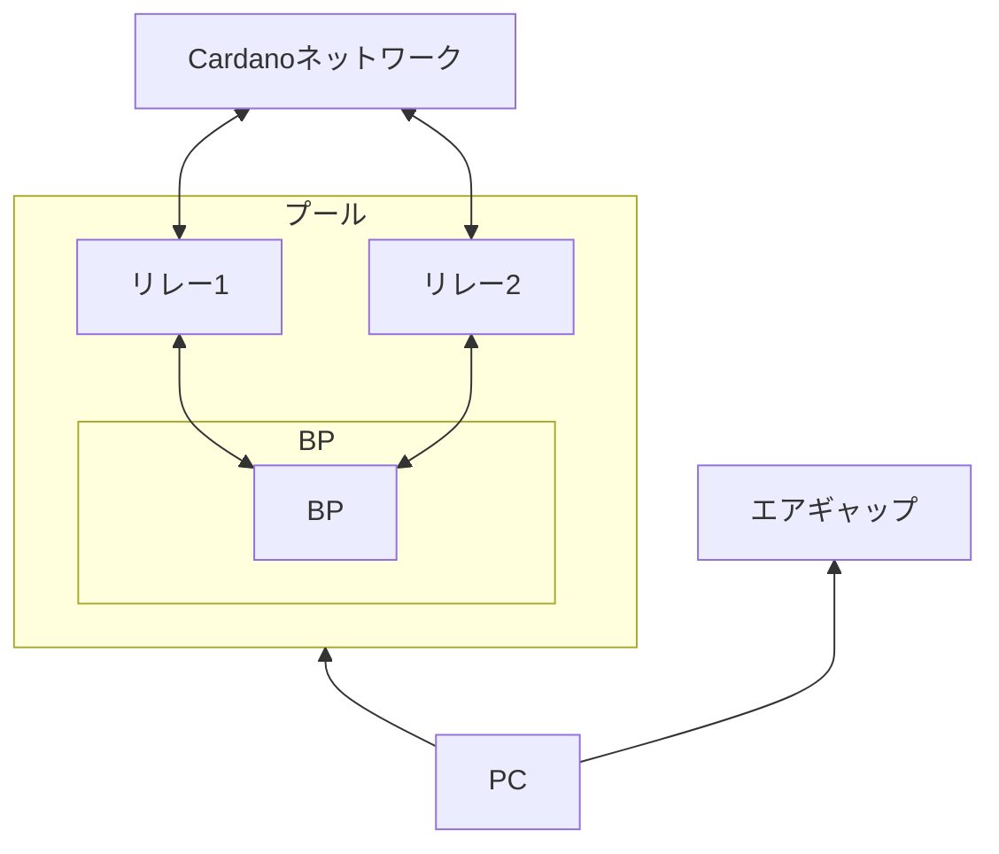

## はじめに [#sec-1]
[SPO JAPAN GUILD](https://spojapanguild.net/)では、Cardanoネットワークの分散化促進を目的として、日本語によるステークプール構築・運用の技術マニュアルを整備しています。  
このマニュアルでは、SPOに必要な知識や作業手順を体系的に習得できます。

<Callout type="info" title="情報">

マニュアルバージョン：`13.9.5`  
対応ノードバージョン：`v10.7.1`

</Callout>

## ステークプールとは [#sec-2]
Cardanoネットワークのコンセンサスアルゴリズムは、PoS（Proof of Stake）を採用しており、ステークプールはCardanoノードを運用することで、トランザクション処理とブロック生成を担い、ネットワークのセキュリティと分散化を支えます。

## SPOとは [#sec-3]
SPO（Stake Pool Operator）は、ステークプールを運用するオペレーターを指します。  
ブロック生成ノードおよびリレーを適切に構成・運用・監視し、Cardanoネットワークのセキュリティと安定性を維持します。

## SPOに求められるスキル [#sec-4]
Cardanoステークプールを運営するには、次のスキルが必要です。

<Callout type="info" title="スキル">

**運用スキル**：  
・ Cardanoノードを継続的にセットアップ、実行、維持する運用スキル  
・ ノードを24時間365日稼働させるコミットメント  
・ サーバ監視・障害対応スキル  

**技術スキル**：  
・ Linuxサーバ管理スキル（運用・保守）  
・ サーバ強化・セキュリティ強化スキル  
・ DevOpsに関する知識  

</Callout>

## SPOの主な業務 [#sec-5]
- ステークプール構築
- サーバー(ノード)監視
- 割り当てられたブロックの生成（※ノード設定が正しければ自動生成されます）
- メンテナンス作業（ノードアップデート等）
- マーケティング・コミュニティ貢献活動

## 運用コスト [#sec-6]
| 区分      | 内容                          |
| :----------- | :------------------------------------: |
| プール登録料(初回のみ)       | 500 ADA  |
| ステークキー登録保証金(初回のみ)       | 2 ADA |
| トランザクション手数料    | 数 ADA |
| サーバー代（最小構成：計3台）/ 月 | 1台あたり 16,000〜32,000円 |

## SPOの報酬 [#sec-7]
<mark>① + (プール総報酬 - ①) * ② = SPOの報酬</mark>

| 区分      | 内容                          |
| :----------- | :------------------------------------ |
| ① 固定費（Fixed Cost）       | 最低 170 ADAから設定可能  |
| ② 変動費（Variable Fee）       | 0%～100% で設定可能  |

<Callout type="warn" title="注意">

固定・変動費を高く設定しすぎると、委任者の報酬が減少します。

</Callout>

## サーバースペック要件 [#sec-8]
<Tabs items={["最小構成", "推奨構成"]}>
<Tab value="最小構成">

| 区分      | 要件                          |
| :---------- | :----------------------------------- |
| **サーバー**      | BP用1台 / リレー用2台  |
| **OS**       | 64-bit Linux (Ubuntu 24.04 LTS) |
| **CPU**   | 2GHz / 2コア以上の Intel または AMD（x86_64） |
| **メモリ**    | 24GB |
| **ストレージ**    | 350GB |
| **ネットワーク**    | 10Mbps |
| **帯域**    | 1時間あたり1GB |
| **電力**    | 24時間365日安定供給 |

</Tab>
<Tab value="推奨構成">

| 区分      | 要件                          |
| :---------- | :----------------------------------- |
| **サーバー**      | BP用1台 / リレー用2台  |
| **OS**       | 64-bit Linux (Ubuntu 24.04 LTS) |
| **CPU**   | 2GHz以上 4コアの Intel または AMD（x86_64） |
| **メモリ**    | 24GB以上 |
| **ストレージ**    | 350GB以上 |
| **ネットワーク**    | 100Mbps |
| **帯域**    | 無制限 |
| **電力**    | 24時間365日安定供給 |

</Tab>
</Tabs>

## エアギャップ環境のスペック要件 [#sec-9]
<Tabs items={["推奨構成"]}>
<Tab value="推奨構成">

| 区分      | 要件                          |
| :---------- | :----------------------------------- |
| **OS**       | 64-bit Linux (Ubuntu 24.04 LTS) |
| **CPU**   | 2GHz以上 4コアの Intel または AMD（x86_64） |
| **メモリ**    | 8GB以上 |
| **ストレージ**    | 100GB以上 |

</Tab>
</Tabs>

## サーバー構成例 [#sec-10]

    

## サーバー選定についての方針 [#sec-11]
<Callout type="info" title="当ギルドの方針">

Cardanoは世界で最も分散化されたネットワークを目指しており、地理的に分散したノードネットワークの形成が非常に重要です。  
この理念に基づき、当ギルドでは<mark>**「おすすめのサーバー(VPS)業者」の情報共有は行っていません。**</mark>  
そのため、地域・プロバイダ・回線品質・価格・信頼性を比較検討したうえで、ご自身の運用方針に合わせて選択してください。

</Callout>

---