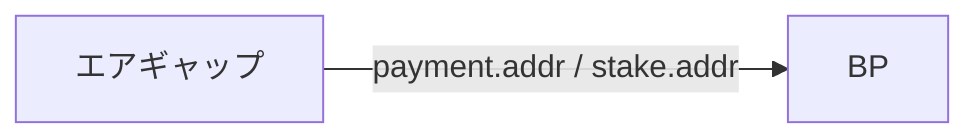

<Callout type="error" title="注意">

プール登録後、以下の手順をやり直しすると変更手続きが面倒になるのでご注意ください。

</Callout>

<Callout type="warning" title="運用上のセキュリティに関する重要なアドバイス">

- キーの生成はエアギャップで生成する必要があり、インターネット接続が無くても生成可能です。  
- paymentキーは支払い用アドレスに使用され、stakeキーはプール委任アドレス用の管理に使用されます。

</Callout>

## 1. プロトコルパラメータの取得 [#sec-1]

<Tabs items={["BP"]}>
<Tab value="BP">

```bash
cd $NODE_HOME
cardano-cli latest query protocol-parameters \
  $NODE_NETWORK \
  --out-file params.json
```

</Tab>
</Tabs>


## 2. 支払いアドレスキーの作成 [#sec-2]

<Tabs items={["エアギャップ"]}>
<Tab value="エアギャップ">

```bash
cd $NODE_HOME
cardano-cli latest address key-gen \
  --verification-key-file payment.vkey \
  --signing-key-file payment.skey
```

</Tab>
</Tabs>

## 3. ステークアドレスキーの作成 [#sec-3]

<Tabs items={["エアギャップ"]}>
<Tab value="エアギャップ">

```bash
cardano-cli latest stake-address key-gen \
  --verification-key-file stake.vkey \
  --signing-key-file stake.skey
```

</Tab>
</Tabs>

## 4. ステークアドレスの作成 [#sec-4]

<Tabs items={["エアギャップ"]}>
<Tab value="エアギャップ">

```bash
cardano-cli latest stake-address build \
  --stake-verification-key-file stake.vkey \
  --out-file stake.addr \
  $NODE_NETWORK
```

</Tab>
</Tabs>

## 5. 支払い用アドレスの作成 [#sec-5]

<Tabs items={["エアギャップ"]}>
<Tab value="エアギャップ">

```bash
cardano-cli latest address build \
  --payment-verification-key-file payment.vkey \
  --stake-verification-key-file stake.vkey \
  --out-file payment.addr \
  $NODE_NETWORK
```

上書き・削除されないようパーミッションを変更する。

```bash
chmod 400 payment.vkey
chmod 400 payment.skey
chmod 400 stake.vkey
chmod 400 stake.skey
chmod 400 stake.addr
chmod 400 payment.addr
```

</Tab>
</Tabs>

| ファイル      | 用途                          |
| ----------- | ------------------------------------ |
| `payment.vkey`       | paymentアドレス公開鍵  |
| `payment.skey`       | paymentアドレス秘密鍵 |
| `payment.addr`    | paymentアドレスファイル |
| `stake.vkey`       | ステークアドレス公開鍵  |
| `stake.skey`       | ステークアドレス秘密鍵 |
| `stake.addr`    | ステークアドレスファイル |

<Callout type="error" title="注意">

これらのファイルは**紛失しないよう保管**してください。  
特に **`*.skey`（秘密鍵）** を失った場合、ステーク報酬の受け取りや ADA の送金などができなくなることがあります。  
複数の**外部媒体**（USB など）へバックアップし、単一故障に備えてください。

</Callout>


## 6. 支払い用アドレスへ入金 [#sec-6]

次のステップは、あなたの支払いアドレスに送金する手順です。

<Callout type="info" title="ファイル転送">

エアギャップの`payment.addr`と`stake.addr` をBPのcnodeディレクトリにコピーします。


</Callout>


<Tabs items={["メインネット", "テストネット"]}>
<Tab value="メインネット">


<Callout type="info" title="ウォレットから送金可能">

* （例）Daedalus / Lace / Eternl など

</Callout>


支払いアドレスを表示させ、このアドレスに送金します。

```bash
echo "$(cat $NODE_HOME/payment.addr)"
```
<Callout type="info" title="必要な ADA の額">

初回は**少額で送金できるか確かめてから**、不足分を追加してください。

`payment.addr` にはおおむね次の用途があります。**実行する手順に応じて足りる合計額**を入金してください。

- ステークプール登録料（**500 ADA** が必要です）
- ステークアドレス登録に必要な ADA（目安 **2 ADA** と手数料）
- **トランザクション手数料**（登録作業などで複数回 Tx を送る場合があるため **数 ADA 以上** を余裕として見込む）
- **誓約（Pledge）** として設定する額（同じウォレットの残高で満たす必要があります。登録証明書に書く誓約額に合わせてください）

</Callout>


</Tab>
<Tab value="テストネット">

<Callout type="info" title="テストネット用tADAの請求">

[テストネット用口座](https://docs.cardano.org/cardano-testnets/tools/faucet)にあなたの支払い用アドレスをリクエストします。  
テストネット用口座は24時間ごとに10000tADAを提供します。

</Callout>


次のコードを実行し。支払いアドレスを表示させます。

```bash
echo "$(cat $NODE_HOME/payment.addr)"
```

このアドレスを上記ページのリクエスト欄に貼り付けます。

</Tab>
</Tabs>

支払い用アドレスに送金後、残高を確認してください。

<Tabs items={["BP"]}>
<Tab value="BP">


```bash
cardano-cli latest query utxo \
  --address $(cat payment.addr) \
  $NODE_NETWORK \
  --output-text
```

次のように表示されたら入金完了です。

```yaml title="期待される表示例：" noCopy
                        TxHash                                 TxIx        Amount
--------------------------------------------------------------------------------------
9e0c10b599606a5**********************************************     0        10000000000     lovelace + TxOutDatumNone
```

</Tab>
</Tabs>

<Callout type="warning" title="ノード同期の確認">

ノードをブロックチェーンと完全に同期させる必要があります。  
完全に同期されていない場合は残高が表示されませんので注意してください。

</Callout>

---