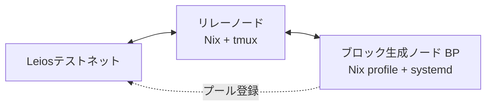

このマニュアルは、**Ouroboros Leios テストネット**上でステークプール（リレー＋ブロック生成ノード）を構築するための手順書です。  
公式ドキュメント [Leios Testnet - Getting Started](https://leios.cardano-scaling.org/docs/testnet/getting-started) をベースに構成しています。

<Callout type="warn" title="プロトタイプネットワークについて">

Leios テストネットは **研究・検証用のプロトタイプネットワーク** です。  
本番（メインネット）とは仕様・パラメータが異なり、予告なくリセットされる場合があります。  
ここで生成するキーや tADA は **テスト専用** であり、メインネットでは使用できません。

</Callout>

## 1. ネットワーク情報 [#sec-1]

<Callout type="info" title="接続情報">

| 項目 | 値 |
| :---- | :---- |
| ネットワークマジック | `164` |
| ブートストラップリレー | `leios-node.play.dev.cardano.org:3001` |
| ノードリリース | `prototype-2026w26` |
| Faucet | [faucet.leios.play.dev.cardano.org/basic-faucet](https://faucet.leios.play.dev.cardano.org/basic-faucet) |
| エクスプローラー | [KleioScan](https://kleioscan.com/#/leios) |
| エラ（Era） | `Dijkstra` |
| ノード待受ポート | `3010` |

</Callout>

## 2. システム要件 [#sec-2]

<Callout type="info" title="推奨スペック">

| 項目 | 要件 |
| :---- | :---- |
| OS / アーキテクチャ | Linux x86-64 または macOS aarch64 |
| CPU | 2コア以上 |
| メモリ | 4GB 以上（ノードは約2〜2.5GB使用） |
| ディスク | SSD 空き 25GB 程度 |

</Callout>

## 3. 構成 [#sec-3]

本マニュアルでは、以下の構成でステークプールを構築します。

<Callout type="info" title="本マニュアルの構成">

- **リレーノード**：**Nix**（`nix run` + tmux）で構築し、監視ダッシュボード（Grafana）も同時に起動します。
- **ブロック生成ノード（BP）**：**Nix**（`nix profile install` で固定パス導入）した cardano-node を **systemd** でバックグラウンド常駐させます。
- **プール登録**：**BP** 上で実施します（キー生成・証明書作成・トランザクション送信）。

</Callout>

<Callout type="warn" title="リレーとBPの役割">

- **リレーノード** … 外部ネットワークと接続し、ブロックを中継します。パブリックIP・ポート開放が必要です。
- **ブロック生成ノード（BP）** … KES / VRF / 運用証明書を用いてブロックを生成します。リレー経由で外部と接続します。

</Callout>

## 4. 構築の流れ [#sec-4]

1. [リレーノードの構築（Nix）](/cardano/leios-testnet2/relay-setup)
2. [BPノードの構築（Nix + systemd）](/cardano/leios-testnet2/bp-setup)
3. [BP用キーの生成](/cardano/leios-testnet2/bp-key-setup)
4. [ステークプール登録](/cardano/leios-testnet2/stake-pool-register)

<Callout type="info" title="サポート">

不明点や不具合の報告は [Musashi Dōjō Discord](https://discord.gg/Bx2qvsjCte) で受け付けています。

</Callout>

---
