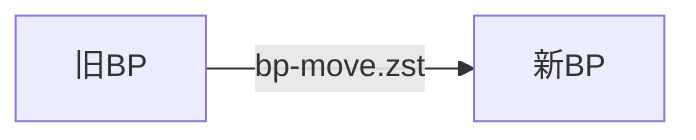

<Callout type="info" title="前提注意事項">

* 本まとめは現VPS会社→新VPS会社へと `BPのみ` を移行するまとめです。
* 実際に行う際には手順をよく読みながら進めてください。
* ブロック生成予定まで余裕がある時に実施してください。
* 旧BPは[6-1. 旧BPシャットダウン](/docs/cardano/operation/bp-migration#6-1-bp)まで、**起動状態** にしておいてください。

</Callout>


## 1. 新BPセットアップ [#sec-1]

<Callout type="info" title="留意事項">

1. サーバ独自機能に留意してください。
    * さくらのパケットフィルタや、AWSのFW設定などのサーバー独自の機能に気を付けてください。
2. 新BPのファイヤーウォール設定は、旧BPと同じ設定にしてください。
3. 旧BPのユーザー名（例：ubuntu）と新BPのユーザー名は変更しないでください。
    * もし変更する場合は、以下のファイル内のパス名を手動で変更してください。
    * `startBlockProducingNode.sh` DIRECTORY=/home/ユーザー名/cnode

</Callout>


### 1-1. Ubuntu初期設定 [#sec-2]

新サーバーで[Ubuntu初期設定](/docs/cardano/setup/ubuntu-setup)を実施します。  


### 1-2. ノードセットアップ [#sec-3]

1. [1. 依存関係インストール](/docs/cardano/setup/node-setup#1) 〜 [7. gLiveViewのインストール](/docs/cardano/setup/node-setup#7-gliveview)まで実施します。
2. [2. トポロジーファイル設定変更](/docs/cardano/setup/relay-bp-setup#2)の「**`BPの場合`**」を実施します。


## 2. 既存リレーでの作業 [#sec-4]
リレートポロジー情報変更 
 
```bash
nano $NODE_HOME/${NODE_CONFIG}-topology.json
```
> 旧BPのIPとポートを新BPのIPとポートに変更します。

トポロジーファイルの再読み込み
```bash
cnreload
```

## 3. 旧BP移行処理 [#sec-5]

ユーザー名とノードポート番号をメモなどに控えておいてください。
```bash
nano $NODE_HOME/startBlockProducingNode.sh
```

### 3-1. 旧BPノード停止 [#sec-6]

<Tabs items={["旧BP"]}>
<Tab value="旧BP">


```bash
sudo systemctl stop cardano-node
```
```bash
sudo systemctl disable cardano-node
```  

</Tab>
</Tabs>

### 3-2. 旧BPファイル移動 [#sec-7]

<Callout type="info" title="**参考）移行ファイル一覧**">


| ファイル名 | 用途 |
:----|:----
| vrf.skey | ブロック生成に必須 |
| vrf.vkey | ブロック生成に必須 |
| kes.skey | ブロック生成に必須 |
| kes.vkey | KES公開鍵 |
| node.cert | ブロック生成に必須 |
| payment.addr | 残高確認で必要 |
| stake.addr | 残高確認で必要 |
| poolMetaData.json | pool.cert作成時に必要 |
| poolMetaDataHash.txt | pool.cert作成時に必要 |
| startBlockProducingNode.sh | ノード起動スクリプト |
| pool.id-bech32 | stakepoolid(bech32形式) |
| pool.id | stakepoolid(hex形式) |
| guild-db | ブロックログ関連ディレクトリ(cncli.db以外) |
| governance | ガバナンス関連ディレクトリ |
| calidus | Calidus関連ディレクトリ |

</Callout>


<Tabs items={["旧BP"]}>
<Tab value="旧BP">


Zstandardインストール
```bash
sudo apt install zstd
```

上記の移行ファイルを一つのファイルに圧縮します。  

<Callout type="info" title="該当ディレクトリが存在しない場合">

`governance/` や `calidus/` を使用していない場合は、**存在しないディレクトリ名をコマンドから削除して実行してください。**

</Callout>


```bash
cd $NODE_HOME
tar --exclude "guild-db/cncli/cncli.db" -acvf bp-move.zst \
  vrf.skey vrf.vkey \
  kes.skey kes.vkey \
  node.cert \
  payment.addr stake.addr \
  poolMetaData.json poolMetaDataHash.txt \
  startBlockProducingNode.sh \
  pool.id-bech32 pool.id \
  guild-db/ governance/ calidus/
```

</Tab>
</Tabs>

旧BPのcnodeにある`bp-move.zst`を新BPのcnodeディレクトリにコピー


## 4. 新BP再設定 [#sec-8]

### 4-1. 移行ファイル復元 [#sec-9]

<Tabs items={["新BP"]}>
<Tab value="新BP">


ノード停止
```bash
sudo systemctl stop cardano-node
```

ファイル確認
```bash
ls $NODE_HOME/bp-move.zst
```
> ファイルパスが表示されることを確認。  
> 例）`/home/cardano/cnode/bp-move.zst`

ファイル展開
```bash
cd $NODE_HOME
tar -xvf bp-move.zst
```
> 戻り値に移行ファイル一覧のファイル名が表示されることを確認

圧縮ファイルを削除
```bash
rm bp-move.zst
```

新規BPサーバーで[5. BPノードとして再起動](/docs/cardano/setup/bp-key-setup#5-bp)を実行し、「`startBlockProducingNode.sh`」を生成してください。
> 旧BPと新BPのユーザー名とノードポート番号は同じにしておくこと

</Tab>
</Tabs>

### 4-2. パーミッション変更 [#sec-10]
<Tabs items={["新BP"]}>
<Tab value="新BP">

```bash
cd $NODE_HOME
chmod 400 vrf.skey
chmod 400 vrf.vkey
chmod +x startBlockProducingNode.sh
```

ノードを起動します。
```bash
sudo systemctl start cardano-node
```
ノードログ確認
```bash
journalctl --unit=cardano-node --follow
```

</Tab>
</Tabs>

### 4-3. 新BP接続確認 [#sec-11]
gLiveViewで新BPが最新ブロックと同期後、リレーと疎通(I/O)ができているかを確認します。

<Tabs items={["新BP"]}>
<Tab value="新BP">

gLiveView確認
```bash
cd $NODE_HOME/scripts
./gLiveView.sh
```
> PeerリストにリレーのIPがあることを確認してください。

</Tab>
</Tabs>

### 4-4. params.json再作成 [#sec-12]

<Tabs items={["新BP"]}>
<Tab value="新BP">

```bash
cd $NODE_HOME
cardano-cli latest query protocol-parameters \
    ${NODE_NETWORK} \
    --out-file params.json
```

</Tab>
</Tabs>

### 4-5. ブロックログ設定 [#sec-13]

- [ブロックログ設定](/docs/cardano/setup/blocklog-setup)


### 4-6. SJGツール導入 [#sec-14]

- [SJGツール導入設定](/docs/cardano/operation/sjg-tool-setup)


### 4-7. ブロック生成状態チェック [#sec-15]

SJGツールを起動し、「[2] ブロック生成状態チェック」ですべての項目がOKになることを確認

### 4-8. ブロック生成ステータス通知設定 [#sec-16]
(SPO Block Notify)

<Tabs items={["旧BPで導入済みの場合", "旧BPで未導入の場合"]}>
<Tab value="旧BPで導入済みの場合">


1. 新BPで[1. 依存プログラムのインストール](/docs/cardano/setup/blocknotify-setup#1)のみを実施
2. 旧BPで設定ファイルを確認

```bash
cat $NODE_HOME/scripts/block-notify/.env
```
または
```bash
cat $NODE_HOME/guild-db/blocklog/.env
```
または
```bash
cat $NODE_HOME/scripts/block-notify/config.ini
```

3. 新BPで[3. 通知プログラムの設定](/docs/cardano/setup/blocknotify-setup#3)を実施します。
（config.iniの設定値は旧BPで表示された設定ファイルの内容を参考にしてください。）

</Tab>
<Tab value="旧BPで未導入の場合">


[SPO BlockNotify設定](/docs/cardano/setup/blocknotify-setup)から導入してください。

</Tab>
</Tabs>

## 5. Prometheus設定 [#sec-17]

### 5-1. 新BP`node exporter`インストール [#sec-18]

<Tabs items={["新BP"]}>
<Tab value="新BP">

```bash
sudo apt install -y prometheus-node-exporter
```

サービスを有効にして、自動的に開始されるように設定します。
```bash
sudo systemctl enable --now prometheus-node-exporter.service
```

ファイアウォール設定でPrometheusメトリクスポートをGrafana稼働サーバーのIP限定で開放
```bash
sudo ufw allow from <Grafana稼働サーバーのIP> to any port 12798
```
```bash
sudo ufw allow from <Grafana稼働サーバーのIP> to any port 9100
```
```bash
sudo ufw reload
```

ノード再起動
```bash
sudo systemctl reload-or-restart cardano-node
```

</Tab>
</Tabs>

### 5-2. Grafanaサーバー`prometheus.yml`の修正 [#sec-19]

<Tabs items={["Grafanaサーバー(リレー1)"]}>
<Tab value="Grafanaサーバー(リレー1)">


`prometheus.yml`に記載されてる旧BPのIPを新BPのIPへ変更してください
```bash
sudo nano /etc/prometheus/prometheus.yml
```

サービス再起動
```bash
sudo systemctl restart grafana-server.service prometheus.service prometheus-node-exporter.service
```

サービスが正しく実行されていることを確認します。
```bash
sudo systemctl --no-pager status grafana-server.service prometheus.service prometheus-node-exporter.service
```

GrafanaにBPのメトリクス(KESなど)が表示されているか確認

</Tab>
</Tabs>

---
## 6. 最終作業 [#sec-20]

### 6-1. 旧BPシャットダウン [#sec-21]

<Tabs items={["旧BP"]}>
<Tab value="旧BP">

```bash
sudo shutdown -h now
```

</Tab>
</Tabs>

### 6-2. Tracemempool無効化 [#sec-22]

Txの増加が確認できたらTracemempoolを無効にします。

<Tabs items={["新BP"]}>
<Tab value="新BP">

```bash
sed -i $NODE_HOME/${NODE_CONFIG}-config.json \
    -e "s/TraceMempool\": true/TraceMempool\": false/g"
```

</Tab>
</Tabs>

ノード再起動
```bash
sudo systemctl reload-or-restart cardano-node
```

### 6-3. Mithril-Signer再セットアップ [#sec-23]

旧サーバーでMithril-Signer-Relayを実行していた場合は、新サーバーでも再セットアップしてください。  
[Mithril Signerノードの設定、更新](/docs/cardano/operation/mithril-signer-node-setup-and-updates)

---