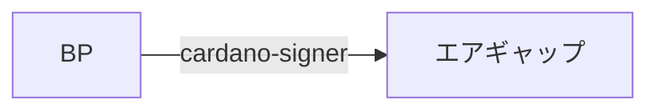
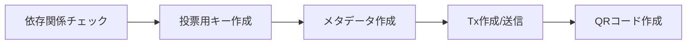

<Callout type="info" title="概要">

- このマニュアルは、プールのpayment.addrを有権者登録する方法です。  
  payment.addrの資金をVotingパワーに使用でき、Catalyst投票が可能になります。

- 依存関係は`BP`にインストールしてください。
- 有権者登録作業はSJG TOOLで行います。

</Callout>


## 1. 事前準備インストール [#sec-1]

**<span style={{color: "red"}}>以下の依存関係はBPサーバーにインストールしてください</span>**  

| bech32  | cardano-signer | catalyst-toolbox |
| :---------- | :---------- | :---------- |
| v1.1.3 | v1.13.0 | v0.5.0 |

### Bech32インストール [#sec-2]

ダウンロード
<Tabs items={["BP"]}>
<Tab value="BP">

```bash
cd $HOME/git
wget  https://github.com/IntersectMBO/bech32/archive/refs/tags/$(curl -s https://api.github.com/repos/IntersectMBO/bech32/releases/latest | jq -r .tag_name).tar.gz
tar -xf $(curl -s https://api.github.com/repos/IntersectMBO/bech32/releases/latest | jq -r .tag_name).tar.gz
mv bech32-$(curl -s https://api.github.com/repos/IntersectMBO/bech32/releases/latest | jq -r .tag_name | tr -d v) bech32
rm $(curl -s https://api.github.com/repos/IntersectMBO/bech32/releases/latest | jq -r .tag_name).tar.gz
```

</Tab>
</Tabs>

ビルド
<Tabs items={["BP"]}>
<Tab value="BP">

```bash
cd bech32
cabal update
cabal build bech32
```

</Tab>
</Tabs>

binディレクトリへコピー
<Tabs items={["BP"]}>
<Tab value="BP">

```bash
sudo cp $(find $HOME/git/bech32/dist-newstyle/build -type f -name "bech32") /usr/local/bin/bech32
```

</Tab>
</Tabs>

バージョン確認
<Tabs items={["BP"]}>
<Tab value="BP">

```bash
bech32 -v
```

</Tab>
</Tabs>

> 戻り値 1.1.3


### cardano-signerインストール [#sec-3]
<Tabs items={["BP"]}>
<Tab value="BP">

```bash
cd $HOME/git
wget https://github.com/gitmachtl/cardano-signer/releases/download/$(curl -s https://api.github.com/repos/gitmachtl/cardano-signer/releases/latest | jq -r .tag_name)/cardano-signer-$(curl -s https://api.github.com/repos/gitmachtl/cardano-signer/releases/latest | jq -r .tag_name | tr -d v)_linux-x64.tar.gz
tar -xf cardano-signer-$(curl -s https://api.github.com/repos/gitmachtl/cardano-signer/releases/latest | jq -r .tag_name | tr -d v)_linux-x64.tar.gz
```

</Tab>
</Tabs>

binディレクトリへコピー
<Tabs items={["BP"]}>
<Tab value="BP">

```bash
sudo cp $HOME/git/cardano-signer /usr/local/bin/cardano-signer
```

</Tab>
</Tabs>

バージョン確認
<Tabs items={["BP"]}>
<Tab value="BP">

```bash
cardano-signer help | grep -m 1 "cardano-signer"
```

</Tab>
</Tabs>

> cardano-signer 1.32.0

**エアギャップへコピー**

**BPの`$HOME/git/`直下にある`cardano-signer`をダウンロードし、エアギャップの`$HOME/git/`直下にコピーする**

<Callout type="warn" title="ファイル転送">

BPにある`cardano-signer`をエアギャップの$HOME/git/ディレクトリにコピーします。


</Callout>


**binディレクトリへコピー**
<Tabs items={["エアギャップ"]}>
<Tab value="エアギャップ">

```bash
sudo cp $HOME/git/cardano-signer /usr/local/bin/cardano-signer
```

</Tab>
</Tabs>

パーミッション設定
<Tabs items={["エアギャップ"]}>
<Tab value="エアギャップ">

```bash
sudo chmod 755 /usr/local/bin/cardano-signer
```

</Tab>
</Tabs>

バージョン確認
<Tabs items={["エアギャップ"]}>
<Tab value="エアギャップ">

```bash
cardano-signer help | grep -m 1 "cardano-signer"
```
> cardano-signer 1.32.0

</Tab>
</Tabs>

### catalyst-toolboxインストール [#sec-4]
<Tabs items={["BP"]}>
<Tab value="BP">

```bash
cd $HOME/git
git clone https://github.com/input-output-hk/catalyst-core.git
cd catalyst-core
git checkout 1bdacb3
```

</Tab>
</Tabs>

Rustパッケージアップデート
<Tabs items={["BP"]}>
<Tab value="BP">

```bash
rustup update
```

</Tab>
</Tabs>

インストール
<Tabs items={["BP"]}>
<Tab value="BP">

```bash
cd src/catalyst-toolbox
cargo install --path . --force
```

</Tab>
</Tabs>

バージョン確認
<Tabs items={["BP"]}>
<Tab value="BP">

```bash
catalyst-toolbox --version
```
> catalyst-toolbox 0.5.0

</Tab>
</Tabs>

## 2. 有権者登録作業 [#sec-5]

### SJGTOOL起動 [#sec-6]


有権者登録の流れ



<Callout type="error" title="作成ファイルについて">

`XXX_voting.skey` / `XXX_voting.vkey` / `XXX_voting.json` (XXXはティッカー名)

- 上記の3ファイルはダウンロードして、USBなどへバックアップしてください。
- `XXX_voting.json`には、復元フレーズが含まれています。  
Fund11から開始予定のWeb版Catalyst投票センターを使用する際に必要になりますので、厳重に保管して下さい。

</Callout>


<Callout type="info" title="中断した場合">

処理が途中で中断した場合でも、SJGTOOLを起動し`[5]Catalyst有権者登録`を選択すれば途中から再開できます。

</Callout>


### QRコード作成後 [#sec-7]

QRコードが発行できたら`$HOME/CatalystVoting`ディレクトリ内ファイルの整理をお願いします。

| ファイル名  | サーバー内処理 | バックアップ
| :---------- | :---------- | :---------- |
| XXX_voting.skey | 削除 | 必須 |
| XXX_voting.vkey | 削除 | 必須 |
| XXX_voting.json | 削除 | 必須 |
| vote-registration.cbor | 削除 | 任意 |
| XXX_vote_qrcode.png | 保管 | 必須 |
| txhash.log | 保管 | 任意 |

---