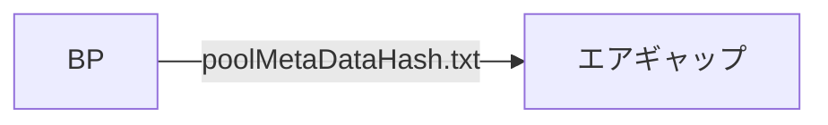
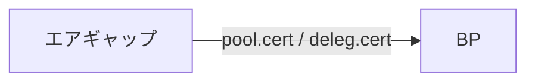
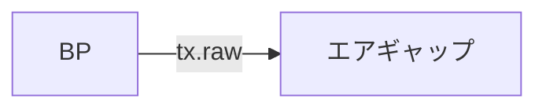
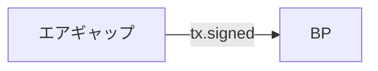

<Callout type="info" title="概要">

- 誓約、固定手数料、変動手数料、リレー情報、メタデータを変更する場合に実施します。
- メタデータURLのみ変更になる場合でも「メタデータ更新を含む場合」を実施しメタデータファイルを再作成してください。

</Callout>


<Callout type="info" title="注意">

誓約・固定手数料・変動手数料の反映は提出エポック＋3エポック後からになります。  
例）  
320エポックに変更申請  
321エポックで有効化  
322エポックで待機  
323エポックで反映  

</Callout>


<Tabs items={["メタデータ更新を含む場合", "誓約、手数料、リレー情報のみ更新の場合"]}>
<Tab value="メタデータ更新を含む場合">

<Tabs items={["BP"]}>
<Tab value="BP">

変数にプールメタデータ値を設定し実行してください
> 文字列は`''`で囲ってください  
> extendedを設定していない場合は `''`のままで大丈夫です
```bash
name=''
description=''
ticker=''
homepage=''
extended=''
```

メタデータファイルを作成する

```bash
cat > $NODE_HOME/poolMetaData.json << EOF
{
  "name": "$name",
  "description": "$description",
  "ticker": "$ticker",
  "homepage": "$homepage",
  "extended": "$extended",
  "nonce":"$(date +%s)"
}
EOF
```

</Tab>
</Tabs>

<Callout type="info" title="poolMetaData.jsonを各ホストサーバーへアップロードする">

poolMetaData.jsonをローカルマシンにダウンロードし、Githubまたはご自身のサーバーの所定の位置にアップロードしてください

</Callout>


**ハッシュ値確認**

<Tabs items={["BP"]}>
<Tab value="BP">

```bash
cd $NODE_HOME
cardano-cli latest stake-pool metadata-hash --pool-metadata-file poolMetaData.json > poolMetaDataHash.txt
```

</Tab>
</Tabs>

オンラインファイルハッシュ値確認
> `https:****.**.**`をメタデータファイルのURLに置き換えてから実行してください

```bash
cd $NODE_HOME
wget -O onlineMetaData.json https:****.**.**
```

オンラインメタデータハッシュ値
```bash
cardano-cli latest stake-pool metadata-hash --pool-metadata-file onlineMetaData.json > onlineMetaDataHash.txt
```

ハッシュ値
```bash
printf "\n　サーバー:$(cat poolMetaDataHash.txt)\nオンライン:$(cat onlineMetaDataHash.txt)\n\n"
```
>ハッシュ値が一致する必要があります。異なる場合はホストサーバーへ正しくアップロードされているかご確認ください。

ハッシュ値が一致したら、確認用ファイルを削除する。
```bash
rm onlineMetaDataHash.txt
rm onlineMetaData.json
```


<Callout type="warn" title="ファイル転送">

BPの``poolMetaDataHash.txt`` をエアギャップのcnodeディレクトリにコピーします。


</Callout>


BPとエアギャップハッシュ値確認
<Tabs items={["BP", "エアギャップ"]}>
<Tab value="BP">

```bash
cd $NODE_HOME
echo $(cat poolMetaDataHash.txt)
```

</Tab>
<Tab value="エアギャップ">

```bash
cd $NODE_HOME
echo $(cat poolMetaDataHash.txt)
```

> ハッシュ値が異なっている場合は、BPのpoolMetaDataHash.txtがエアギャップに正しくコピーされていません。

</Tab>
</Tabs>

</Tab>
<Tab value="誓約、手数料、リレー情報のみ更新の場合">

このタブではプールメタデータの変更はありません。**登録証明書トランザクションを作成する**以降の手順へ進んでください。

</Tab>
</Tabs>

**登録証明書トランザクションを作成する**

<Callout type="info" title="注意">

以下は参考コードです。ご自身のプール設定値に変更してください  
例）  

- 固定費・・・170ADA
- Margin・・・5%
- 誓約・・・1000ADA

</Callout>


<Tabs items={["エアギャップ"]}>
<Tab value="エアギャップ">

```bash
cd $NODE_HOME
```

```bash
chmod u+rwx $HOME/cold-keys
cardano-cli latest stake-pool registration-certificate \
  --cold-verification-key-file $HOME/cold-keys/node.vkey \
  --vrf-verification-key-file vrf.vkey \
  --pool-pledge 1000000000 \
  --pool-cost 170000000 \
  --pool-margin 0.05 \
  --pool-reward-account-verification-key-file stake.vkey \
  --pool-owner-stake-verification-key-file stake.vkey \
  $NODE_NETWORK \
  --pool-relay-ipv4 ***.***.***.*** \
  --pool-relay-port 6000 \
  --pool-relay-ipv4 ***.***.***.*** \
  --pool-relay-port 6000 \
  --metadata-url https://xxx.github.io/xxx/poolMetaData.json \
  --metadata-hash $(cat poolMetaDataHash.txt) \
  --out-file pool.cert
```

</Tab>
</Tabs>

<Callout type="info" title="ヒント">

上記のコードを自プール用の設定に修正したら、次回も使用できるようテキストファイルとして保存しておいてください。

</Callout>


ステークプールに誓約します。

<Tabs items={["エアギャップ"]}>
<Tab value="エアギャップ">

```bash
cardano-cli latest stake-address stake-delegation-certificate \
  --stake-verification-key-file stake.vkey \
  --cold-verification-key-file $HOME/cold-keys/node.vkey \
  --out-file deleg.cert
```

</Tab>
</Tabs>

<Callout type="warn" title="ファイル転送">

エアギャップの`pool.cert`と`deleg.cert`をBPのcnodeディレクトリにコピーします。


</Callout>


最新のスロット番号を取得します

<Tabs items={["BP"]}>
<Tab value="BP">

```bash
cd $NODE_HOME
currentSlot=$(cardano-cli latest query tip $NODE_NETWORK | jq -r '.slot')
echo Current Slot: $currentSlot
```

</Tab>
</Tabs>

payment.addrの残高を出力します。

<Tabs items={["BP"]}>
<Tab value="BP">

```bash
cardano-cli latest query utxo \
  --address $(cat payment.addr) \
  $NODE_NETWORK \
  --output-text \
  --out-file fullUtxo.out

tail -n +3 fullUtxo.out | sort -k3 -nr | sed -e '/lovelace + [0-9]/d' > balance.out

cat balance.out
```

</Tab>
</Tabs>

UTXOを算出します
<Tabs items={["BP"]}>
<Tab value="BP">

```bash
tx_in=""
total_balance=0
while read -r utxo; do
  in_addr=$(awk '{ print $1 }' <<< "${utxo}")
  idx=$(awk '{ print $2 }' <<< "${utxo}")
  utxo_balance=$(awk '{ print $3 }' <<< "${utxo}")
  total_balance=$((${total_balance}+${utxo_balance}))
  echo TxHash: ${in_addr}#${idx}
  echo ADA: ${utxo_balance}
  tx_in="${tx_in} --tx-in ${in_addr}#${idx}"
done < balance.out
txcnt=$(cat balance.out | wc -l)
echo Total ADA balance: ${total_balance}
echo Number of UTXOs: ${txcnt}
```

</Tab>
</Tabs>

build-rawトランザクションコマンドを実行します。


<Tabs items={["BP"]}>
<Tab value="BP">

```bash
cardano-cli latest transaction build-raw \
  ${tx_in} \
  --tx-out $(cat payment.addr)+${total_balance} \
  --invalid-hereafter $(( ${currentSlot} + 10000)) \
  --fee 200000 \
  --certificate-file pool.cert \
  --certificate-file deleg.cert \
  --out-file tx.tmp
```

</Tab>
</Tabs>

最低手数料を計算します。

<Tabs items={["BP"]}>
<Tab value="BP">

```bash
fee=$(cardano-cli latest transaction calculate-min-fee \
  --tx-body-file tx.tmp \
  --witness-count 3 \
  --output-text \
  --protocol-params-file params.json | awk '{ print $1 }')
echo fee: $fee
```

</Tab>
</Tabs>

計算結果を出力します。

<Tabs items={["BP"]}>
<Tab value="BP">

```bash
txOut=$((${total_balance}-${fee}))
echo txOut: ${txOut}
```

</Tab>
</Tabs>

トランザクションファイルを構築します。

<Tabs items={["BP"]}>
<Tab value="BP">

```bash
cardano-cli latest transaction build-raw \
  ${tx_in} \
  --tx-out $(cat payment.addr)+${txOut} \
  --invalid-hereafter $(( ${currentSlot} + 10000)) \
  --fee ${fee} \
  --certificate-file pool.cert \
  --certificate-file deleg.cert \
  --out-file tx.raw
```

</Tab>
</Tabs>

<Callout type="warn" title="ファイル転送">

BPの`tx.raw` をエアギャップのcnodeディレクトリにコピーします。


</Callout>


トランザクションに署名します。

<Tabs items={["エアギャップ"]}>
<Tab value="エアギャップ">

```bash
cd $NODE_HOME
cardano-cli latest transaction sign \
  --tx-body-file tx.raw \
  --signing-key-file payment.skey \
  --signing-key-file $HOME/cold-keys/node.skey \
  --signing-key-file stake.skey \
  $NODE_NETWORK \
  --out-file tx.signed
chmod a-rwx $HOME/cold-keys
```

</Tab>
</Tabs>

<Callout type="warn" title="ファイル転送">

エアギャップの`tx.signed` をBPのcnodeディレクトリにコピーします。


</Callout>


トランザクションを送信します。

<Tabs items={["BP"]}>
<Tab value="BP">

```bash
cardano-cli latest transaction submit \
  --tx-file tx.signed \
  $NODE_NETWORK
```
> Transacsion Successfully submittedと表示されれば成功

</Tab>
</Tabs>

---