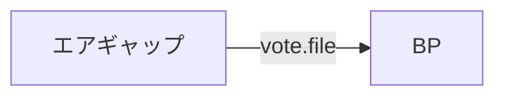
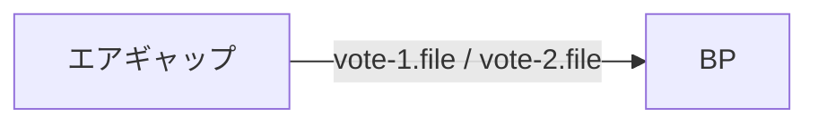
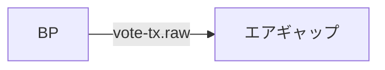
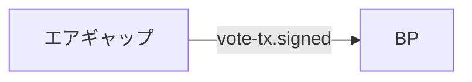

<Callout type="info" title="概要">

- この投票手順はガバナンスアクションのSPO投票のみに使用できます。

- SJG Toolに実装しているコマンドとは異なりますが実行結果は同じです。

- 投票にはトランザクション手数料が必要です。

- トランザクション手数料はpayment.addrから引き落とされます。プール誓約を下回らないようご注意ください。

ガバナンスアクション確認サイト  

[https://adastat.net/governances](https://adastat.net/governances)  

[https://beta.cexplorer.io/gov/action](https://beta.cexplorer.io/gov/action)  

[https://cardanoscan.io/govActions](https://cardanoscan.io/govActions)  

[https://gov.tools/governance_actions](https://gov.tools/governance_actions)

</Callout>

## SPO Governance

Cardanoでは、Conway EraからCIP-1694に基づくオンチェーンガバナンスが導入され、**Constitutional Committee（CC）・DRep・SPO**の3つのガバナンス機関が、それぞれ対象となるGovernance Actionに投票します。

### SPOが投票するGovernance Action

SPOはCold Keyを使用して投票し、Governance Actionごとに設定されたSPOの批准閾値を満たす必要があります。

| Governance Action | 批准閾値 | 内容 |
| --- | :---: | --- |
| **Motion of no-confidence** | >51% | 現在の憲法委員会を解任 |
| **Update committee / threshold** | >51% | 憲法委員会メンバーの追加・削除、または承認閾値を変更 |
| **Hard Fork Initiation** | >51% | ハードフォークによるプロトコルのアップグレードを実行 |
| **Protocol Parameter Changes（セキュリティ関連）**<br />`maxBlockBodySize`<br />`maxTxSize`<br />`maxBlockHeaderSize`<br />`maxValueSize`<br />`maxBlockExecutionUnits`<br />`txFeePerByte`<br />`txFeeFixed`<br />`utxoCostPerByte`<br />`govActionDeposit`<br />`minFeeRefScriptCostPerByte` | >51% | セキュリティに関連するプロトコルパラメータを変更 |
| **Info** | 100% | 情報提供を目的とし、オンチェーンへの直接的な効果はなし |

SPOはTreasury Withdrawal（トレジャリーの引き出し）やConstitutional Amendment（憲法改正）には投票しません。  

また、Protocol Parameter Changesについても、SPOが投票するのは上記のセキュリティに関連するParameterが対象です。

### Hard Fork Initiation

Hard Fork Initiationでは、ノードをアップグレードするだけでは投票したことにはなりません。  

SPOが**Cold Key**を使用して、**Yes / No / Abstain**のいずれかを明示的にオンチェーン投票する必要があります。

---

<Tabs items={["BP/エアギャップ"]}>
<Tab value="BP/エアギャップ">

初めて作業する場合はガバナンス作業用ディレクトリを作成

```bash
mkdir -p $NODE_HOME/governance
```

</Tab>
</Tabs>

## 1. 投票ファイル作成 [#sec-1]

エアギャップで投票ファイルを作成

<Tabs groupId="spo-vote-mode" items={["単一投票", "複数投票"]}>

<Tab value="単一投票">

<Callout type="info" title="投票例">

1つのGovernance Actionに投票する場合

</Callout>

1. `gov_id`変数に投票するガバナンスアクションのトランザクションIDを指定する（Bech32 IDは指定できない）

2. 投票スタンスは次の3つのいずれかを指定 `--yes` `--no` `--abstain`

```bash
gov_id=
```

この提案に対する投票スタンスを入力してください。

賛成の場合：
```bash
voting_stance=--yes
```
反対の場合：
```bash
voting_stance=--no
```
棄権の場合：
```bash
voting_stance=--abstain
```

```bash
chmod u+rwx $HOME/cold-keys

cd $NODE_HOME

cardano-cli latest governance vote create \
  ${voting_stance} \
  --governance-action-tx-id $gov_id \
  --governance-action-index "0" \
  --cold-verification-key-file $HOME/cold-keys/node.vkey \
  --out-file $NODE_HOME/governance/vote.file
```
> 基本的に`--governance-action-index`は`0`ですが、具体的には対象Governance ActionのIndexを確認して指定してください。

</Tab>

<Tab value="複数投票">

<Callout type="info" title="投票例">

複数のGovernance Actionに1つのトランザクションで投票する場合

Governance Actionごとに1つの投票ファイルを作成します。  
それぞれ`Yes / No / Abstain`を個別に指定できます。

</Callout>

1. `gov_id_1`、`gov_id_2`に投票するガバナンスアクションのトランザクションIDを指定する（Bech32 IDは指定できない）

2. Governance Actionごとに投票スタンス `--yes` `--no` `--abstain` のいずれかを指定

```bash
gov_id_1=
```

この提案に対する投票スタンスを入力してください。

賛成の場合：
```bash
voting_stance_1=--yes
```
反対の場合：
```bash
voting_stance_1=--no
```
棄権の場合：
```bash
voting_stance_1=--abstain
```

Governance Action 1の投票ファイルを作成

```bash
chmod u+rwx $HOME/cold-keys

cd $NODE_HOME

cardano-cli latest governance vote create \
  ${voting_stance_1} \
  --governance-action-tx-id $gov_id_1 \
  --governance-action-index "0" \
  --cold-verification-key-file $HOME/cold-keys/node.vkey \
  --out-file $NODE_HOME/governance/vote-1.file
```
> 基本的に`--governance-action-index`は`0`ですが、具体的には対象Governance ActionのIndexを確認して指定してください。

Governance Action 2の投票ファイルを作成

```bash
gov_id_2=
```

この提案に対する投票スタンスを入力してください。

賛成の場合：
```bash
voting_stance_2=--yes
```
反対の場合：
```bash
voting_stance_2=--no
```
棄権の場合：
```bash
voting_stance_2=--abstain
```

```bash
cardano-cli latest governance vote create \
  ${voting_stance_2} \
  --governance-action-tx-id $gov_id_2 \
  --governance-action-index "0" \
  --cold-verification-key-file $HOME/cold-keys/node.vkey \
  --out-file $NODE_HOME/governance/vote-2.file
```
> 基本的に`--governance-action-index`は`0`ですが、具体的には対象Governance ActionのIndexを確認して指定してください。

<Callout type="warning" title="注意">

Governance Actionごとに異なる投票ファイル名を指定してください。

同じGovernance Actionに対する複数の投票ファイルを、同じトランザクションに含めることはできません。

</Callout>

</Tab>

</Tabs>

<Callout type="warn" title="ファイル転送">

<Tabs groupId="spo-vote-mode" items={["単一投票", "複数投票"]}>

<Tab value="単一投票">

エアギャップの`vote.file`をBPの`~/cnode/governance/`ディレクトリにコピーします。



</Tab>

<Tab value="複数投票">

エアギャップの`vote-1.file`、`vote-2.file`をBPの`~/cnode/governance/`ディレクトリにコピーします。



</Tab>

</Tabs>

</Callout>

**ハッシュ値確認**  

エアギャップとBPで投票ファイルのハッシュを比較します。  

<span style={{color: "red"}}>必ずハッシュ値が一致していることを確認してください</span>

<Tabs groupId="spo-vote-mode" items={["単一投票", "複数投票"]}>

<Tab value="単一投票">

エアギャップ

```bash
sha256sum $NODE_HOME/governance/vote.file
```

BP

```bash
sha256sum $NODE_HOME/governance/vote.file
```

</Tab>

<Tab value="複数投票">

エアギャップ

```bash
sha256sum $NODE_HOME/governance/vote-1.file
sha256sum $NODE_HOME/governance/vote-2.file
```

BP

```bash
sha256sum $NODE_HOME/governance/vote-1.file
sha256sum $NODE_HOME/governance/vote-2.file
```

</Tab>

</Tabs>

## 2. トランザクションファイル作成 [#sec-2]

<Tabs items={["BP"]}>
<Tab value="BP">

payment.addrの残高を取得

```bash
cd $NODE_HOME

cardano-cli latest query utxo \
  --address $(cat payment.addr) \
  $NODE_NETWORK \
  --output-text \
  --out-file fullUtxo.out

tail -n +3 fullUtxo.out | sort -k3 -nr | sed -e '/lovelace + [0-9]/d' > balance.out

cat balance.out
```

未使用UTXOを取得

```bash
tx_in=""
total_balance=0

while read -r utxo; do
  in_addr=$(awk '{ print $1 }' <<< "${utxo}")
  idx=$(awk '{ print $2 }' <<< "${utxo}")
  utxo_balance=$(awk '{ print $3 }' <<< "${utxo}")
  total_balance=$((${total_balance}+${utxo_balance}))
  echo TxHash: ${in_addr}#${idx}
  echo ADA: ${utxo_balance}
  tx_in="${tx_in} --tx-in ${in_addr}#${idx}"
done < balance.out

txcnt=$(cat balance.out | wc -l)

echo Total ADA balance: ${total_balance}
echo Number of UTXOs: ${txcnt}
```

</Tab>
</Tabs>

<Tabs groupId="spo-vote-mode" items={["単一投票", "複数投票"]}>

<Tab value="単一投票">

```bash
cd $NODE_HOME

cardano-cli latest transaction build \
  $NODE_NETWORK \
  ${tx_in} \
  --change-address $(cat $NODE_HOME/payment.addr) \
  --vote-file $NODE_HOME/governance/vote.file \
  --witness-override 2 \
  --out-file $NODE_HOME/governance/vote-tx.raw
```

</Tab>

<Tab value="複数投票">

```bash
cd $NODE_HOME

cardano-cli latest transaction build \
  $NODE_NETWORK \
  ${tx_in} \
  --change-address $(cat $NODE_HOME/payment.addr) \
  --vote-file $NODE_HOME/governance/vote-1.file \
  --vote-file $NODE_HOME/governance/vote-2.file \
  --witness-override 2 \
  --out-file $NODE_HOME/governance/vote-tx.raw
```

</Tab>

</Tabs>

<Callout type="warn" title="ファイル転送">

BPの`vote-tx.raw`をエアギャップの`~/cnode/governance/`ディレクトリにコピーします。



</Callout>

**ハッシュ値確認**  

BPとエアギャップで`vote-tx.raw`ファイルハッシュを比較します。  

<span style={{color: "red"}}>必ずハッシュ値が一致していることを確認してください</span>

<Tabs items={["BP", "エアギャップ"]}>

<Tab value="BP">

```bash
sha256sum $NODE_HOME/governance/vote-tx.raw
```

</Tab>

<Tab value="エアギャップ">

```bash
sha256sum $NODE_HOME/governance/vote-tx.raw
```

</Tab>

</Tabs>

## 3. 署名ファイル作成 [#sec-3]

<Tabs items={["エアギャップ"]}>
<Tab value="エアギャップ">

```bash
cardano-cli latest transaction sign \
  --tx-body-file $NODE_HOME/governance/vote-tx.raw \
  --signing-key-file $HOME/cold-keys/node.skey \
  --signing-key-file $NODE_HOME/payment.skey \
  --out-file $NODE_HOME/governance/vote-tx.signed

chmod a-rwx $HOME/cold-keys
```

</Tab>
</Tabs>

<Callout type="warn" title="ファイル転送">

エアギャップの`vote-tx.signed`をBPの`~/cnode/governance/`ディレクトリにコピーします。



</Callout>

**ハッシュ値確認**  

エアギャップとBPで`vote-tx.signed`ファイルハッシュを比較します。  

<span style={{color: "red"}}>必ずハッシュ値が一致していることを確認してください</span>

<Tabs items={["エアギャップ", "BP"]}>

<Tab value="エアギャップ">

```bash
sha256sum $NODE_HOME/governance/vote-tx.signed
```

</Tab>

<Tab value="BP">

```bash
sha256sum $NODE_HOME/governance/vote-tx.signed
```

</Tab>

</Tabs>

## 4. 投票トランザクション送信 [#sec-4]

<Tabs items={["BP"]}>
<Tab value="BP">

```bash
cd $NODE_HOME

cardano-cli latest transaction submit \
  --tx-file $NODE_HOME/governance/vote-tx.signed \
  $NODE_NETWORK
```

</Tab>
</Tabs>

---