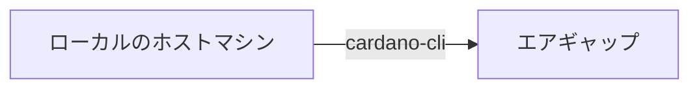
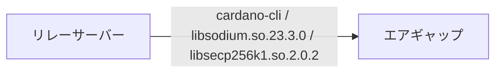

このガイドは ノードバージョン`10.7.1`に対応しています。  

最終更新日：2026年5月5日  

<Callout type="info" title="バージョン対応表">

* <span style={{color: "red"}}>各依存関係もバージョンアップしてますのでよくお読みになって進めてください</span>

| OS | Node | CLI | GHC | Cabal | CNCLI |
| :---------- | :---------- | :---------- | :---------- | :---------- | :---------- |
| ubuntu 24.04.* | 10.7.1 | 10.16.0.0 | 9.6.7 | 3.12.1.0 | 6.7.0 |

**■アップデートパターンDB再構築有無**

| バージョン | DB再構築有無 | 設定ファイル更新有無 | トポロジーファイル更新有無 |
| :---------- | :---------- | :---------- | :---------- |
| 10.6.4 → 10.7.1 | あり | 更新あり | なし |

</Callout>


<Callout type="warn" title="留意点">

- 作業実施前にブロック生成スケジュールを確認してください。  
- 今回のアップデートではDB更新があるため、ブロック生成が2時間以上無いことを確認してください。   
- 複数行のコードをコードボックスのコピーボタンを使用してコマンドラインに貼り付ける場合は、最後の行が自動実行されないため確認の上Enterを押してコードを実行してください。  
- OSバージョンアップを完了していること  
[Ubuntu22.04から24.04へ移行](/docs/cardano/operation/ubuntu24-migration)

</Callout>


<AccordionsBlue type="single">
  <Accordion id="node-update-major-changes" title="主な変更点と新機能および検証結果">

<Callout type="info" title="cardano-node">


**10.7.1 <span style={{color: "red"}}>マイナーアップデート</span>**  

- 10.7.0で確認されたパフォーマンス問題を修正し、Plutus・Consensus・トレーシングの改善を含むマイナーアップデート  
- PraosModeを有効  

**10.6.4 <span style={{color: "red"}}>Plutusインタープリタに対する多数の修正と改善リリース</span>**

- ソースビルドの場合 blst v0.3.14使用必須
- PraosModeを有効

**10.5.3 <span style={{color: "red"}}>バグ修正緊急リリース</span>**

- cardano-crypto-classライブラリ参照先修正
- ソースビルドの場合 blst v0.3.14使用必須
- PraosModeのみ有効

**10.5.2 <span style={{color: "red"}}>バグ修正緊急リリース</span>**  

<span style={{color: "red"}}> 10.3.x, 10.4.x or 10.5.xをご利用中の場合は速やかに10.5.2へアップグレードしてください</span>

1）ハッシュサイズに関する問題  
2）ネットワークスタック内の ピア選択の不具合  
を修正しています。

特定の条件下では、ネットワークの Periodic Churn（定期的な入れ替え） の仕組みが正しく機能せず、十分な数の「Warm ピア」を降格できない状態になるバグが発見されました。
その結果、長期的に見て アクティブピアのサンプリング（選定）が十分多様化しないことが懸念されます。

SPOはこのリリースへのアップグレードが推奨されます。  

- PraosMode推奨

**10.5.1**  

- Windowsのソケットに関する不具合の修正
- DNSルックアップエラーのキャッシュ時間の短縮
- PeerSharing設定動作の改良
- `--non-producer-node` の代わりに `--start-as-non-producer-node` を使うようにコマンドラインオプションが変更（旧オプションは非推奨に）

**10.5.0**

- Ouroboros Genesis の最適化
- GHC 8.10 のサポート削除

**10.4.1**

* UTxO-HD統合  
<span style={{color: "red"}}>現時点ではプール運営のノードではディスクバックエンドは非推奨のため、当マニュアルではインメモリバックエンドセットアップで構築されています</span>  
UTxO-HDの概要については[こちら](https://docs.google.com/presentation/d/16gJt5k9p3H9ycwHNO6O0HGb0cYvRpbwhUsvH4kFEthM/edit?usp=sharing)をご参照ください
* config.json内 `LedgerDB`新しいキーを設定

</Callout>


<Callout type="info" title="cardano-cli v10.16.0.0">


- BLS鍵に関する機能が追加されたアップデート。  
- BLS鍵の生成・ハッシュ化、およびProof of Possession（所有証明）の生成に対応。

</Callout>


<Callout type="info" title="検証結果">

■検証環境
PreProd-Testnet / cardano-node 10.7.1 / cardano-cli 10.16.0.0 / SJG-TOOL 4.1.2  

| 検証項目 | 結果 |
| :---------- | :---------- |
| ソースコードビルド | ✅ |
| ブロック生成 | ✅ |
| リソース監視 | ✅ |
| 報酬出金 | ✅ |
| ウォレット送金 | ✅ |
| KES更新 | ✅ |
| ガバナンス投票 | ✅ |

</Callout>


  </Accordion>
</AccordionsBlue>


## 1. 依存環境アップデート [#sec-1]

**現在のノードバージョンを変数に代入**
```bash
current_node=$(cardano-node version | grep cardano-node)
echo $current_node
```

### 1-1. システムのアップデートと依存関係のインストール [#sec-2]

```bash
sudo apt update && sudo apt upgrade -y
```
```bash
sudo apt install bc curl htop nano needrestart protobuf-compiler rsync ufw zstd automake build-essential pkg-config libffi-dev libgmp-dev libssl-dev libncurses-dev libsystemd-dev zlib1g-dev make g++ tmux git jq wget libtool autoconf liblmdb-dev liburing-dev libsnappy-dev -y
```

### 1-2. 依存関係バージョン確認 [#sec-3]

**cabalバージョン確認**
```bash
cabal --version
```
```yaml title="期待される表示例：" noCopy
cabal-install version 3.12.1.0
compiled using version 3.12.1.0 of the Cabal library 
```

**GHCバージョン確認**
```bash
ghc --version
```
```yaml title="期待される表示例：" noCopy
The Glorious Glasgow Haskell Compilation System, version 9.6.7
```

**libsodiumコミット確認**
```bash
cd $HOME/git/libsodium
git branch --contains | grep -m1 HEAD | cut -c 21-28
```
```yaml title="期待される表示例：" noCopy
dbb48cce
```


**secp256k1バージョン確認**
```bash
cd $HOME/git/secp256k1
git branch --contains | grep -m1 HEAD | cut -c 21-27
```
```yaml title="期待される表示例：" noCopy
acf5c55
```


**Blstバージョン確認**  
インストール済みバージョン
```bash
cat /usr/local/lib/pkgconfig/libblst.pc | grep Version
```
```yaml title="期待される表示例：" noCopy
Version: 0.3.14
```


各アプリのバージョン（戻り値）が上記と異なる場合は、該当する項目を開いて対応してください。

<AccordionsRed type="multiple">
  <Accordion id="node-update-cabal-below-3810" title="cabal 3.8.1.0以下の場合">

**cabal 3.8.1.0以下の場合のみ実行**
**cabalバージョンアップ**
```bash
ghcup upgrade
ghcup install cabal 3.12.1.0
ghcup set cabal 3.12.1.0
```

cabalバージョン確認
```bash
cabal --version
```
```yaml title="期待される表示例：" noCopy
cabal-install version 3.12.1.0
compiled using version 3.12.1.0 of the Cabal library 
```

  </Accordion>

  <Accordion id="node-update-ghc-not-967" title="GHC 9.6.7以外の場合 (9.6.7より新しい場合を含む)">

```bash
ghcup upgrade
ghcup install ghc 9.6.7
ghcup set ghc 9.6.7
```

ghcバージョン確認
```bash
ghc --version
```
```yaml title="期待される表示例：" noCopy
The Glorious Glasgow Haskell Compilation System, version 9.6.7
```

  </Accordion>

  <Accordion id="node-update-libsodium-commit" title="libsodiumコミット値が違う場合">

```bash
cd ~/git/libsodium
git fetch --all --prune
git checkout dbb48cc
./autogen.sh
sleep 1
./configure
make
make check
sudo make install
```
> `make`コマンド実行後半に出現する `warning` は無視して大丈夫です。

  </Accordion>

  <Accordion id="node-update-secp256k1-commit" title="secp256k1コミット値が違うまたは戻り値が無い場合">

```bash
cd $HOME/git/secp256k1/
git fetch --all --prune --recurse-submodules --tags
git checkout acf5c55
./autogen.sh
sleep 1
./configure --prefix=/usr --enable-module-schnorrsig --enable-experimental
make
make check
```
```yaml title="期待される表示例：" noCopy
Testsuite summary for libsecp256k1 0.3.2
============================================================================
# TOTAL: 3
# PASS:  3
# SKIP:  0
# XFAIL: 0
# FAIL:  0
# XPASS: 0
# ERROR: 0
============================================================================
```
> PASS:3であることを確認する


**インストールコマンドを必ず実行する**
```bash
sudo make install
```

  </Accordion>

  <Accordion id="node-update-blst-old-or-missing" title="Blst 0.3.13以下または「No such file or directory」の場合">

<Tabs items={["0.3.13以下の場合", "「No such file or directory」の場合"]}>
<Tab value="0.3.13以下の場合">

```bash
cd $HOME/git/blst
git fetch --all --prune --recurse-submodules --tags
git checkout tags/v0.3.14
./build.sh
```

</Tab>
<Tab value="「No such file or directory」の場合">

```bash
cd $HOME/git
git clone https://github.com/supranational/blst
cd blst
git checkout v0.3.14
./build.sh
```

</Tab>
</Tabs>

設定ファイル作成

```bash
cat > libblst.pc << EOF
prefix=/usr/local
exec_prefix=\${prefix}
libdir=\${exec_prefix}/lib
includedir=\${prefix}/include

Name: libblst
Description: Multilingual BLS12-381 signature library
URL: https://github.com/supranational/blst
Version: 0.3.14
Cflags: -I\${includedir}
Libs: -L\${libdir} -lblst
EOF
```

設定ファイルコピー
```bash
sudo cp libblst.pc /usr/local/lib/pkgconfig/
```
```bash
sudo cp bindings/blst_aux.h bindings/blst.h bindings/blst.hpp  /usr/local/include/
```
```bash
sudo cp libblst.a /usr/local/lib
```
```bash
sudo chmod u=rw,go=r /usr/local/{lib/{libblst.a,pkgconfig/libblst.pc},include/{blst.{h,hpp},blst_aux.h}}
```

バージョン確認
```bash
cat /usr/local/lib/pkgconfig/libblst.pc | grep Version
```
```yaml title="期待される表示例：" noCopy
Version: 0.3.14
```

  </Accordion>
</AccordionsRed>


### 1-3. CNCLIバージョン確認(BPのみ) [#sec-4]

CNCLIバージョン確認
```bash
cncli --version
```
```yaml title="期待される表示例：" noCopy
cncli v6.7.0 <8162cfb> (x86_64-unknown-linux-gnu)
```

<AccordionsRed type="single">
  <Accordion id="node-update-cncli-below-660" title="cncli v6.6.0以下だった場合">

**CNCLIのアップデート**

```bash
cd $HOME
cncli_release="$(curl -s https://api.github.com/repos/cardano-community/cncli/releases/latest | jq -r '.tag_name' | sed -e "s/^.\{1\}//")"
```
```bash
curl -sLJ https://github.com/cardano-community/cncli/releases/download/v${cncli_release}/cncli-${cncli_release}-ubuntu22-x86_64-unknown-linux-musl.tar.gz -o $HOME/cncli-${cncli_release}-x86_64-unknown-linux-musl.tar.gz
```
```bash
tar xzvf $HOME/cncli-${cncli_release}-x86_64-unknown-linux-musl.tar.gz -C $HOME/.cargo/bin/
```
```bash
rm $HOME/cncli-${cncli_release}-x86_64-unknown-linux-musl.tar.gz
```

バージョン確認
```bash
cncli --version
```
```yaml title="期待される表示例：" noCopy
cncli v6.7.0 <8162cfb> (x86_64-unknown-linux-gnu)
```

  </Accordion>
</AccordionsRed>


## 2. ノードアップデート [#sec-5]

<Callout type="info" title="バイナリファイルインストール方法の違いについて">


* **_ビルド済みバイナリ_**・・・IntersectMBOリポジトリソースコードからビルドされたバイナリファイルをダウンロードします。ビルド不要のためビルド時間を短縮できます。 

* **_ソースコードからビルド_**・・・ご自身のサーバーでソースコードからビルドしてバイナリファイルを作成します。検証目的やソースコードからビルドしたい場合に利用できます。ビルドに30分前後かかります。Raspberry Piを使用してプールを構築する場合は、ARM用コンパイラでコンパイルする必要があります。

</Callout>


<Tabs items={["ビルド済みバイナリを使用する場合", "ソースコードからビルドする場合はこちら"]}>
<Tab value="ビルド済みバイナリを使用する場合">


### 2-1. バイナリダウンロード [#sec-6]

旧バイナリの削除
```bash
rm -rf $HOME/git/cardano-node-old/
```

バイナリファイルのダウンロード
```bash
mkdir $HOME/git/cardano-node2
cd $HOME/git/cardano-node2
wget -q https://github.com/IntersectMBO/cardano-node/releases/download/10.7.1/cardano-node-10.7.1-linux-amd64.tar.gz
```

解凍
```bash
tar zxvf cardano-node-10.7.1-linux-amd64.tar.gz ./bin/cardano-node ./bin/cardano-cli ./bin/snapshot-converter
```

**バージョンの確認**

```bash
$(find $HOME/git/cardano-node2 -type f -name "cardano-cli") version  
$(find $HOME/git/cardano-node2 -type f -name "cardano-node") version  
```
以下の戻り値を確認します。  
```yaml title="期待される表示例：" noCopy
cardano-cli 10.16.0.0 - linux-x86_64 - ghc-9.6  
git rev 045bc187a36ef0cbd236db902b85dd8f202fb059

cardano-node 10.7.1 - linux-x86_64 - ghc-9.6  
git rev 045bc187a36ef0cbd236db902b85dd8f202fb059
```


**ノードの停止** 
```bash
sudo systemctl stop cardano-node
```

### 2-2. バイナリインストール [#sec-7]

**バイナリーファイルをシステムフォルダーへコピー**

```bash
sudo cp $(find $HOME/git/cardano-node2 -type f -name "cardano-cli") /usr/local/bin/cardano-cli
```
```bash
sudo cp $(find $HOME/git/cardano-node2 -type f -name "cardano-node") /usr/local/bin/cardano-node
```

**システムに反映されたノードバージョンの確認**

```bash
cardano-cli version
cardano-node version
```

以下の戻り値を確認します。
```yaml title="期待される表示例：" noCopy
cardano-cli 10.16.0.0 - linux-x86_64 - ghc-9.6  
git rev 045bc187a36ef0cbd236db902b85dd8f202fb059

cardano-node 10.7.1 - linux-x86_64 - ghc-9.6  
git rev 045bc187a36ef0cbd236db902b85dd8f202fb059
```

</Tab>
<Tab value="ソースコードからビルドする場合はこちら">

**ソースコードダウンロード**

**現在のノードバージョンを変数に代入**
```bash
current_node=$(cardano-node version | grep cardano-node)
echo $current_node
```

TMUXセッションを展開
```bash
tmux new -s build
```
> アップデート作業中にSSHが中断した場合は、`tmux a -t build`で再開できます。

以前ビルドしたディレクトリの削除
```bash
rm -rf $HOME/git/cardano-node-old/
```

ソースコードのダウンロード
```bash
cd $HOME/git
git clone https://github.com/IntersectMBO/cardano-node.git cardano-node2
cd cardano-node2/
```

**2-2.ソースコードからビルド**

```bash
cabal clean
cabal update
```

```bash
git fetch --all --recurse-submodules --tags
git checkout tags/10.7.1
cabal configure --with-compiler=ghc-9.6.7
```

```bash
cabal build all cardano-cli
```
<Callout type="info" title="ヒント">

* ビルド完了までに数十分ほどかかります。
* SSH接続が途中で切断された場合、再度接続して`tmux a -t build`で再開してください。  
* ビルド中にデタッチ(Ctrl+B D)してバックグラウンド処理へ切り替えられます。

</Callout>


**バージョン確認**

```bash
$(./scripts/bin-path.sh cardano-cli) version  
$(./scripts/bin-path.sh cardano-node) version  
```

以下の戻り値を確認します。
```yaml title="期待される表示例：" noCopy
cardano-cli 10.16.0.0 - linux-x86_64 - ghc-9.6  
git rev 045bc187a36ef0cbd236db902b85dd8f202fb059

cardano-node 10.7.1 - linux-x86_64 - ghc-9.6  
git rev 045bc187a36ef0cbd236db902b85dd8f202fb059
```

**ビルド用TMUXセッションを終了します。** 
```bash
exit
```

**ノードの停止** 
```bash
sudo systemctl stop cardano-node
```

**バイナリーファイルをシステムフォルダーへコピー**

```bash
cd $HOME/git/cardano-node2
sudo cp $(./scripts/bin-path.sh cardano-cli) /usr/local/bin/cardano-cli
```
```bash
sudo cp $(./scripts/bin-path.sh cardano-node) /usr/local/bin/cardano-node
```

**システムに反映されたノードバージョンの確認**

```bash
cardano-cli version
cardano-node version
```

以下の戻り値を確認します。
```yaml title="期待される表示例：" noCopy
cardano-cli 10.16.0.0 - linux-x86_64 - ghc-9.6  
git rev 045bc187a36ef0cbd236db902b85dd8f202fb059

cardano-node 10.7.1 - linux-x86_64 - ghc-9.6  
git rev 045bc187a36ef0cbd236db902b85dd8f202fb059
```

<AccordionsYellow type="single">
  <Accordion id="node-update-from-1031-below-extra" title="10.3.1以下からアップデートする場合はこちらも実施">

**snapshot-converterのダウンロード**
```bash
cd $HOME/git/cardano-node2
wget -q https://github.com/IntersectMBO/cardano-node/releases/download/10.7.1/cardano-node-10.7.1-linux-amd64.tar.gz
```
解凍
```bash
tar zxvf cardano-node-10.7.1-linux-amd64.tar.gz ./bin/snapshot-converter
```

  </Accordion>
</AccordionsYellow>


</Tab>
</Tabs>

### 2-3. 設定ファイル更新 [#sec-8]

既存ファイルのバックアップ
```bash
mkdir -p $NODE_HOME/backup
cp $NODE_HOME/${NODE_CONFIG}-config.json $NODE_HOME/backup/${NODE_CONFIG}-config.json
```


設定ファイルダウンロード

BPとリレー共通：
```bash
cd $NODE_HOME
wget -q https://spojapanguild.net/node_config/10.7.1/${NODE_CONFIG}-config.json -O ${NODE_CONFIG}-config.json
wget -q https://spojapanguild.net/node_config/10.7.1/${NODE_CONFIG}-checkpoints.json -O ${NODE_CONFIG}-checkpoints.json
```


<AccordionsYellow type="single">
  <Accordion id="node-update-from-1014-extra" title="10.1.4~からアップデートする場合はこちらも実施">


<Callout type="info" title="BPのみ">

起動スクリプト更新 
```bash
PORT=`grep "PORT=" $NODE_HOME/startBlockProducingNode.sh`
b_PORT=${PORT#"PORT="}
echo "BPポートは ${b_PORT} です"
```
> BPのポート番号が表示されることを確認します。

```bash
cat > $NODE_HOME/startBlockProducingNode.sh << EOF 
#!/bin/bash
DIRECTORY=$NODE_HOME
PORT=${b_PORT}
HOSTADDR=0.0.0.0
TOPOLOGY=\${DIRECTORY}/${NODE_CONFIG}-topology.json
DB_PATH=\${DIRECTORY}/db
SOCKET_PATH=\${DIRECTORY}/db/socket
CONFIG=\${DIRECTORY}/${NODE_CONFIG}-config.json
KES=\${DIRECTORY}/kes.skey
VRF=\${DIRECTORY}/vrf.skey
CERT=\${DIRECTORY}/node.cert
/usr/local/bin/cardano-node +RTS -N --disable-delayed-os-memory-return -I0.1 -Iw300 -A32m -n4m -F1.5 -H2500M -RTS run --topology \${TOPOLOGY} --database-path \${DB_PATH} --socket-path \${SOCKET_PATH} --host-addr \${HOSTADDR} --port \${PORT} --config \${CONFIG} --shelley-kes-key \${KES} --shelley-vrf-key \${VRF} --shelley-operational-certificate \${CERT}
EOF
```

</Callout>


<Callout type="info" title="全ノード">

**DB更新**  

**Mithrilインストール**
```bash
cd $HOME/git
mithril_release="$(curl -s https://api.github.com/repos/input-output-hk/mithril/releases/latest | jq -r '.tag_name')"
wget https://github.com/input-output-hk/mithril/releases/download/${mithril_release}/mithril-${mithril_release}-linux-x64.tar.gz -O mithril.tar.gz
```

設定
```bash
tar zxvf mithril.tar.gz mithril-client
sudo cp mithril-client /usr/local/bin/mithril-client
```

パーミッション設定
```bash
sudo chmod +x /usr/local/bin/mithril-client
```

DLファイル削除
```bash
rm mithril.tar.gz mithril-client
```

バージョン確認
```bash
mithril-client -V
```
> Mithril Githubの[リリースノート](https://github.com/input-output-hk/mithril/releases/latest)内にある`mithril-client-cli`のバージョンをご確認ください。


スナップショット復元

作業用TMUX起動
```bash
tmux new -s mithril
```

変数セット
```bash
export AGGREGATOR_ENDPOINT=https://aggregator.release-mainnet.api.mithril.network/aggregator
export GENESIS_VERIFICATION_KEY=$(wget -q -O - https://raw.githubusercontent.com/input-output-hk/mithril/main/mithril-infra/configuration/release-mainnet/genesis.vkey)
export ANCILLARY_VERIFICATION_KEY=$(wget -q -O - https://raw.githubusercontent.com/input-output-hk/mithril/main/mithril-infra/configuration/release-mainnet/ancillary.vkey)
export SNAPSHOT_DIGEST=latest
```

<Callout type="info" title="旧dbをバックアップしたい方はこちら">

<Callout type="error" title="空き容量に関しての注意事項">

DBをバックアップする場合、サーバーディスクの空き容量をご確認ください。
安定稼働のためには250GB以上の空き容量が必要です。
```bash
df -h /usr | awk '{print $4}'
```
<strong><span style={{color: "red"}}>Availが250GB以上あることを確認してください。</span></strong>

</Callout>


リネーム
```bash
mv $NODE_HOME/db/ $NODE_HOME/backup/db9/
```

<Callout type="error" title="ノードバージョンアップ後の作業">

稼働に問題がないことが確認でき次第削除することをお勧めします。
```bash
rm -rf $NODE_HOME/backup/db9/
```

</Callout>


</Callout>


既存DBの削除
```bash
rm -rf $NODE_HOME/db
```

最新スナップショットDL
```bash
mithril-client cardano-db download \
  --download-dir $NODE_HOME \
  --include-ancillary \
  $SNAPSHOT_DIGEST
```
> スナップショットダウンロード～解凍まで自動的に行われます。1/7～7/7が終了するまで待ちましょう。  

DBスナップショットDL/解凍完了メッセージ  
```yaml title="期待される表示例：" noCopy
7/7 - Verifying the cardano db signature…    
Cardano database snapshot '*****' archives have been successfully unpacked. Immutable files have been successfully verified with Mithril.
```

tmux作業ウィンドウを終了します。
```bash
exit
```

</Callout>


  </Accordion>
</AccordionsYellow>


### 2-4. DB更新 [#sec-9]

<Tabs items={["全ノード"]}>
<Tab value="全ノード">


**Mithrilインストール**
```bash
cd $HOME/git
mithril_release="$(curl -s https://api.github.com/repos/input-output-hk/mithril/releases/latest | jq -r '.tag_name')"
wget https://github.com/input-output-hk/mithril/releases/download/${mithril_release}/mithril-${mithril_release}-linux-x64.tar.gz -O mithril.tar.gz
```

設定
```bash
tar zxvf mithril.tar.gz mithril-client
sudo cp mithril-client /usr/local/bin/mithril-client
```

パーミッション設定
```bash
sudo chmod +x /usr/local/bin/mithril-client
```

DLファイル削除
```bash
rm mithril.tar.gz mithril-client
```

バージョン確認
```bash
mithril-client -V
```
> Mithril Githubの[リリースノート](https://github.com/input-output-hk/mithril/releases/latest)内にある`mithril-client-cli`のバージョンをご確認ください。


スナップショット復元

作業用TMUX起動
```bash
tmux new -s mithril
```

変数セット
```bash
export AGGREGATOR_ENDPOINT=https://aggregator.release-mainnet.api.mithril.network/aggregator
export GENESIS_VERIFICATION_KEY=$(wget -q -O - https://raw.githubusercontent.com/input-output-hk/mithril/main/mithril-infra/configuration/release-mainnet/genesis.vkey)
export ANCILLARY_VERIFICATION_KEY=$(wget -q -O - https://raw.githubusercontent.com/input-output-hk/mithril/main/mithril-infra/configuration/release-mainnet/ancillary.vkey)
export SNAPSHOT_DIGEST=latest
```

既存DBの削除
```bash
rm -rf $NODE_HOME/db
```

最新スナップショットDL
```bash
mithril-client cardano-db download \
  --download-dir $NODE_HOME \
  --include-ancillary \
  $SNAPSHOT_DIGEST
```
> スナップショットダウンロード～解凍まで自動的に行われます。1/5～7/7が終了するまで待ちましょう。  

DBスナップショットDL/解凍完了メッセージ  
```yaml title="期待される表示例：" noCopy
7/7 - Verifying the cardano db signature…    
Cardano database snapshot '*****' archives have been successfully unpacked. Immutable files have been successfully verified with Mithril.
```

tmux作業ウィンドウを終了します。
```bash
exit
```

</Tab>
</Tabs>

### 2-5. サーバー再起動 [#sec-10]

**作業フォルダリネーム**

以前のバージョンで使用していたバイナリフォルダをリネームし、バックアップとして保持します。  
最新バージョンを構築したフォルダをcardano-nodeとして使用します。

```bash
cd $HOME/git
mv cardano-node/ cardano-node-old/
mv cardano-node2/ cardano-node/
```

サーバーの再起動
```bash
sudo reboot
```

SSH接続後、ノード同期状況の確認
```bash
sudo journalctl --unit=cardano-node --follow
```


<Callout type="info" title="ノードログメッセージ確認">


以下のメッセージがログに含まれている場合に同期状況を判断できます。

| メッセージ | ステータス |
| :---------- | :---------- |
| `Chain extended, new tip: xxxxxxxx at slot xxxxxx`| チェーン同期成功 |
| `GenesisReadFileError`| ジェネシスファイルエラー |
| `InvalidYaml` | 設定ファイルエラー |
| `Invalid option` | 起動オプションエラー |
| `Invalid argument` | 起動コマンドエラー |
| `Address in use` | ノード起動ポートが競合しています |

</Callout>


## 3. 依存関係作業 [#sec-11]

### 3-1. リレー/BP共通 [#sec-12]

**gLiveView更新**
```bash
sed -i $NODE_HOME/scripts/env \
    -e '1,73s!UPDATE_CHECK="N"!UPDATE_CHECK="Y"!' \
    -e '1,73s!#PROM_HOST=127.0.0.1!PROM_HOST=127.0.0.1!' \
    -e '1,73s!#PROM_PORT=12798!PROM_PORT=12798!'
```

**gliveの起動**
```bash
glive
```

更新メッセージが表示されたら`yes`を入力して`enter`  
```yaml title="期待される表示例：" noCopy
env script update(s) detected, do you want to download the latest version? (yes/no): yes
```

gLiveView.sh更新完了のメッセージが表示されたら再度`enter`  
```yaml title="期待される表示例：" noCopy
gLiveView.sh update successfully applied!  
press any key to proceed ..
```


**更新フラグの切り替え**
```bash
sed -i $NODE_HOME/scripts/env \
    -e '1,73s!UPDATE_CHECK="Y"!UPDATE_CHECK="N"!'
```

**gliveバージョン確認**
```bash
glive
```
```yaml title="期待される表示例：" noCopy
Koios gLiveView v1.32.0
```


### 3-2. BPサービス確認 [#sec-13]

<AccordionsYellow type="single">
  <Accordion id="node-update-blocknotify-missing" title="blocknotify（SPO Block Notify）未導入・未更新の場合">

<Tabs items={["未導入の方で今後も導入予定が無い方", "新規導入または更新する方"]}>
<Tab value="未導入の方で今後も導入予定が無い方">

[5. サービスファイル作成・登録](/docs/cardano/setup/blocklog-setup#sec-5)を再実行してください。（エイリアス設定は不要です）

</Tab>
<Tab value="新規導入または更新する方">

[SPO BlockNotify設定](/docs/cardano/setup/blocknotify-setup)から新規導入または更新を実施してください。

</Tab>
</Tabs>


  </Accordion>
</AccordionsYellow>


BPノードが完全に同期した後、サービス起動状態を確認します。

* cnclilog  
* leaderlog  
* validate  
* logmonitor  
* blocknotify(SPO Block Notifyを導入している場合)


<AccordionsRed type="single">
  <Accordion id="node-update-cnclilog-missing-etav" title="cnclilogで`Missing eta_v for block xxxxxx` エラーが出る場合の対処法">

cncliを再同期してください。

```bash
sudo systemctl stop cnode-cncli-sync.service
```
```bash
rm $NODE_HOME/guild-db/cncli/*
```
```bash
sudo systemctl restart cnode-cncli-sync.service
```
```bash
cnclilog
```
100% sync'dになるまでお待ち下さい。

  </Accordion>
</AccordionsRed>


### 3-3. Grafanaアラートの対象メトリクス変更 [#sec-14]

左ペインの「Alerting」→「Alert rules」→「ノード監視」→「BPリレー接続監視」のメトリクスを変更して保存します。  
`cardano_node_metrics_peers_connectedPeers_int`から  
```bash
cardano_node_metrics_peerSelection_ActivePeers
```
へと変更してください。


## 4. エアギャップアップデート [#sec-15]
<Callout type="info" title="SFTP機能ソフト導入">

R-loginの転送機能が遅いので、大容量ファイルをダウン・アップロードする場合は、SFTP接続可能なソフトを使用すると効率的です。（FileZilaなど）  
ファイル転送には[SFTPソフト設定](/docs/cardano/operation/sftp-setup)を行ってください。

</Callout>


<Tabs items={["ビルド済みバイナリをダウンロードした場合", "ソースコードからビルドした場合"]}>
<Tab value="ビルド済みバイナリをダウンロードした場合">

<Tabs items={["リレーサーバー"]}>
<Tab value="リレーサーバー">

```bash
sudo cp $(find $HOME/git/cardano-node -type f -name "cardano-cli") ~/cardano-cli
```

</Tab>
</Tabs>


USBを用いて`cardano-cli`をエアギャップに移動します。


<Tabs items={["エアギャップ"]}>
<Tab value="エアギャップ">

**ディレクトリ作成**
```bash
mkdir -p $HOME/git/cardano-node2
```
> $HOME/git/cardano-node2/ に`cardano-cli`を格納します。  


**`cardano-cli` バイナリの配置**
```bash
sudo cp $(find $HOME/git/cardano-node2 -type f -name "cardano-cli") /usr/local/bin/cardano-cli
```
```bash
sudo chmod +x /usr/local/bin/cardano-cli
```

**バージョンの確認**
```bash
cardano-cli version
```

**戻り値確認**
```yaml title="期待される表示例：" noCopy
cardano-cli 10.16.0.0 - linux-x86_64 - ghc-9.6  
git rev 045bc187a36ef0cbd236db902b85dd8f202fb059
```

</Tab>
</Tabs>


</Tab>
<Tab value="ソースコードからビルドした場合">

<Tabs items={["リレーサーバー"]}>
<Tab value="リレーサーバー">

```bash
cd $HOME/git/cardano-node
sudo cp $(./scripts/bin-path.sh cardano-cli) ~/cardano-cli
```

**必要ライブラリ取得**
```bash
cp /usr/local/lib/libsodium.so.23.3.0 $HOME/libsodium.so.23.3.0
cp /lib/libsecp256k1.so.2.0.2 $HOME/libsecp256k1.so.2.0.2
```

**確認**
```bash
ll $HOME/cardano-cli $HOME/libsodium.so.23.3.0 $HOME/libsecp256k1.so.2.0.2
```

**戻り値確認**
```yaml title="期待される表示例：" noCopy
cardano-cli
libsecp256k1.so.2.0.2
libsodium.so.23.3.0
```

</Tab>
</Tabs>

<Callout type="warn" title="ファイル転送">

USBを用いて`cardano-cli`、`libsodium.so.23.3.0`、`libsecp256k1.so.2.0.2`をエアギャップの$HOME/git/cardano-node2に移動します。


</Callout>


エアギャップマシンで以下を実行します。
<Tabs items={["エアギャップ"]}>
<Tab value="エアギャップ">

**ディレクトリ作成**
```bash
mkdir -p $HOME/git/cardano-node2
```

**cardano-cliの配置**
```bash
sudo cp $HOME/git/cardano-node2/cardano-cli /usr/local/bin/cardano-cli
```
**権限付与**
```bash
sudo chmod +x /usr/local/bin/cardano-cli
```
**依存ライブラリ配置用ディレクトリ作成**
```bash
sudo mkdir -p /usr/local/lib
```
**`lib`ディレクトリに`libsodium.so.23.3.0`、`libsecp256k1.so.2.0.2`を配置**
```bash
sudo cp $HOME/git/cardano-node2/libsodium.so.23.3.0 /usr/local/lib/
```
```bash
sudo cp $HOME/git/cardano-node2/libsecp256k1.so.2.0.2 /usr/local/lib/
```

**権限設定**
```bash
sudo chown root:root /usr/local/lib/libsodium.so.23.3.0
```
```bash
sudo chown root:root /usr/local/lib/libsecp256k1.so.2.0.2
```
```bash
sudo chmod 755 /usr/local/lib/libsodium.so.23.3.0
```
```bash
sudo chmod 755 /usr/local/lib/libsecp256k1.so.2.0.2
```

**シンボリックリンク作成**
```bash
cd /usr/local/lib
```

**libsodium**
```bash
sudo ln -sf libsodium.so.23.3.0 libsodium.so.23
```
```bash
sudo ln -sf libsodium.so.23 libsodium.so
```

**libsecp256k1**
```bash
sudo ln -sf libsecp256k1.so.2.0.2 libsecp256k1.so.2
```
```bash
sudo ln -sf libsecp256k1.so.2 libsecp256k1.so
```

**リンカーの更新**
```bash
echo '/usr/local/lib' | sudo tee /etc/ld.so.conf.d/local.conf
sudo ldconfig
```

**依存関係確認**
```bash
ldd /usr/local/bin/cardano-cli
```

**戻り値確認**
```yaml title="期待される表示例：" noCopy
libsodium.so.23 => /usr/local/lib/libsodium.so.23
libsecp256k1.so.2 => /usr/local/lib/libsecp256k1.so.2
```

**cardano-cliの動作確認**
```bash
cardano-cli version
```

**戻り値確認**
```yaml title="期待される表示例：" noCopy
cardano-cli 10.16.0.0 - linux-x86_64 - ghc-9.6  
git rev 045bc187a36ef0cbd236db902b85dd8f202fb059
```


</Tab>
</Tabs>


</Tab>
</Tabs>

---