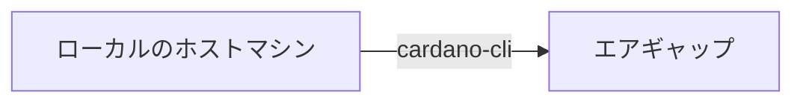

このガイドは ノードバージョン`11.1.2`に対応しています。  

<LastUpdated />

<Callout type="warn" title="留意点">
`11.0.1`以前から`11.1.2`へのアップデートでは大幅な変更があります。

- ログシステム変更(cardano-tracer常駐)
- stdoutログ形式をJSONに変更
- Configファイル変更(cardano-tracer用)
- Prometheus設定変更
- GenesisModeへ切り替え
- Topologyファイルアップデート
- ブロックログ関連スクリプトアップデート
- BlockNotifyアップデート
- SJGTOOLアップデート
- blocks.shアップデート
- Grafana本体のアップデート（13.2.2）
- Grafanaダッシュボードアップデート

{/* - 作業実施前にブロック生成スケジュールを確認してください。  
- 今回のアップデートではDB更新があるため、ブロック生成が2時間以上無いことを確認してください。    
- 複数行のコードをコードボックスのコピーボタンを使用してコマンドラインに貼り付ける場合は、最後の行が自動実行されないため確認の上`Enter`を押してコードを実行してください。 */} 

</Callout>

<Callout type="info" title="バージョン対応表">

**<span style={{color: "red"}}>各依存関係もバージョンアップしてますのでよくお読みになって進めてください</span>**

| OS | Node | CLI | GHC | Cabal | CNCLI |
| :----------: | :----------: | :----------: | :----------: | :----------: | :----------: |
| ubuntu 24.04.* | 11.1.2 | 11.2.3.0 | 9.6.7 | 3.12.1.0 | 6.8.0 |

**■アップデートパターンDB再構築有無**

| バージョン | DB再構築有無 | 設定ファイル更新有無 | トポロジーファイル更新有無 |
| :----------: | :----------: | :----------: | :----------: |
| 11.0.1 → 11.1.2 | なし | 更新あり | 更新あり |

</Callout>

<AccordionsBlue type="single">
  <Accordion id="node-update-major-changes" title="主な変更点と新機能および検証結果">

<Callout type="info" title="cardano-node 11.1.2">

- Time Lock Scriptのメモリ使用量を最適化  
- Block HeaderのProtocol Version minorを更新  
- その他の主要コンポーネントに変更なし  
- 11.1.1のSystem Testing・Benchmark結果を継承  

</Callout>

<Callout type="info" title="cardano-node 11.1.1">

- `Dijkstra` eraに向けたLedger・Consensus・Node機能を更新  
- 旧Tracingシステムを削除し、New Tracingシステムへ完全移行  
- `LedgerDB V1` / `LMDB`を削除し、`LedgerDB V2`へ統一  
- LedgerDB Snapshotの生成・共有に関する仕組みを改善  
- P2Pを唯一のネットワークモードとし、ネットワーク関連機能を更新  
- Mainnet / Preprodの設定ファイルを更新し、`GenesisMode`構成に対応  

</Callout>


<Callout type="info" title="cardano-cli 11.2.3.0">

- `Dijkstra` eraの各種コマンドに対応
- `query kes-period-info` / `query tip`に影響していた不具合を修正
- Dijkstra eraの`transaction view`、Protocol Parameter更新、Simple Scriptなどに対応
- Conway以降のWitnessファイルを`transaction assemble`で扱えるよう修正

</Callout>


<Callout type="info" title="検証結果">

■検証環境
PreProd-Testnet / cardano-node 11.1.2 / cardano-cli 11.2.3.0 / SJG-TOOL 5.0.0  

| 検証項目 | 結果 |
| :----------: | :----------: |
| ソースコードビルド | ✅ |
| ブロック生成 | ✅ |
| リソース監視 | ✅ |
| 報酬出金 | ✅ |
| ウォレット送金 | ✅ |
| KES更新 | ✅ |
| ガバナンス投票 | ✅ |

</Callout>


  </Accordion>
</AccordionsBlue>


## 1. 依存環境アップデート [#sec-1]

**現在のノードバージョンを変数に代入**
```bash
current_node=$(cardano-node version | grep cardano-node)
echo $current_node
```

### システムのアップデートと依存関係のインストール [#sec-2]

```bash
sudo apt update && sudo apt upgrade -y
```

### 依存関係バージョン確認 [#sec-3]

**cabalバージョン確認**
```bash
cabal --version
```
```yaml title="期待される表示例：" noCopy
cabal-install version 3.12.1.0
compiled using version 3.12.1.0 of the Cabal library 
```

**GHCバージョン確認**
```bash
ghc --version
```
```yaml title="期待される表示例：" noCopy
The Glorious Glasgow Haskell Compilation System, version 9.6.7
```

**libsodiumコミット確認**
```bash
cd $HOME/git/libsodium
git branch --contains | grep -m1 HEAD | cut -c 21-28
```
```yaml title="期待される表示例：" noCopy
dbb48cce
```


**secp256k1バージョン確認**
```bash
cd $HOME/git/secp256k1
git branch --contains | grep -m1 HEAD | cut -c 21-27
```
```yaml title="期待される表示例：" noCopy
acf5c55
```


**Blstバージョン確認**  
インストール済みバージョン
```bash
cat /usr/local/lib/pkgconfig/libblst.pc | grep Version
```
```yaml title="期待される表示例：" noCopy
Version: 0.3.14
```


各アプリのバージョン（戻り値）が上記と異なる場合は、該当する項目を開いて対応してください。

<AccordionsRed type="multiple">
  <Accordion id="node-update-cabal-below-3810" title="cabal 3.8.1.0以下の場合">

**cabal 3.8.1.0以下の場合のみ実行**
**cabalバージョンアップ**
```bash
ghcup upgrade
ghcup install cabal 3.12.1.0
ghcup set cabal 3.12.1.0
```

cabalバージョン確認
```bash
cabal --version
```
```yaml title="期待される表示例：" noCopy
cabal-install version 3.12.1.0
compiled using version 3.12.1.0 of the Cabal library 
```

  </Accordion>

  <Accordion id="node-update-ghc-not-967" title="GHC 9.6.7以外の場合 (9.6.7より新しい場合を含む)">

```bash
ghcup upgrade
ghcup install ghc 9.6.7
ghcup set ghc 9.6.7
```

ghcバージョン確認
```bash
ghc --version
```
```yaml title="期待される表示例：" noCopy
The Glorious Glasgow Haskell Compilation System, version 9.6.7
```

  </Accordion>

  <Accordion id="node-update-libsodium-commit" title="libsodiumコミット値が違う場合">

```bash
cd ~/git/libsodium
git fetch --all --prune
git checkout dbb48cc
./autogen.sh
sleep 1
./configure
make
make check
sudo make install
```
> `make`コマンド実行後半に出現する `warning` は無視して大丈夫です。

  </Accordion>

  <Accordion id="node-update-secp256k1-commit" title="secp256k1コミット値が違うまたは戻り値が無い場合">

```bash
cd $HOME/git/secp256k1/
git fetch --all --prune --recurse-submodules --tags
git checkout acf5c55
./autogen.sh
sleep 1
./configure --prefix=/usr --enable-module-schnorrsig --enable-experimental
make
make check
```
```yaml title="期待される表示例：" noCopy
Testsuite summary for libsecp256k1 0.3.2
============================================================================
# TOTAL: 3
# PASS:  3
# SKIP:  0
# XFAIL: 0
# FAIL:  0
# XPASS: 0
# ERROR: 0
============================================================================
```
> PASS:3であることを確認する


**インストールコマンドを必ず実行する**
```bash
sudo make install
```

  </Accordion>

  <Accordion id="node-update-blst-old-or-missing" title="Blst 0.3.13以下または「No such file or directory」の場合">

<Tabs items={["0.3.13以下の場合", "「No such file or directory」の場合"]}>
<Tab value="0.3.13以下の場合">

```bash
cd $HOME/git/blst
git fetch --all --prune --recurse-submodules --tags
git checkout tags/v0.3.14
./build.sh
```

</Tab>
<Tab value="「No such file or directory」の場合">

```bash
cd $HOME/git
git clone https://github.com/supranational/blst
cd blst
git checkout v0.3.14
./build.sh
```

</Tab>
</Tabs>

設定ファイル作成

```bash
cat > libblst.pc << EOF
prefix=/usr/local
exec_prefix=\${prefix}
libdir=\${exec_prefix}/lib
includedir=\${prefix}/include

Name: libblst
Description: Multilingual BLS12-381 signature library
URL: https://github.com/supranational/blst
Version: 0.3.14
Cflags: -I\${includedir}
Libs: -L\${libdir} -lblst
EOF
```

設定ファイルコピー
```bash
sudo cp libblst.pc /usr/local/lib/pkgconfig/
```
```bash
sudo cp bindings/blst_aux.h bindings/blst.h bindings/blst.hpp  /usr/local/include/
```
```bash
sudo cp libblst.a /usr/local/lib
```
```bash
sudo chmod u=rw,go=r /usr/local/{lib/{libblst.a,pkgconfig/libblst.pc},include/{blst.{h,hpp},blst_aux.h}}
```

バージョン確認
```bash
cat /usr/local/lib/pkgconfig/libblst.pc | grep Version
```
```yaml title="期待される表示例：" noCopy
Version: 0.3.14
```

  </Accordion>
</AccordionsRed>


### CNCLIバージョン確認 [#sec-4]

<Tabs items={["BP"]}>

<Tab value="BP">

CNCLIバージョン確認
```bash
cncli --version
```
```yaml title="期待される表示例：" noCopy
cncli v6.8.0 <~~~> (x86_64-unknown-linux-gnu)
```

<AccordionsRed type="single">
  <Accordion id="node-update-cncli-below-660" title="cncli v6.7.0以下だった場合">

**CNCLIのアップデート**

```bash
cd $HOME
cncli_release="$(curl -s https://api.github.com/repos/cardano-community/cncli/releases/latest | jq -r '.tag_name' | sed -e "s/^.\{1\}//")"
```
```bash
curl -sLJ https://github.com/cardano-community/cncli/releases/download/v${cncli_release}/cncli-${cncli_release}-ubuntu22-x86_64-unknown-linux-musl.tar.gz -o $HOME/cncli-${cncli_release}-x86_64-unknown-linux-musl.tar.gz
```
```bash
tar xzvf $HOME/cncli-${cncli_release}-x86_64-unknown-linux-musl.tar.gz -C $HOME/.cargo/bin/
```
```bash
rm $HOME/cncli-${cncli_release}-x86_64-unknown-linux-musl.tar.gz
```

バージョン確認
```bash
cncli --version
```
```yaml title="期待される表示例：" noCopy
cncli v6.8.0 <~~~> (x86_64-unknown-linux-gnu)
```

  </Accordion>
</AccordionsRed>

</Tab>

</Tabs>

## 2. ノードアップデート [#sec-5]

<Callout type="info" title="バイナリファイルインストール方法の違いについて">


- **_ビルド済みバイナリ_**・・・IntersectMBOリポジトリソースコードからビルドされたバイナリファイルをダウンロードします。ビルド不要のためビルド時間を短縮できます。 

- **_ソースコードからビルド_**・・・ご自身のサーバーでソースコードからビルドしてバイナリファイルを作成します。検証目的やソースコードからビルドしたい場合に利用できます。ビルドに30分前後かかります。Raspberry Piを使用してプールを構築する場合は、ARM用バイナリを使用する必要があります。

</Callout>


<Tabs items={["ビルド済みバイナリを使用する場合", "ソースコードからビルドする場合はこちら"]}>
<Tab value="ビルド済みバイナリを使用する場合">


### バイナリダウンロード [#sec-6]

旧バイナリの削除
```bash
rm -rf $HOME/git/cardano-node-old/
```

バイナリファイルのダウンロード
```bash
mkdir -p $HOME/git/cardano-node2
cd $HOME/git/cardano-node2
wget -4 https://github.com/IntersectMBO/cardano-node/releases/download/11.1.2/cardano-node-11.1.2-linux-amd64.tar.gz
```

解凍
```bash
tar zxvf cardano-node-11.1.2-linux-amd64.tar.gz ./bin/cardano-node ./bin/cardano-cli ./bin/snapshot-converter ./bin/cardano-tracer
```

**ノードの停止** 
```bash
sudo systemctl stop cardano-node
```

### バイナリインストール [#sec-7]

**バイナリーファイルをシステムフォルダーへコピー**

```bash
sudo cp $(find $HOME/git/cardano-node2 -type f \( -name "cardano-node" -o -name "cardano-cli" -o -name "cardano-tracer" \)) /usr/local/bin/
```

**システムに反映されたノードバージョンの確認**

```bash
cardano-node version
cardano-cli version
cardano-tracer --version
```
```yaml title="期待される表示例：" noCopy
cardano-node 11.1.2 - linux-x86_64 - ghc-9.6
git rev fef83fed01d7926f3de83b3b917be5a4a48768b5

cardano-cli 11.2.3.0 - linux-x86_64 - ghc-9.6
git rev fef83fed01d7926f3de83b3b917be5a4a48768b5

0.5.0
```

</Tab>
<Tab value="ソースコードからビルドする場合はこちら">

**ソースコードダウンロード**

**現在のノードバージョンを変数に代入**
```bash
current_node=$(cardano-node version | grep cardano-node)
echo $current_node
```

TMUXセッションを展開
```bash
tmux new -s build
```
> アップデート作業中にSSHが中断した場合は、`tmux a -t build`で再開できます。

以前ビルドしたディレクトリの削除
```bash
rm -rf $HOME/git/cardano-node-old/
```

ソースコードのダウンロード
```bash
cd $HOME/git
git clone https://github.com/IntersectMBO/cardano-node.git cardano-node2
cd cardano-node2/
```

**2-2.ソースコードからビルド**

```bash
cabal clean
cabal update
```

```bash
git fetch --all --recurse-submodules --tags
git checkout tags/11.1.2
cabal configure --with-compiler=ghc-9.6.7
```

```bash
cabal build all cardano-cli
```
<Callout type="info" title="ヒント">

- ビルド完了までに数十分ほどかかります。
- SSH接続が途中で切断された場合、再度接続して`tmux a -t build`で再開してください。  
- ビルド中にデタッチ(Ctrl+B D)してバックグラウンド処理へ切り替えられます。

</Callout>

`cardano-node`、`cardano-cli`、`cardano-tracer`バイナリをbinディレクトリにコピーします。

ノードの停止
```bash
sudo systemctl stop cardano-node
```

Tracerの停止
```bash
sudo systemctl stop cardano-tracer
```

```bash
cd $HOME/git/cardano-node2
sudo cp -p "$(./scripts/bin-path.sh cardano-node)" "$(./scripts/bin-path.sh cardano-cli)" "$(./scripts/bin-path.sh cardano-tracer)" /usr/local/bin/
```

**cardano-node**、**cardano-cli**、**cardano-tracer**のバージョンが最新Gitタグバージョンであることを確認してください。

```bash
cardano-node version
cardano-cli version
cardano-tracer --version
```

```yaml title="期待される表示例：" noCopy
cardano-node 11.1.2 - linux-x86_64 - ghc-9.6  
git rev fef83fed01d7926f3de83b3b917be5a4a48768b5  

cardano-cli 11.2.3.0 - linux-x86_64 - ghc-9.6  
git rev fef83fed01d7926f3de83b3b917be5a4a48768b5  

0.5.0
```

`TMUX`セッションを閉じます。

```bash
exit
```

</Tab>
</Tabs>

### 設定ファイル更新 [#sec-8]

既存ファイルのバックアップ
```bash
mkdir -p $NODE_HOME/backup

cp $NODE_HOME/${NODE_CONFIG}-byron-genesis.json $NODE_HOME/${NODE_CONFIG}-shelley-genesis.json $NODE_HOME/${NODE_CONFIG}-alonzo-genesis.json $NODE_HOME/${NODE_CONFIG}-conway-genesis.json $NODE_HOME/${NODE_CONFIG}-config.json $NODE_HOME/${NODE_CONFIG}-topology.json $NODE_HOME/backup/
```


設定ファイルをダウンロードします。
```bash
cd $NODE_HOME
WGET_OPTS=(-4 --no-use-server-timestamps --tries=5 --waitretry=3 --connect-timeout=10 --read-timeout=30)
wget "${WGET_OPTS[@]}" https://download.spojapanguild.net/node_config/11.1.2/${NODE_CONFIG}-byron-genesis.json -O ${NODE_CONFIG}-byron-genesis.json
wget "${WGET_OPTS[@]}" https://download.spojapanguild.net/node_config/11.1.2/${NODE_CONFIG}-shelley-genesis.json -O ${NODE_CONFIG}-shelley-genesis.json
wget "${WGET_OPTS[@]}" https://download.spojapanguild.net/node_config/11.1.2/${NODE_CONFIG}-alonzo-genesis.json -O ${NODE_CONFIG}-alonzo-genesis.json
wget "${WGET_OPTS[@]}" https://download.spojapanguild.net/node_config/11.1.2/${NODE_CONFIG}-conway-genesis.json -O ${NODE_CONFIG}-conway-genesis.json
wget "${WGET_OPTS[@]}" https://download.spojapanguild.net/node_config/11.1.2/${NODE_CONFIG}-config.json -O ${NODE_CONFIG}-config.json
wget "${WGET_OPTS[@]}" https://download.spojapanguild.net/node_config/11.1.2/${NODE_CONFIG}-topology.json -O ${NODE_CONFIG}-topology.json
wget "${WGET_OPTS[@]}" https://download.spojapanguild.net/node_config/11.1.2/${NODE_CONFIG}-checkpoints.json -O ${NODE_CONFIG}-checkpoints.json
```

ファイル確認
```
for f in "${NODE_CONFIG}"-{byron-genesis,shelley-genesis,alonzo-genesis,conway-genesis,config,topology,checkpoints}.json; do
  if jq -e -s 'length == 1 and (.[0] | type == "object")' "$f" >/dev/null 2>&1; then
    echo "OK  $f"
  else
    echo "NG  $f"
  fi
done
```
<Callout type="warn" title="ファイル確認の注意点">

すべてのファイルが「OK」になることを確認してください。「NG」がある場合は、後続の手順には進まずに該当ファイルを再ダウンロードして確認し直してください。

</Callout>

```yaml title="期待される表示例：" noCopy
OK  mainnet-byron-genesis.json
OK  mainnet-shelley-genesis.json
OK  mainnet-alonzo-genesis.json
OK  mainnet-conway-genesis.json
OK  mainnet-config.json
OK  mainnet-topology.json
OK  mainnet-checkpoints.json
```

リレーのみで実行

<Tabs items={["リレーのみ"]}>

<Tab value="リレーのみ">

`peer-snapshot.json`のダウンロード
```bash
cd $NODE_HOME
wget "${WGET_OPTS[@]}" https://download.spojapanguild.net/node_config/11.1.2/${NODE_CONFIG}-peer-snapshot.json -O ${NODE_CONFIG}-peer-snapshot.json
```

</Tab>

</Tabs>


`config.json`の`TraceOptionNodeName`を、各ノードを識別するためのNode名に変更します。

<Tabs items={["リレー1", "リレー2", "BP"]}>

<Tab value="リレー1">

`TraceOptionNodeName`を`${NODE_CONFIG}-relay-1`に変更します。

```bash
sed -i "s/\"TraceOptionNodeName\": \"\"/\"TraceOptionNodeName\": \"${NODE_CONFIG}-relay-1\"/" ${NODE_CONFIG}-config.json
```

</Tab>

<Tab value="リレー2">

`TraceOptionNodeName`を`${NODE_CONFIG}-relay-2`に変更します。

```bash
sed -i "s/\"TraceOptionNodeName\": \"\"/\"TraceOptionNodeName\": \"${NODE_CONFIG}-relay-2\"/" ${NODE_CONFIG}-config.json
```

</Tab>

<Tab value="BP">

`TraceOptionNodeName`を`${NODE_CONFIG}-bp`に変更します。

```bash
sed -i "s/\"TraceOptionNodeName\": \"\"/\"TraceOptionNodeName\": \"${NODE_CONFIG}-bp\"/" ${NODE_CONFIG}-config.json
```

</Tab>

</Tabs>

設定したNode名を確認します。

```bash
jq -r '.TraceOptionNodeName' $NODE_HOME/${NODE_CONFIG}-config.json
```
```yaml title="期待される表示例：" noCopy
mainnet-relay-1 または mainnet-relay-2 または mainnet-bp
```

{/*
### DB更新 [#sec-9]

<Tabs items={["全ノード"]}>
<Tab value="全ノード">


**Mithrilインストール**
```bash
cd $HOME/git
mithril_release="$(curl -s https://api.github.com/repos/IntersectMBO/mithril/releases/latest | jq -r '.tag_name')"
wget -4 https://github.com/IntersectMBO/mithril/releases/download/${mithril_release}/mithril-${mithril_release}-linux-x64.tar.gz -O mithril.tar.gz
```

設定
```bash
tar zxvf mithril.tar.gz mithril-client
sudo cp mithril-client /usr/local/bin/mithril-client
```

パーミッション設定
```bash
sudo chmod +x /usr/local/bin/mithril-client
```

DLファイル削除
```bash
rm mithril.tar.gz mithril-client
```

バージョン確認
```bash
mithril-client -V
```
> Mithril Githubの[リリースノート](https://github.com/IntersectMBO/mithril/releases/latest)内にある`mithril-client-cli`のバージョンをご確認ください。


スナップショット復元

作業用TMUX起動
```bash
tmux new -s mithril
```

変数セット
```bash
export AGGREGATOR_ENDPOINT=https://aggregator.release-mainnet.api.mithril.network/aggregator
export GENESIS_VERIFICATION_KEY=$(wget -4 -q -O - https://raw.githubusercontent.com/IntersectMBO/mithril/main/mithril-infra/configuration/release-mainnet/genesis.vkey)
export ANCILLARY_VERIFICATION_KEY=$(wget -4 -q -O - https://raw.githubusercontent.com/IntersectMBO/mithril/main/mithril-infra/configuration/release-mainnet/ancillary.vkey)
export SNAPSHOT_DIGEST=latest
```

既存DBの削除
```bash
rm -rf $NODE_HOME/db
```

最新スナップショットDL
```bash
mithril-client cardano-db download \
  --download-dir $NODE_HOME \
  --include-ancillary \
  $SNAPSHOT_DIGEST
```
> スナップショットダウンロード～解凍まで自動的に行われます。1/5～7/7が終了するまで待ちましょう。  

DBスナップショットDL/解凍完了メッセージ  
```yaml title="期待される表示例：" noCopy
7/7 - Verifying the cardano db signature…    
Cardano database snapshot '*****' archives have been successfully unpacked. Immutable files have been successfully verified with Mithril.
```

tmux作業ウィンドウを終了します。
```bash
exit
```

</Tab>
</Tabs>
*/}

### トポロジーファイルの変更 [#sec-10]

この手順では、`GenesisMode` を使用する構成を前提としています。  
Genesis Modeでは bootstrapPeers を使用せず、リレーは peerSnapshotFile を使用してGenesis同期を行います。  
BPは自リレーのみに接続し、peerSnapshotFile は使用しません。


[5. ノード起動スクリプトの作成](/cardano/setup/node-setup#sec-15) で決めた**ノード用ポート**に合わせること。  
以下のフォームで、接続先に合わせた JSON またはファイル作成コマンドを生成できます。

<TopologyGenerator />

以下は手動設定用のサンプルです。BP用サンプルの自リレーは `advertise: false` ですが、フォームでは自リレーの初期値を `true` とし、変更できます。
行末の「`＋`」で注釈を表示できます。

<Tabs items={["リレー1", "リレー2", "BP"]}>
<Tab value="リレー1">

<AnnotatedCode
  code={[
    'cat > ${NODE_HOME}/${NODE_CONFIG}-topology.json << EOF',
    '{',
    '  "localRoots": [',
    '    {',
    '      "accessPoints": [',
    '        {',
    '          "address": "BPのIP",',
    '          "port": 00000',
    '        }',
    '      ],',
    '      "advertise": false,',
    '      "trustable": false,',
    '      "hotValency": 1',
    '    },',
    '    {',
    '      "accessPoints": [',
    '        {',
    '          "address": "リレー2のIP or DNS",',
    '          "port": 6000',
    '        }',
    '      ],',
    '      "advertise": true,',
    '      "trustable": false,',
    '      "hotValency": 1',
    '    }',
    '  ],',
    '  "peerSnapshotFile": "$NODE_HOME/${NODE_CONFIG}-peer-snapshot.json",',
    '  "publicRoots": [],',
    '  "useLedgerAfterSlot": 194140785',
    '}',
    'EOF',
  ].join('\n')}
  annotations={{
    7: 'BP の IP。',
    8: 'BP のポート。`grep PORT=` `startBlockProducingNode.sh` の値に合わせてください（例は `00000`）。',
    11: 'BP 宛の接続先をPeer Sharingで他ノードへ知らせないため `advertise: false` にします。',
    18: 'リレー2 の IP アドレスまたは DNS。',
    19: 'リレー2 のポート。リレー2 ノード側に設定したポートへ合わせてください。',
    22: '`true` にすると、この接続先をPeer Sharingで他ノードへ知らせることを許可します。',
    27: 'Genesis Modeで初期同期に使用するPeer Snapshotファイルを指定します。',
    29: 'このスロット以降、Ledger Peersを使用します。',
  }}
/>

</Tab>
<Tab value="リレー2">

<AnnotatedCode
  code={[
    'cat > ${NODE_HOME}/${NODE_CONFIG}-topology.json << EOF',
    '{',
    '  "localRoots": [',
    '    {',
    '      "accessPoints": [',
    '        {',
    '          "address": "BPのIP",',
    '          "port": 00000',
    '        }',
    '      ],',
    '      "advertise": false,',
    '      "trustable": false,',
    '      "hotValency": 1',
    '    },',
    '    {',
    '      "accessPoints": [',
    '        {',
    '          "address": "リレー1のIP or DNS",',
    '          "port": 6000',
    '        }',
    '      ],',
    '      "advertise": true,',
    '      "trustable": false,',
    '      "hotValency": 1',
    '    }',
    '  ],',
    '  "peerSnapshotFile": "$NODE_HOME/${NODE_CONFIG}-peer-snapshot.json",',
    '  "publicRoots": [],',
    '  "useLedgerAfterSlot": 194140785',
    '}',
    'EOF',
  ].join('\n')}
  annotations={{
    7: 'BP の IP。',
    8: 'BP のポート。`grep PORT=` `startBlockProducingNode.sh` の値に合わせてください（例は `00000`）。',
    11: 'BP 宛の接続先をPeer Sharingで他ノードへ知らせないため `advertise: false` にします。',
    18: 'リレー1 の IP アドレスまたは DNS。',
    19: 'リレー1 のポート。リレー1 ノード側に設定したポートへ合わせてください。',
    22: '`true` にすると、この接続先をPeer Sharingで他ノードへ知らせることを許可します。',
    27: 'Genesis Modeで初期同期に使用するPeer Snapshotファイルを指定します。',
    29: 'このスロット以降、Ledger Peersを使用します。',
  }}
/>

</Tab>

<Tab value="BP">
<AnnotatedCode
  code={[
    'cat > ${NODE_HOME}/${NODE_CONFIG}-topology.json << EOF',
    '{',
    '  "localRoots": [',
    '    {',
    '      "accessPoints": [',
    '        {',
    '          "address": "リレー1のIP or DNS",',
    '          "port": 6000',
    '        },',
    '        {',
    '          "address": "リレー2のIP or DNS",',
    '          "port": 6000',
    '        }',
    '      ],',
    '      "advertise": false,',
    '      "trustable": false,',
    '      "hotValency": 2',
    '    }',
    '  ],',
    '  "publicRoots": [],',
    '  "useLedgerAfterSlot": -1',
    '}',
    'EOF',
  ].join('\n')}
  annotations={{
    7: 'リレー1 の IP アドレスまたは DNS。',
    8: 'リレー1 ノード側に設定したポート。',
    11: 'リレー2 の IP アドレスまたは DNS。',
    12: 'リレー2 ノード側に設定したポート。',
    15: 'BP は自リレーをPeer Sharingで他ノードへ知らせないため `advertise: false` にします。',
    17: 'Hot として維持したい自リレー数。`accessPoints` の数と揃えるのが一般的です。',
    21: '`-1` を指定してLedger Peersを使用しないようにします。',
  }}
/>
</Tab>
</Tabs>

### 構文チェックと再起動 [#sec-11]

```bash
jq . $NODE_HOME/${NODE_CONFIG}-topology.json
```

JSON がそのまま表示されれば問題ありません。  
`parse error` のときは `{}` `[]` `,` を確認してください。


## 3. Tracer設定 [#sec-12]

### ノード起動スクリプトの修正 [#sec-13]

<Tabs items={["リレー", "BP"]}>
<Tab value="リレー">

リレーのポート番号を確認します。
```bash
PORT=`grep "PORT=" $NODE_HOME/startRelayNode1.sh`
r_PORT=${PORT#"PORT="}
echo "リレーポートは ${r_PORT} です"
```
> リレーのポート番号が表示されることを確認します。

起動スクリプトファイルの作成
```bash
cat > $NODE_HOME/startRelayNode1.sh << EOF 
#!/bin/bash
DIRECTORY=$NODE_HOME
PORT=${r_PORT}
HOSTADDR=0.0.0.0
TOPOLOGY=\${DIRECTORY}/${NODE_CONFIG}-topology.json
DB_PATH=\${DIRECTORY}/db
SOCKET_PATH=\${DIRECTORY}/db/socket
CONFIG=\${DIRECTORY}/${NODE_CONFIG}-config.json
TRACER_SOCKET_PATH=\${DIRECTORY}/tracer/socket
/usr/local/bin/cardano-node run +RTS -N --disable-delayed-os-memory-return -I0.1 -Iw300 -A16m -F1.5 -H2500M -RTS --topology \${TOPOLOGY} --database-path \${DB_PATH} --socket-path \${SOCKET_PATH} --host-addr \${HOSTADDR} --port \${PORT} --config \${CONFIG} --tracer-socket-path-connect \${TRACER_SOCKET_PATH}
EOF
```

</Tab>
<Tab value="BP">

ノードポート番号を確認します。
```bash
PORT=`grep "PORT=" $NODE_HOME/startBlockProducingNode.sh`
b_PORT=${PORT#"PORT="}
echo "BPポートは ${b_PORT} です"
```
> BPのポート番号が表示されることを確認します。

起動スクリプトにKES、VRF、運用証明書のパスを追記し、更新します。

```bash
cat > $NODE_HOME/startBlockProducingNode.sh << EOF 
#!/bin/bash
DIRECTORY=$NODE_HOME
PORT=${b_PORT}
HOSTADDR=0.0.0.0
TOPOLOGY=\${DIRECTORY}/${NODE_CONFIG}-topology.json
DB_PATH=\${DIRECTORY}/db
SOCKET_PATH=\${DIRECTORY}/db/socket
CONFIG=\${DIRECTORY}/${NODE_CONFIG}-config.json
TRACER_SOCKET_PATH=\${DIRECTORY}/tracer/socket
KES=\${DIRECTORY}/kes.skey
VRF=\${DIRECTORY}/vrf.skey
CERT=\${DIRECTORY}/node.cert
/usr/local/bin/cardano-node run +RTS -N --disable-delayed-os-memory-return -I0.1 -Iw300 -A32m -n4m -F1.5 -H2500M -RTS --topology \${TOPOLOGY} --database-path \${DB_PATH} --socket-path \${SOCKET_PATH} --host-addr \${HOSTADDR} --port \${PORT} --config \${CONFIG} --tracer-socket-path-connect \${TRACER_SOCKET_PATH} --shelley-kes-key \${KES} --shelley-vrf-key \${VRF} --shelley-operational-certificate \${CERT}
EOF
```

</Tab>
</Tabs>

### cardano-tracerサービス設定 [#sec-14]

Tracer用のディレクトリとログ保存用のディレクトリを作成します。

```bash
mkdir -p ${NODE_HOME}/tracer
mkdir -p ${NODE_HOME}/logs
```

既存のNodeログがある場合は、cardano-tracer導入前のログをarchiveディレクトリへ移動します。
```bash
mkdir -p ${NODE_HOME}/logs/archive

find ${NODE_HOME}/logs -maxdepth 1 -type f -name 'node-*.json' \
  -exec mv {} ${NODE_HOME}/logs/archive/ \;

[ -L ${NODE_HOME}/logs/node.json ] && \
  mv ${NODE_HOME}/logs/node.json ${NODE_HOME}/logs/archive/
```

環境変数設定
```bash
grep -q '^export CARDANO_TRACER_SOCKET_PATH=' $HOME/.bashrc || echo "export CARDANO_TRACER_SOCKET_PATH=\"${NODE_HOME}/tracer/socket\"" >> $HOME/.bashrc
sed -i 's#journalctl -u cardano-node -f#journalctl -q -u cardano-node -f -o cat | jq -cC --unbuffered .#g' "$HOME/.bashrc"
source $HOME/.bashrc
```

設定を確認します。
```bash
echo ${CARDANO_TRACER_SOCKET_PATH}
```

以下のように表示されることを確認します。
```yaml title="期待される表示例：" noCopy
/home/<USER>/cnode/tracer/socket
```

cnodeコマンド確認
```bash
cat $HOME/.bashrc | grep "alias cnode"
```

以下のように表示されることを確認します。
```yaml title="期待される表示例：" noCopy
alias cnode="journalctl -q -u cardano-node -f -o cat | jq -cC --unbuffered ."
```

**tracer-config.jsonの取得**

Tracer用の設定ファイルを取得します。

```bash
cd ${NODE_HOME}/tracer
```

```bash
WGET_OPTS=(-4 --no-use-server-timestamps --tries=5 --waitretry=3 --connect-timeout=10 --read-timeout=30)
wget "${WGET_OPTS[@]}" https://download.spojapanguild.net/node_config/11.1.2/${NODE_CONFIG}-tracer-config.json -O ${NODE_CONFIG}-tracer-config.json
```

**tracer-config.jsonの設定**

`tracer-config.json`のログ保存先、Unix SocketのPATH、Network Magicを環境に合わせて変更します。

```bash
NETWORK_MAGIC=$(jq -r '.networkMagic' $NODE_HOME/${NODE_CONFIG}-shelley-genesis.json)
sed -i \
  -e "s|\"logRoot\": \"\"|\"logRoot\": \"${NODE_HOME}/logs\"|" \
  -e "s|\"contents\": \"\"|\"contents\": \"${NODE_HOME}/tracer/socket\"|" \
  -e "s|\"networkMagic\": 0|\"networkMagic\": ${NETWORK_MAGIC}|" \
  ${NODE_CONFIG}-tracer-config.json
```

**cardano-tracerのsystemd service作成**

`cardano-tracer`のsystemd serviceファイルを作成します。

```bash
cat > ${NODE_HOME}/tracer/cardano-tracer.service << EOF
[Unit]
Description=Cardano Tracer Service
Wants=network-online.target
After=network-online.target
Before=cardano-node.service
StartLimitIntervalSec=0

[Service]
User=${USER}
Type=simple
WorkingDirectory=${NODE_HOME}
ExecStart=/usr/local/bin/cardano-tracer --config ${NODE_HOME}/tracer/${NODE_CONFIG}-tracer-config.json
Restart=always
RestartSec=5
LimitNOFILE=32768

[Install]
WantedBy=multi-user.target
EOF
```

systemdへ配置します。

```bash
sudo cp ${NODE_HOME}/tracer/cardano-tracer.service /etc/systemd/system/cardano-tracer.service
```

systemdへ設定を反映します。

```bash
sudo systemctl daemon-reload
```

`cardano-tracer`の自動起動を有効化します。

```bash
sudo systemctl enable --now cardano-tracer.service
```

### Firewallの設定 [#sec-15]

<Callout type="tip" title="💡">

AWS等のVPS側でFirewallを使用している場合は、管理コンソールからFirewallの設定を行ってください。

</Callout>

Grafana稼働サーバーでは、Prometheusから`localhost:12808`へアクセスするため、`12808`ポートのFirewall設定は不要です。

BPまたはリレー2以降では、Grafana稼働サーバーから`cardano-tracer`の`12808`ポートへの接続を許可します。

<Tabs items={["BPまたはリレー2以降"]}>

<Tab value="BPまたはリレー2以降">

従来、PrometheusからCardano Nodeの`12798`ポートへ直接アクセスするためにFirewallで接続を許可していた場合は、該当するルールを削除します。

現在のFirewallルールを番号付きで確認します。

```bash
sudo ufw status numbered
```

`12798`ポートへの接続を許可しているルールの番号を確認し、削除します。

```bash
sudo ufw delete 番号
```

> 確認を求められた場合は`y`を入力します。

Grafana稼働サーバーのIPアドレスを入力します。

```bash
prometheus_ipv4=
```

Grafana稼働サーバーのIPアドレスから`cardano-tracer`の`12808`ポートへの接続を許可します。

```bash
sudo ufw allow from ${prometheus_ipv4} to any port 12808 proto tcp
```

Firewallの設定を確認します。

```bash
sudo ufw status
```

Firewallの設定をリロードします。

```bash
sudo ufw reload
```

</Tab>

</Tabs>

### systemdサービスのログ設定を変更 [#sec-16]

`StandardOutput`、`StandardError`、`SyslogIdentifier`の設定を各systemdサービスから削除します。

<Tabs items={['全ノード', 'BP']}>

<Tab value="全ノード">

`cardano-node.service`から`StandardOutput`、`StandardError`、`SyslogIdentifier`を削除します。

```bash
sudo sed -i \
  -e '/^[[:space:]]*StandardOutput[[:space:]]*=/d' \
  -e '/^[[:space:]]*StandardError[[:space:]]*=/d' \
  -e '/^[[:space:]]*SyslogIdentifier[[:space:]]*=/d' \
  /etc/systemd/system/cardano-node.service
```

```bash
sed -i \
  -e '/^[[:space:]]*StandardOutput[[:space:]]*=/d' \
  -e '/^[[:space:]]*StandardError[[:space:]]*=/d' \
  -e '/^[[:space:]]*SyslogIdentifier[[:space:]]*=/d' \
  "${NODE_HOME}/cardano-node.service"
```

削除されていることを確認します。

```bash
grep -HnE '^[[:space:]]*(StandardOutput|StandardError|SyslogIdentifier)[[:space:]]*=' \
  /etc/systemd/system/cardano-node.service \
  "${NODE_HOME}/cardano-node.service" \
  || echo "OK: syslog directives removed"
```

以下が表示されれば問題ありません。

```yaml title="期待される表示例：" noCopy
OK: syslog directives removed
```

<AccordionsBlue type="single">

  <Accordion id="handling-when-using-dmq-nodes" title="DMQ Nodeを導入している場合の対応">

<Callout type="info" title="DMQを導入している場合のみ">

DMQを導入している場合のみ、以下の`dmq-node.service`に関する手順を実行してください。

DMQを導入していない場合は、この手順をスキップしてください。

</Callout>

`dmq-node.service`から`StandardOutput`、`StandardError`、`SyslogIdentifier`を削除します。

```bash
sudo sed -i \
  -e '/^[[:space:]]*StandardOutput[[:space:]]*=/d' \
  -e '/^[[:space:]]*StandardError[[:space:]]*=/d' \
  -e '/^[[:space:]]*SyslogIdentifier[[:space:]]*=/d' \
  /etc/systemd/system/dmq-node.service
```

```bash
sed -i \
  -e '/^[[:space:]]*StandardOutput[[:space:]]*=/d' \
  -e '/^[[:space:]]*StandardError[[:space:]]*=/d' \
  -e '/^[[:space:]]*SyslogIdentifier[[:space:]]*=/d' \
  "${HOME}/mithril/dmq/dmq-node.service"
```

削除されていることを確認します。

```bash
grep -HnE '^[[:space:]]*(StandardOutput|StandardError|SyslogIdentifier)[[:space:]]*=' \
  /etc/systemd/system/dmq-node.service \
  "${HOME}/mithril/dmq/dmq-node.service" \
  || echo "OK: DMQ syslog directives removed"
```

以下が表示されれば問題ありません。

```yaml title="期待される表示例：" noCopy
OK: DMQ syslog directives removed
```

  </Accordion>

</AccordionsBlue>

systemdへ変更を反映します。

```bash
sudo systemctl daemon-reload
```


</Tab>

<Tab value="BP">

以下のBP関連サービスから`StandardOutput`、`StandardError`、`SyslogIdentifier`を削除します。

```bash
for service in \
  cnode-blocknotify.service \
  cnode-cncli-leaderlog.service \
  cnode-cncli-sync.service \
  cnode-cncli-validate.service \
  cnode-logmonitor.service
do
  sed -i \
    -e '/^[[:space:]]*StandardOutput[[:space:]]*=/d' \
    -e '/^[[:space:]]*StandardError[[:space:]]*=/d' \
    -e '/^[[:space:]]*SyslogIdentifier[[:space:]]*=/d' \
    "${NODE_HOME}/service/${service}"

  sudo sed -i \
    -e '/^[[:space:]]*StandardOutput[[:space:]]*=/d' \
    -e '/^[[:space:]]*StandardError[[:space:]]*=/d' \
    -e '/^[[:space:]]*SyslogIdentifier[[:space:]]*=/d' \
    "/etc/systemd/system/${service}"
done
```

削除されていることを確認します。

```bash
grep -HnE '^[[:space:]]*(StandardOutput|StandardError|SyslogIdentifier)[[:space:]]*=' \
  "${NODE_HOME}/service/cnode-blocknotify.service" \
  "${NODE_HOME}/service/cnode-cncli-leaderlog.service" \
  "${NODE_HOME}/service/cnode-cncli-sync.service" \
  "${NODE_HOME}/service/cnode-cncli-validate.service" \
  "${NODE_HOME}/service/cnode-logmonitor.service" \
  /etc/systemd/system/cnode-blocknotify.service \
  /etc/systemd/system/cnode-cncli-leaderlog.service \
  /etc/systemd/system/cnode-cncli-sync.service \
  /etc/systemd/system/cnode-cncli-validate.service \
  /etc/systemd/system/cnode-logmonitor.service \
  || echo "OK: syslog directives removed"
```

以下が表示されれば問題ありません。

```yaml title="期待される表示例：" noCopy
OK: syslog directives removed
```

systemdへ変更を反映します。

```bash
sudo systemctl daemon-reload
```

</Tab>

</Tabs>


### サーバー再起動 [#sec-17]

**作業フォルダリネーム**

以前のバージョンで使用していたバイナリフォルダをリネームし、バックアップとして保持します。  
最新バージョンを構築したフォルダをcardano-nodeとして使用します。

```bash
cd $HOME/git
mv cardano-node/ cardano-node-old/
mv cardano-node2/ cardano-node/
```

サーバーの再起動
```bash
sudo reboot
```

SSH接続後、ノード同期状況の確認

```bash
cnode
```

色付きログになっていることを確認してください


> 同期までしばらくお待ちください

<Callout type="info" title="ノードログメッセージ確認">

以下のメッセージがログに含まれている場合に同期状況を判断できます。

| メッセージ | ステータス |
| :---------- | :---------- |
| `GenesisReadFileError`| ジェネシスファイルエラー |
| `InvalidYaml` | 設定ファイルエラー |
| `Invalid option` | 起動オプションエラー |
| `Invalid argument` | 起動コマンドエラー |
| `Address in use` | ノード起動ポートが競合しています |

</Callout>

gliveでノード同期状況を確認します。
```bash
glive
```

<Callout type="idea" title="TraceMempoolについて">

以前のバージョンではTraceMempoolオプションを無効(false)にすることでCPUリソースを抑えるのに効果的でしたが、新Tracerへ移行したv11.xではTXの検証機能が改善されたことで、この問題はすでに解決されています。そのため、現バージョンではgLiveViewでMempoolの数値を確認できるようになりました。

</Callout>


`cardano-tracer`が正常に起動していることを確認します。

```bash
sudo systemctl status cardano-tracer --no-pager
```
```yaml title="期待される表示例：" noCopy
Active: active (running) 
```

Tracer Socketの確認
```bash
test -S ${CARDANO_TRACER_SOCKET_PATH} && echo "Tracer socket OK"
```
```yaml title="期待される表示例：" noCopy
Tracer socket OK
```
`cardano-tracer`にCardano Nodeが接続していることを確認します。
```bash
curl -s http://127.0.0.1:12808/
```
> Node名が表示されれば、Cardano Nodeがcardano-tracerに正常に接続されています。

```yaml title="期待される表示例：" noCopy
<html><head><title>Prometheus metrics</title></head><body><ul><li><a href="/mainnet-bp">mainnet-bp</a></li></ul></body></html>
```

## 4. 関連ツール・サービスの更新 [#sec-18]

Guild Operators の `gLiveView.sh` と `env` を再取得し、構築時と同じ置換を適用します。  
`UPDATE_CHECK` による自動更新は使わず、ファイルを置き換えてから `sed` で設定し直します。

<Callout type="warn" title="上書き時の注意">

- 既存の `gLiveView.sh` / `env` は上書きされます。`env` に手作業で追加した設定がある場合は、置換後に再設定してください。
- `logMonitor.sh` / `blocks.sh` / `sjgtool.sh` は Guild Operators ではなく、後述の sjg-tools 更新で取得します。

</Callout>

<Tabs items={["リレー", "BP"]}>
<Tab value="リレー">

スクリプトを再取得します。
```bash
cd $NODE_HOME/scripts
curl -o gLiveView.sh https://raw.githubusercontent.com/cardano-community/guild-operators/master/scripts/cnode-helper-scripts/gLiveView.sh
curl -o env https://raw.githubusercontent.com/cardano-community/guild-operators/master/scripts/cnode-helper-scripts/env
chmod 755 gLiveView.sh
```

ノードポートを確認します。
```bash
PORT=`grep "PORT=" $NODE_HOME/startRelayNode1.sh`
b_PORT=${PORT#"PORT="}
echo "リレーポートは${b_PORT}です"
```

`env` ファイル内の定義を修正します。
```bash
sed -i $NODE_HOME/scripts/env \
    -e '1,73s!#CNODE_HOME="/opt/cardano/cnode"!CNODE_HOME="'${NODE_HOME}'"!' \
    -e '1,73s!#CNODE_PORT=6000!CNODE_PORT='${b_PORT}'!' \
    -e '1,73s!#UPDATE_CHECK="Y"!UPDATE_CHECK="N"!' \
    -e '1,73s!#CONFIG="${CNODE_HOME}/files/config.json"!CONFIG="${CNODE_HOME}/'${NODE_CONFIG}'-config.json"!' \
    -e '1,73s!#SOCKET="${CNODE_HOME}/sockets/node.socket"!SOCKET="${CNODE_HOME}/db/socket"!' \
    -e '1,73s!#PROM_HOST=127.0.0.1!PROM_HOST=127.0.0.1!' \
    -e '1,73s!#PROM_PORT=12798!PROM_PORT=12798!'
```

`gLiveView` を起動してバージョンを確認します。
```bash
glive
```
```yaml title="期待される表示例：" noCopy
Koios gLiveView v1.32.1
```

</Tab>
<Tab value="BP">

スクリプトを再取得します。
```bash
cd $NODE_HOME/scripts
curl -o gLiveView.sh https://raw.githubusercontent.com/cardano-community/guild-operators/master/scripts/cnode-helper-scripts/gLiveView.sh
curl -o env https://raw.githubusercontent.com/cardano-community/guild-operators/master/scripts/cnode-helper-scripts/env
chmod 755 gLiveView.sh
```

ノードポートを確認します。
```bash
PORT=`grep "PORT=" $NODE_HOME/startBlockProducingNode.sh`
b_PORT=${PORT#"PORT="}
echo "BPポートは${b_PORT}です"
```

`env` ファイル内の定義を、ブロックログ用の設定を含めて修正します。
```bash
sed -i $NODE_HOME/scripts/env \
  -e '1,73s!#CNODEBIN="${HOME}/.local/bin/cardano-node"!CNODEBIN="/usr/local/bin/cardano-node"!' \
  -e '1,73s!#CCLI="${HOME}/.local/bin/cardano-cli"!CCLI="/usr/local/bin/cardano-cli"!' \
  -e '1,73s!#CNCLI="${HOME}/.local/bin/cncli"!CNCLI="${HOME}/.cargo/bin/cncli"!' \
  -e '1,73s!#CNODE_HOME="/opt/cardano/cnode"!CNODE_HOME="'${NODE_HOME}'"!' \
  -e '1,73s!#CNODE_PORT=6000!CNODE_PORT='${b_PORT}'!' \
  -e '1,73s!#UPDATE_CHECK="Y"!UPDATE_CHECK="N"!' \
  -e '1,73s!#CONFIG="${CNODE_HOME}/files/config.json"!CONFIG="${CNODE_HOME}/'${NODE_CONFIG}'-config.json"!' \
  -e '1,73s!#SOCKET="${CNODE_HOME}/sockets/node.socket"!SOCKET="${CNODE_HOME}/db/socket"!' \
  -e '1,73s!#PROM_HOST=127.0.0.1!PROM_HOST=127.0.0.1!' \
  -e '1,73s!#PROM_PORT=12798!PROM_PORT=12798!' \
  -e '1,73s!#BLOCKLOG_TZ="UTC"!BLOCKLOG_TZ="Asia/Tokyo"!' \
  -e '1,73s!#ENABLE_KOIOS=Y!ENABLE_KOIOS=N!' \
  -e '1,73s!#POOL_NAME=""!POOL_DIR=${CNODE_HOME}!' \
  -e '1,116s!#WALLET_PAY_ADDR_FILENAME="payment.addr"!WALLET_PAY_ADDR_FILENAME="payment.addr"!' \
  -e '1,116s!#WALLET_STAKE_ADDR_FILENAME="reward.addr"!WALLET_STAKE_ADDR_FILENAME="stake.addr"!' \
  -e '1,116s!#POOL_HOTKEY_VK_FILENAME="hot.vkey"!POOL_HOTKEY_VK_FILENAME="kes.vkey"!' \
  -e '1,116s!#POOL_HOTKEY_SK_FILENAME="hot.skey"!POOL_HOTKEY_SK_FILENAME="kes.skey"!' \
  -e '1,116s!#POOL_COLDKEY_VK_FILENAME="cold.vkey"!POOL_COLDKEY_VK_FILENAME="node.vkey"!' \
  -e '1,116s!#POOL_COLDKEY_SK_FILENAME="cold.skey"!POOL_COLDKEY_SK_FILENAME="node.skey"!' \
  -e '1,116s!#POOL_OPCERT_COUNTER_FILENAME="cold.counter"!POOL_OPCERT_COUNTER_FILENAME="node.counter"!' \
  -e '1,116s!#POOL_OPCERT_FILENAME="op.cert"!POOL_OPCERT_FILENAME="node.cert"!' \
  -e '1,116s!#POOL_VRF_SK_FILENAME="vrf.skey"!POOL_VRF_SK_FILENAME="vrf.skey"!'
```

`gLiveView` を起動してバージョンを確認します。
```bash
glive
```
```yaml title="期待される表示例：" noCopy
Koios gLiveView v1.32.1
```

</Tab>
</Tabs>


### BP関連ツールの更新・確認 [#sec-19]

<Tabs items={["BP"]}>

<Tab value="BP">

#### `cncli.sh` / `cntools.library` の更新 [#sec-20]

`cncli.sh` と `cntools.library` を再取得し、構築時と同じ置換を適用します。

CNCLI 関連サービスを停止します。
```bash
sudo systemctl stop cnode-cncli-sync.service cnode-cncli-validate.service cnode-cncli-leaderlog.service
```

スクリプトを再取得します。
```bash
cd $NODE_HOME/scripts
wget -4 https://raw.githubusercontent.com/cardano-community/guild-operators/master/scripts/cnode-helper-scripts/cncli.sh -O ./cncli.sh
wget -4 https://raw.githubusercontent.com/cardano-community/guild-operators/master/scripts/cnode-helper-scripts/cntools.library -O ./cntools.library
chmod 755 cncli.sh
```

**プールIDの確認**
```bash
pool_hex=`cat $NODE_HOME/pool.id`
pool_bech32=`cat $NODE_HOME/pool.id-bech32`
printf "\nプールID(hex)は \e[32m${pool_hex}\e[m です\n\n"
printf "\nプールID(bech32)は \e[32m${pool_bech32}\e[m です\n\n"
```

<strong><span style={{color: "red"}}>ご自身のプールID `2種類`が表示されていることを確認してください</span></strong>  
プールIDが表示されていない場合は、[こちらの手順](/cardano/setup/stake-pool-register#sec-4)を実行してください。

**cncli.shファイルの修正**
```bash
sed -i $NODE_HOME/scripts/cncli.sh \
  -e '1,30s!#POOL_ID=""!POOL_ID="'${pool_hex}'"!' \
  -e '1,30s!#POOL_ID_BECH32=""!POOL_ID_BECH32="'${pool_bech32}'"!' \
  -e '1,30s!#POOL_VRF_SKEY=""!POOL_VRF_SKEY="${CNODE_HOME}/vrf.skey"!' \
  -e '1,30s!#POOL_VRF_VKEY=""!POOL_VRF_VKEY="${CNODE_HOME}/vrf.vkey"!'
```

CNCLI 関連サービスを起動します。
```bash
sudo systemctl start cnode-cncli-sync.service cnode-cncli-validate.service cnode-cncli-leaderlog.service
```

同期状況を確認します。
```bash
cnclilog
```
```yaml title="期待される表示例：" noCopy
INFO cncli::nodeclient::sync: block ******** of ********: 100.00% sync'd
```

<AccordionsYellow type="single">
  <Accordion id="node-update-blocknotify-missing" title="blocknotify（SPO Block Notify）未導入・未更新の場合">

<Tabs items={["未導入の方で今後も導入予定が無い方", "新規導入または更新する方"]}>
<Tab value="未導入の方で今後も導入予定が無い方">

[5. サービスファイル作成・登録](/cardano/setup/blocklog-setup#sec-5)を再実行してください。（エイリアス設定は不要です）

</Tab>
<Tab value="新規導入または更新する方">

[SPO BlockNotify設定](/cardano/setup/blocknotify-setup)から新規導入または更新を実施してください。

</Tab>
</Tabs>


  </Accordion>
</AccordionsYellow>

#### `sjgtool`の更新 [#sec-21]

```bash
cd $NODE_HOME/scripts
wget -4 https://raw.githubusercontent.com/kuhito-inc/sjg-tools/main/sjgtool.sh -O sjgtool.sh
chmod 755 sjgtool.sh
```

起動してバージョンを確認します。

```bash
gtool
```

```yaml title="期待される表示例：" noCopy
>> SPO JAPAN GUILD TOOL Version 5.0.0 <<
```

BPノードが完全に同期した後、サービス起動状態を確認します。

- leaderlog  
- validate  

#### `logMonitor`の更新 [#sec-22]

`logMonitor`はCardano Nodeのログを監視し、ブロック生成に関する情報をCNCLIのblocklogへ反映するためのスクリプトです。

`logMonitor`サービスを停止します。

```bash
sudo systemctl stop cnode-logmonitor.service
```

新しいTracingシステムに対応した`logMonitor`を取得します。

```bash
cd $NODE_HOME/scripts

wget -4 https://raw.githubusercontent.com/kuhito-inc/sjg-tools/main/logMonitor.sh -q -O ./logMonitor.sh
chmod 755 logMonitor.sh
```

SQLiteの一時的なデータベースロック発生時に即時エラーとなるのを避けるため、SQLiteのタイムアウトを設定します。

```bash
grep -qxF '.timeout 5000' "$HOME/.sqliterc" 2>/dev/null || printf '.timeout 5000\n' >> "$HOME/.sqliterc"
```

SQLiteのタイムアウトが設定されていることを確認します。

```bash
sqlite3 "$NODE_HOME/guild-db/blocklog/blocklog.db" 'PRAGMA busy_timeout;'
```

```yaml title="期待される表示例：" noCopy
-- Loading resources from /home/<USER>/.sqliterc
5000
```

CNCLI関連サービスを再起動します。

```bash
sudo systemctl reload-or-restart cnode-cncli-sync.service
```

`logMonitor`サービスを起動します。

```bash
sudo systemctl start cnode-logmonitor.service
```

サービスが正常に起動していることを確認します。

```bash
sudo systemctl status cnode-logmonitor
```

```yaml title="期待される表示例：" noCopy
Active: active (running)
```

`logMonitor`のログを確認します。

```bash
logmonitor
```

#### `blocks`の更新 [#sec-23]

```bash
cd $NODE_HOME/scripts
wget -4 https://raw.githubusercontent.com/kuhito-inc/sjg-tools/main/blocks.sh -O blocks.sh
chmod 755 blocks.sh
```

起動してバージョンを確認します。

```bash
blocks
```

```yaml title="期待される表示例：" noCopy
ブロックログ @ Developed by Guild Operators & Customized by BTBF v2.0.1
```


#### `blocknotify`の更新 [#sec-24]

> 導入していない方は不要です。

SPO BlockNotifyの停止

```bash
sudo systemctl stop cnode-blocknotify.service
```

アップデートファイルのダウンロード

```bash
bn_release="$(curl -s https://api.github.com/repos/btbf/block-notify/releases/latest | jq -r '.tag_name')"
wget -4 https://raw.githubusercontent.com/btbf/block-notify/refs/tags/${bn_release}/block_notify.py -O $NODE_HOME/scripts/block-notify/block_notify.py
```

設定ファイルの更新

```bash
cd $NODE_HOME/scripts/block-notify
sed -i 's/^prometheus_port[[:space:]]*=.*/prometheus_port = 12808/' config.ini
grep -q '^node_config[[:space:]]*=' config.ini || sed -i "/^node_home[[:space:]]*=/a node_config = %(node_home)s/${NODE_CONFIG}-config.json" config.ini
```

SPO BlockNotifyの起動

```bash
sudo systemctl start cnode-blocknotify.service
```

起動確認

```bash
blocknotify
```

バージョンの確認

```bash
$HOME/notify-venv/bin/python $NODE_HOME/scripts/block-notify/block_notify.py version
```
```yaml title="期待される表示例：" noCopy
v2.6.0
```

それぞれのサービスを起動して、正常に起動していることを確認してください。
> すでに正常稼働していれば不要です。

```bash
cnclilog
```
```bash
leaderlog
```
```bash
validate
```
```bash
logmonitor
```
```bash
blocknotify
```


<AccordionsRed type="single">
  <Accordion id="node-update-cnclilog-missing-etav" title="cnclilogで`Missing eta_v for block xxxxxx` エラーが出る場合の対処法">

cncliを再同期してください。

```bash
sudo systemctl stop cnode-cncli-sync.service
```
```bash
rm $NODE_HOME/guild-db/cncli/*
```
```bash
sudo systemctl restart cnode-cncli-sync.service
```
```bash
cnclilog
```
100% sync'dになるまでお待ち下さい。

  </Accordion>
</AccordionsRed>

</Tab>
</Tabs>


## 5. 監視環境の再構築 [#sec-25]

### Grafanaのアップデート [#sec-26]

Grafana稼働サーバー（例：リレー1）で、Grafanaを最新メジャーリリースの`13.2.2`へアップデートします。  

<Tabs items={["Grafana稼働サーバー"]}>

<Tab value="Grafana稼働サーバー">

**現在のバージョン確認**

12.xの場合:

```bash
grafana-server -v
```

13.xの場合:

```bash
grafana server -v
```

既に`13.2.2`以上であれば、この節の以降の手順は不要です。  
次の[Prometheusの設定変更](/cardano/operation/node-update#sec-27)へ進んでください。

**APTリポジトリの確認と復旧**

```bash
apt-cache policy grafana
```
> `Version table:`が`/var/lib/dpkg/status`のみ、または`https://apt.grafana.com`が表示されない場合は、リポジトリを再登録します。

```bash
sudo rm -f /usr/share/keyrings/grafana.key /etc/apt/keyrings/grafana.gpg
```

```bash
sudo mkdir -p /etc/apt/keyrings
```

```bash
wget -4 -q -O - https://apt.grafana.com/gpg.key | gpg --dearmor | sudo tee /etc/apt/keyrings/grafana.gpg > /dev/null
```

```bash
sudo chmod 644 /etc/apt/keyrings/grafana.gpg
```

```bash
echo 'deb [signed-by=/etc/apt/keyrings/grafana.gpg] https://apt.grafana.com stable main' | sudo tee /etc/apt/sources.list.d/grafana.list
```

不要な旧Grafanaリポジトリ設定ファイルを削除します。

```bash
sudo mv /etc/apt/sources.list.d/grafana.list.distUpgrade /etc/apt/sources.list.d/grafana.list.distUpgrade.disabled 2>/dev/null
```

```bash
sudo apt update
```

```bash
apt-cache policy grafana | head -n 10
```

```yaml title="期待される表示例：" noCopy
grafana:
  Installed: 12.4.0
  Candidate: 13.2.2
  Version table:
     13.2.2 500
        500 https://apt.grafana.com stable/main amd64 Packages
```
> `Candidate`が`13.2.2`であり、出典が`https://apt.grafana.com`であることを確認してください。

**Grafanaの更新**

```bash
sudo apt install -y grafana
```

```bash
sudo grafana cli plugins update-all
```

Infinity datasourceを最新版に更新します。未導入の場合はインストールします。

```bash
sudo grafana cli plugins install yesoreyeram-infinity-datasource
```

```bash
sudo systemctl daemon-reload
```

```bash
sudo systemctl enable --now grafana-server.service
```

```bash
sudo systemctl restart grafana-server.service
```

```bash
sudo systemctl --no-pager status grafana-server.service
```

`Active: active (running)`であることを確認します。

**バージョン確認**

```bash
grafana server -v
```

```yaml title="期待される表示例：" noCopy
Version 13.2.2
```

ブラウザからGrafanaへログインし、既存ダッシュボードが表示されることを確認してください。
> すでに表示されている場合は、ブラウザをリロードしてください。

</Tab>

</Tabs>

### Prometheusの設定変更 [#sec-27]

Cardano Nodeのmetricsを`cardano-tracer`経由で取得するため、Grafana稼働サーバーのPrometheus設定を変更します。

従来はCardano Nodeの`12798`ポートから直接metricsを取得していましたが、`cardano-tracer`導入後は`12808`ポートから取得します。

**Prometheusの設定ファイル作成**

<Tabs items={["Grafana稼働サーバー"]}>

<Tab value="Grafana稼働サーバー">

以下のコマンドはGrafana稼働サーバー(例.リレー1)で実行してください

リレー2のIPアドレスまたはDNSを`=`の後に入力して実行してください

```bash
relay2_ipv4_or_dns=
```

BPのIPアドレスを`=`の後に入力して実行してください

```bash
bp_ipv4=
```

Node名を設定します。
> 以下はそのまま実行してください。

```bash
NODE_NAME_RELAY_1=${NODE_CONFIG}-relay-1
NODE_NAME_RELAY_2=${NODE_CONFIG}-relay-2
NODE_NAME_BP=${NODE_CONFIG}-bp
```

> 設定するNode名は、各Cardano Nodeの`TraceOptionNodeName`と一致している必要があります。

現在のPrometheus設定ファイルをバックアップします。

```bash
sudo cp /etc/prometheus/prometheus.yml /etc/prometheus/prometheus.yml.bak
```

Prometheusの設定ファイルを作成します。

```bash
cat > $HOME/prometheus.yml << EOF
global:
  scrape_interval: 15s

  external_labels:
    monitor: 'codelab-monitor'

scrape_configs:
  - job_name: 'prometheus'
    static_configs:
      - targets: ['localhost:9100']
        labels:
          alias: 'relaynode1'
          type: 'system'

      - targets: ['${relay2_ipv4_or_dns}:9100']
        labels:
          alias: 'relaynode2'
          type: 'system'

      - targets: ['${bp_ipv4}:9100']
        labels:
          alias: 'block-producing-node'
          type: 'system'

      - targets: ['localhost:12808']
        labels:
          alias: 'relaynode1'
          type: 'cardano-node'
          __metrics_path__: '/${NODE_NAME_RELAY_1}'

      - targets: ['${relay2_ipv4_or_dns}:12808']
        labels:
          alias: 'relaynode2'
          type: 'cardano-node'
          __metrics_path__: '/${NODE_NAME_RELAY_2}'

      - targets: ['${bp_ipv4}:12808']
        labels:
          alias: 'block-producing-node'
          type: 'cardano-node'
          __metrics_path__: '/${NODE_NAME_BP}'
EOF
```

<Callout type="info" title="備考">

`9100`は`prometheus-node-exporter`によるCPU、メモリ、ディスクなどのシステムmetricsです。

`12808`は`cardano-tracer`が公開するCardano Nodeのmetricsです。

</Callout>

Prometheus設定ファイルの構文を確認します。

```bash
sudo promtool check config $HOME/prometheus.yml
```

構文エラーがない場合は、以下のように表示されます。

```yaml title="正常時の表示例：" noCopy
Checking /home/$USER/prometheus.yml
SUCCESS: /home/$USER/prometheus.yml is valid prometheus config file syntax
```

Prometheus設定ファイルを配置します。

```bash
sudo mv $HOME/prometheus.yml /etc/prometheus/prometheus.yml
```

Prometheusを再起動します。

```bash
sudo systemctl restart prometheus.service
```

Prometheusが正常に起動していることを確認します。

```bash
sudo systemctl status prometheus.service --no-pager
```
```yaml title="期待される表示例：" noCopy
Active: active (running) 
```

</Tab>

</Tabs>

### Dashboardのインポート [#sec-28]

<Tabs items={["BP"]}>

<Tab value="BP">

BPで実行してください

Grafanaパネル用のJSONファイルをダウンロードします。
```bash
curl -o $NODE_HOME/spo-japan-guild-cardano-node-dashboard.json https://docs.spojapanguild.net/grafana/cardano-node/spo-japan-guild-cardano-node-dashboard.json
```
```bash
sed -i \
  -e "s/bech32_id_of_your_pool/$(cat $NODE_HOME/pool.id-bech32)/g" \
  $NODE_HOME/spo-japan-guild-cardano-node-dashboard.json
```

</Tab>
</Tabs>

1. BPの`cnode`フォルダにある`spo-japan-guild-cardano-node-dashboard.json`をローカルPCにダウンロードします。

2. 左ペインの「**Dashboards**」→「**New**」→「**Import dashboard**」を選択します。

3. 「**Import via dashboard JSON model**」を選択し、ダウンロードした`spo-japan-guild-cardano-node-dashboard.json`を指定します。

4. 「**DS_PROMETHEUS**」→「**Prometheus**」を選択し、「**DS_YESOREYERAM-INFINITY-DATASOURCE**」→「**yesoreyeram-infinity-datasource**」を選択し、「**Import**」を選択します。  


### Grafanaアラートの対象メトリクス変更 [#sec-29]

左ペインの「Alerting」→「Alert rules」→「Manage alert rules」→「SJG→ノード監視」→「BPリレー接続監視」のメトリクスを変更して保存します。  

`cardano_node_metrics_peerSelection_ActivePeers{alias="block-producing-node"}`から  

```bash
cardano_node_metrics_peerSelection_ActivePeers_int{alias="block-producing-node"}
```
へと変更してください。

## 6. エアギャップアップデート [#sec-30]
<Callout type="info" title="SFTP機能ソフト導入">

R-loginの転送機能が遅いので、大容量ファイルをダウン・アップロードする場合は、SFTP接続可能なソフトを使用すると効率的です。（FileZilaなど）  
ファイル転送には[SFTPソフト設定](/cardano/operation/sftp-setup)を行ってください。

</Callout>


<Tabs items={["ビルド済みバイナリをダウンロードした場合", "ソースコードからビルドした場合"]}>
<Tab value="ビルド済みバイナリをダウンロードした場合">

<Tabs items={["リレーサーバー"]}>
<Tab value="リレーサーバー">

```bash
sudo cp $(find $HOME/git/cardano-node -type f -name "cardano-cli") ~/cardano-cli
```

</Tab>
</Tabs>


USBを用いて`cardano-cli`をエアギャップに移動します。


<Tabs items={["エアギャップ"]}>
<Tab value="エアギャップ">

**ディレクトリ作成**
```bash
mkdir -p $HOME/git/cardano-node2
```
> $HOME/git/cardano-node2/ に`cardano-cli`を格納します。  

**`cardano-cli` バイナリの配置**
```bash
sudo cp $(find $HOME/git/cardano-node2 -type f -name "cardano-cli") /usr/local/bin/cardano-cli
```
```bash
sudo chmod +x /usr/local/bin/cardano-cli
```

**バージョンの確認**
```bash
cardano-cli version
```

**戻り値確認**
```yaml title="期待される表示例：" noCopy
cardano-cli 11.2.3.0 - linux-x86_64 - ghc-9.6  
git rev fef83fed01d7926f3de83b3b917be5a4a48768b5
```

</Tab>
</Tabs>


</Tab>
<Tab value="ソースコードからビルドした場合">

<Tabs items={["リレーサーバー"]}>
<Tab value="リレーサーバー">

```bash
cd $HOME/git/cardano-node
sudo cp $(./scripts/bin-path.sh cardano-cli) ~/cardano-cli
```

**必要ライブラリ取得**
```bash
SODIUM_PATH=$(ldconfig -p | grep "libsodium.so.23" | head -1 | awk '{print $NF}')
SECP_PATH=$(ldconfig -p | grep "libsecp256k1.so.2" | head -1 | awk '{print $NF}')

cp -L "$SODIUM_PATH" $HOME/libsodium.so.23
cp -L "$SECP_PATH" $HOME/libsecp256k1.so.2
```

**確認**
```bash
ll $HOME/cardano-cli $HOME/libsodium.so.23 $HOME/libsecp256k1.so.2
```

**戻り値確認**
```yaml title="期待される表示例：" noCopy
cardano-cli
libsecp256k1.so.2
libsodium.so.23
```

</Tab>
</Tabs>

<Callout type="info" title="ファイル転送">

USBを用いて`cardano-cli`、`libsecp256k1.so.2`、`libsodium.so.23`をエアギャップの$HOME/git/cardano-node2に移動します。


</Callout>


エアギャップで以下を実行します。
<Tabs items={["エアギャップ"]}>
<Tab value="エアギャップ">

**ディレクトリ作成**
```bash
mkdir -p $HOME/git/cardano-node2
```

**cardano-cliの配置**
```bash
sudo cp $HOME/git/cardano-node2/cardano-cli /usr/local/bin/cardano-cli
```
**権限付与**
```bash
sudo chmod +x /usr/local/bin/cardano-cli
```
**依存ライブラリ配置用ディレクトリ作成**
```bash
sudo mkdir -p /usr/local/lib
```
**`lib`ディレクトリに`libsecp256k1.so.2`、`libsodium.so.23`を配置**
```bash
sudo cp $HOME/git/cardano-node2/libsecp256k1.so.2 /usr/local/lib/
```
```bash
sudo cp $HOME/git/cardano-node2/libsodium.so.23 /usr/local/lib/
```

**権限設定**
```bash
sudo chown root:root /usr/local/lib/libsecp256k1.so.2
```
```bash
sudo chown root:root /usr/local/lib/libsodium.so.23
```
```bash
sudo chmod 755 /usr/local/lib/libsecp256k1.so.2
```
```bash
sudo chmod 755 /usr/local/lib/libsodium.so.23
```

**シンボリックリンク作成**
```bash
cd /usr/local/lib
```

**libsecp256k1**
```bash
sudo ln -sf libsecp256k1.so.2 libsecp256k1.so
```

**libsodium**
```bash
sudo ln -sf libsodium.so.23 libsodium.so
```

**リンカーの更新**
```bash
echo '/usr/local/lib' | sudo tee /etc/ld.so.conf.d/local.conf
sudo ldconfig
```

**依存関係確認**
```bash
ldd /usr/local/bin/cardano-cli | grep -E "secp|sodium"
```

**戻り値確認**
```yaml title="期待される表示例：" noCopy
libsodium.so.23 => /usr/local/lib/libsodium.so.23 (*****)
libsecp256k1.so.2 => /usr/local/lib/libsecp256k1.so.2 (*****)
```

**cardano-cliの動作確認**
```bash
cardano-cli version
```

**戻り値確認**
```yaml title="期待される表示例：" noCopy
cardano-cli 11.2.3.0 - linux-x86_64 - ghc-9.6  
git rev fef83fed01d7926f3de83b3b917be5a4a48768b5
```


</Tab>
</Tabs>


</Tab>
</Tabs>

---
