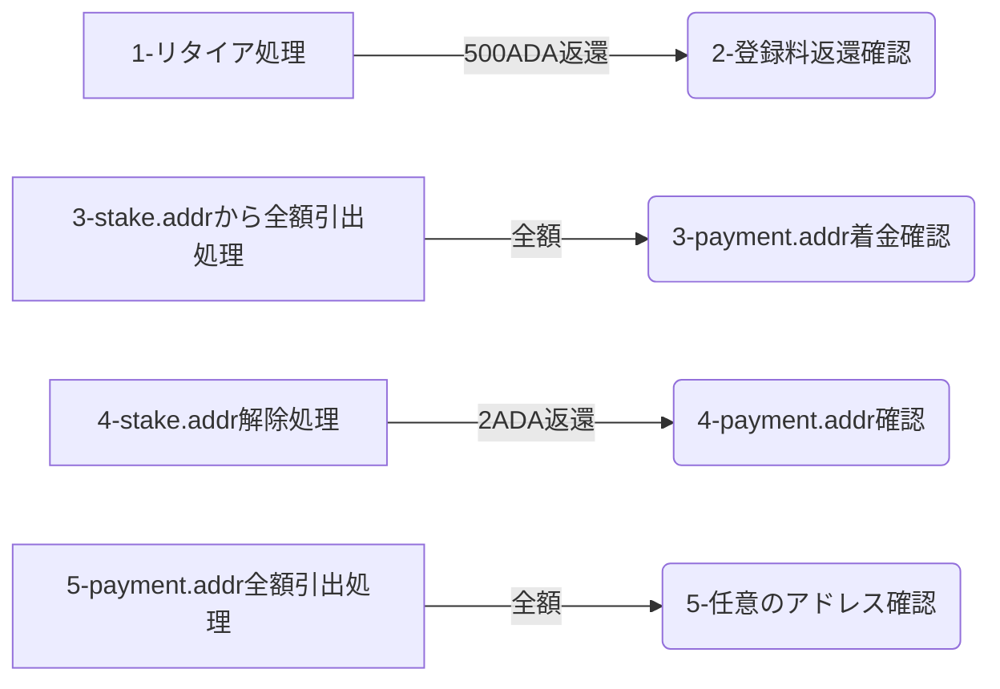
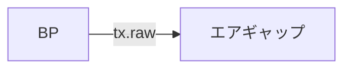
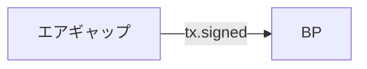
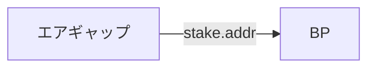
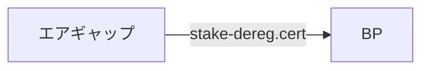

<Callout type="info" title="プール廃止の流れ">




</Callout>


## 1. リタイア処理 [#sec-1]

**現在のエポックの計算**

<Tabs items={["BP"]}>
<Tab value="BP">

```bash
startTimeGenesis=$(cat $NODE_HOME/${NODE_CONFIG}-shelley-genesis.json | jq -r .systemStart)
startTimeSec=$(date --date=${startTimeGenesis} +%s)
currentTimeSec=$(date -u +%s)
epochLength=$(cat $NODE_HOME/${NODE_CONFIG}-shelley-genesis.json | jq -r .epochLength)
epoch=$(( (${currentTimeSec}-${startTimeSec}) / ${epochLength} ))
echo current epoch: ${epoch}
```

</Tab>
</Tabs>

**引退エポックの算出**
> プールが最も早く引退できるエポックと最も遅い引退エポックを見つけます。

<Tabs items={["BP"]}>
<Tab value="BP">

```bash
poolRetireMaxEpoch=$(cat $NODE_HOME/params.json | jq -r '.poolRetireMaxEpoch')
echo poolRetireMaxEpoch: ${poolRetireMaxEpoch}

minRetirementEpoch=$(( ${epoch} + 1 ))
maxRetirementEpoch=$(( ${epoch} + ${poolRetireMaxEpoch} ))

echo リタイア可能最短エポック: ${minRetirementEpoch}
echo リタイア可能最長エポック: ${maxRetirementEpoch}
```

</Tab>
</Tabs>

<Callout type="info" title="リタイアのタイミングについて">

**例**: エポック320でeMax18の場合,

- 最も早いポックは 321 \( 現在のエポック  + 1\)
- 最も遅いエポックは 338 \( eMax + 現在のエポック\)

- プールはリタイア指定エポック開始時にリタイア処理されます。  
- もし心変わりがある場合は、エポック指定エポック開始前に[運用証明書(pool.cert)の更新](/cardano/operation/cert-update)を送信することでリタイア手続きを無効にできます。
- プール登録料500ADAはリタイア処理エポック開始時にstake.addrに入金されます。  

</Callout>


**登録解除証明書 `pool.dereg`の作成**  

以下のコマンド内の `--epoch ***` にリタイアしたいエポックを記入します。

<Tabs items={["エアギャップ"]}>
<Tab value="エアギャップ">

```bash
cd $NODE_HOME
chmod u+rwx $HOME/cold-keys
cardano-cli latest stake-pool deregistration-certificate \
  --cold-verification-key-file $HOME/cold-keys/node.vkey \
  --epoch *** \
  --out-file pool.dereg
```

</Tab>
</Tabs>

<Callout type="info" title="ファイル転送">

エアギャップの`pool.dereg`をBPのcnodeディレクトリにコピー


</Callout>


**payment.addrの残高参照**

<Tabs items={["BP"]}>
<Tab value="BP">

```bash
cd $NODE_HOME
cardano-cli latest query utxo \
  --address $(cat payment.addr) \
  $NODE_NETWORK \
  --output-text \
  --out-file fullUtxo.out

tail -n +3 fullUtxo.out | sort -k3 -nr | sed -e '/lovelace + [0-9]/d' > balance.out

cat balance.out
```

</Tab>
</Tabs>

**UTXOを算出**

<Tabs items={["BP"]}>
<Tab value="BP">

```bash
tx_in=""
total_balance=0
while read -r utxo; do
  in_addr=$(awk '{ print $1 }' <<< "${utxo}")
  idx=$(awk '{ print $2 }' <<< "${utxo}")
  utxo_balance=$(awk '{ print $3 }' <<< "${utxo}")
  total_balance=$((${total_balance}+${utxo_balance}))
  echo TxHash: ${in_addr}#${idx}
  echo ADA: ${utxo_balance}
  tx_in="${tx_in} --tx-in ${in_addr}#${idx}"
done < balance.out
txcnt=$(cat balance.out | wc -l)
echo Total ADA balance: ${total_balance}
echo Number of UTXOs: ${txcnt}
```

</Tab>
</Tabs>

**現在のスロットを算出**

<Tabs items={["BP"]}>
<Tab value="BP">

```bash
currentSlot=$(cardano-cli latest query tip $NODE_NETWORK | jq -r '.slot')
echo Current Slot: $currentSlot
```

</Tab>
</Tabs>

**トランザクションのビルド**

<Tabs items={["BP"]}>
<Tab value="BP">

```bash
cardano-cli latest transaction build-raw \
  ${tx_in} \
  --tx-out $(cat payment.addr)+${total_balance} \
  --invalid-hereafter $(( ${currentSlot} + 10000)) \
  --fee 200000 \
  --certificate-file pool.dereg \
  --out-file tx.tmp
```

</Tab>
</Tabs>

**最低料金の計算**

<Tabs items={["BP"]}>
<Tab value="BP">

```bash
fee=$(cardano-cli latest transaction calculate-min-fee \
  --tx-body-file tx.tmp \
  --witness-count 2 \
  --output-text \
  --protocol-params-file params.json | awk '{ print $1 }')
echo fee: $fee
```

</Tab>
</Tabs>

**変更出力の計算**

<Tabs items={["BP"]}>
<Tab value="BP">

```bash
txOut=$((${total_balance}-${fee}))
echo txOut: ${txOut}
```

</Tab>
</Tabs>

**トランザクションのビルド**

<Tabs items={["BP"]}>
<Tab value="BP">

```bash
cardano-cli latest transaction build-raw \
  ${tx_in} \
  --tx-out $(cat payment.addr)+${txOut} \
  --invalid-hereafter $(( ${currentSlot} + 10000)) \
  --fee ${fee} \
  --certificate-file pool.dereg \
  --out-file tx.raw
```

</Tab>
</Tabs>

<Callout type="info" title="ファイル転送">

BPの`tx.raw`をエアギャップのcnodeディレクトリにコピー



</Callout>


**トランザクションに署名**

<Tabs items={["エアギャップ"]}>
<Tab value="エアギャップ">

```bash
cardano-cli latest transaction sign \
  --tx-body-file tx.raw \
  --signing-key-file payment.skey \
  --signing-key-file $HOME/cold-keys/node.skey \
  $NODE_NETWORK \
  --out-file tx.signed
```

</Tab>
</Tabs>

**コールドキーのロック**

```bash
chmod a-rwx $HOME/cold-keys
```


<Callout type="info" title="ファイル転送">


エアギャップの`tx.signed` を BPのcnodeディレクトリにコピーします。



</Callout>


**トランザクションの送信**

<Tabs items={["BP"]}>
<Tab value="BP">

```bash
cardano-cli latest transaction submit \
  --tx-file tx.signed \
  $NODE_NETWORK
```

</Tab>
</Tabs>

### リタイア確認 [#sec-2]

- KOIOS APIを使用して、ステークプールのリタイア状況とリタイアエポックを確認します。

<Tabs items={["BP"]}>
<Tab value="BP">

```bash
cd $NODE_HOME
curl -s -X POST -H "content-type: application/json" -d @- "https://api.koios.rest/api/v1/pool_info" << EOS | jq '.[0].pool_status,.[0].retiring_epoch'
{"_pool_bech32_ids":["$(cat 'pool.id-bech32')"]}
EOS
```

```yaml title="期待される表示例：" noCopy
"retired"
309
```
> 1行目はプールのリタイア状況です。  
> `retiring`：リタイア予定  
> `retired`：リタイア済み  
> 
> 2行目はリタイアエポックです。  
> 上記の例では、Epoch 309でリタイアしたことを示します。

</Tab>
</Tabs>

## 2. 登録料返還確認 [#sec-3]

<Callout type="error" title="注意">

以降の処理は、プールのリタイア処理が完了してから実施してください。

</Callout>


<Callout type="info" title="ファイル転送">


エアギャップの`stake.addr` を BPのcnodeディレクトリにコピーします。



</Callout>


<Tabs items={["BP"]}>
<Tab value="BP">

```bash
cd $NODE_HOME
cardano-cli latest query stake-address-info \
  --address $(cat stake.addr) \
  $NODE_NETWORK
```

</Tab>
</Tabs>

**戻り値確認**

> rewardAccountBalance: の値を確認


## 3. ガバナンス参加状況の確認 [#sec-4]

現在の仕様では、ガバナンスに参加していない場合、プール報酬を引き出すことができません。  
ガバナンス参加状況をコマンドで確認するか、sjgtoolで確認してからガバナンスに参加してください。

<Tabs items={["コマンド", "sjgtool"]}>
<Tab value="コマンド">

BPで以下のコマンドを実行してください。

1. ガバナンスに参加しているかを確認します。
```bash
curl -s -X POST "https://api.koios.rest/api/v1/account_info" -H "Accept: application/json" -H "Content-Type: application/json" -d "{\"_stake_addresses\":[\"$(cat "$NODE_HOME/stake.addr")\"]}" | jq -r '.[].delegated_drep'
```
> `null` の場合は委任していません。  

2. [委任代表者（DRep）への委任](/cardano/operation/delegating-to-a-drep)を確認して、`自動棄権`または`DRep指定`を選択してガバナンスに参加してください。

</Tab>
<Tab value="sjgtool">

BPで以下のコマンドを実行してください。

sjgtoolを導入している場合は、sjgtoolからDRepへの委任状況を確認できます。

1. sjgtoolを起動します。
```bash
gtool
```

2. `[6] ガバナンス(投票・委任)` を選択します。

3. `プールステークアドレスのDRep委任状況`を確認し、委任していない場合はそのまま続けて`[2] DRep委任`を選択し、`自動棄権`または`DRep指定`を選択してガバナンスに参加してください。

</Tab>
</Tabs>


## 4. stake.addrから引き出し [#sec-5]

[stake.addrからpayment.addrへ送金する方法](/cardano/operation/withdrawal#sec-2)を実施してください。


## 5. ステークキーの解除 [#sec-6]

<Callout type="error" title="注意">

- この手順ではstake.addrの登録を解除し、2ADAの返還手続きを行います。
- プール登録料(500ADA)が返還される前に以下の処理を行ってしまうと、500ADAを受け取ることが出来ません。  
- 以下の手続きは、プール登録料の500ADAを受け取ってから実施してください。

</Callout>


**ステークキー登録解除証明書作成**

<Tabs items={["エアギャップ"]}>
<Tab value="エアギャップ">

```bash
cd $NODE_HOME
cardano-cli latest stake-address deregistration-certificate \
  --stake-verification-key-file stake.vkey \
  --key-reg-deposit-amt 2000000 \
  --out-file stake-dereg.cert
```

</Tab>
</Tabs>

<Callout type="info" title="ファイル転送">


エアギャップの`stake-dereg.cert` を BPのcnodeディレクトリにコピーします。



</Callout>


**ステークキー登録料算出**

<Tabs items={["BP"]}>
<Tab value="BP">

```bash
keyDeposit=$(cat $NODE_HOME/params.json | jq -r '.stakeAddressDeposit')
echo keyDeposit: $keyDeposit
```

</Tab>
</Tabs>

**最新スロット算出**

<Tabs items={["BP"]}>
<Tab value="BP">

```bash
cd $NODE_HOME
currentSlot=$(cardano-cli latest query tip $NODE_NETWORK | jq -r '.slot')
echo Current Slot: $currentSlot
```

</Tab>
</Tabs>

**payment.addr残高を参照**

<Tabs items={["BP"]}>
<Tab value="BP">

```bash
cardano-cli latest query utxo \
  --address $(cat payment.addr) \
  $NODE_NETWORK \
  --output-text \
  --out-file fullUtxo.out

tail -n +3 fullUtxo.out | sort -k3 -nr | sed -e '/lovelace + [0-9]/d' > balance.out

cat balance.out
```

</Tab>
</Tabs>

**UTXOを算出**

<Tabs items={["BP"]}>
<Tab value="BP">

```bash   
tx_in=""
total_balance=0
while read -r utxo; do
  in_addr=$(awk '{ print $1 }' <<< "${utxo}")
  idx=$(awk '{ print $2 }' <<< "${utxo}")
  utxo_balance=$(awk '{ print $3 }' <<< "${utxo}")
  total_balance=$((${total_balance}+${utxo_balance}))
  echo TxHash: ${in_addr}#${idx}
  echo ADA: ${utxo_balance}
  tx_in="${tx_in} --tx-in ${in_addr}#${idx}"
done < balance.out
txcnt=$(cat balance.out | wc -l)
echo Total ADA balance: ${total_balance}
echo Number of UTXOs: ${txcnt}
```

</Tab>
</Tabs>

**仮トランザクションファイルを作成**

<Tabs items={["BP"]}>
<Tab value="BP">

```bash
cardano-cli latest transaction build-raw \
  ${tx_in} \
  --tx-out $(cat payment.addr)+$(( ${total_balance} + ${keyDeposit} )) \
  --invalid-hereafter $(( ${currentSlot} + 10000)) \
  --fee 200000 \
  --certificate stake-dereg.cert \
  --out-file tx.tmp
```

</Tab>
</Tabs>

**最低料金の計算**

<Tabs items={["BP"]}>
<Tab value="BP">

```bash
fee=$(cardano-cli latest transaction calculate-min-fee \
  --tx-body-file tx.tmp \
  --witness-count 2 \
  --output-text \
  --protocol-params-file params.json | awk '{ print $1 }')
echo fee: $fee
```

</Tab>
</Tabs>

**変更出力の計算**

<Tabs items={["BP"]}>
<Tab value="BP">

```bash
txOut=$((total_balance+keyDeposit-fee))
echo Change Output: ${txOut}
```

</Tab>
</Tabs>

**トランザクションのビルド**

<Tabs items={["BP"]}>
<Tab value="BP">

```bash
cardano-cli latest transaction build-raw \
  ${tx_in} \
  --tx-out $(cat payment.addr)+${txOut} \
  --invalid-hereafter $(( ${currentSlot} + 10000)) \
  --fee ${fee} \
  --certificate-file stake-dereg.cert \
  --out-file tx.raw
```

</Tab>
</Tabs>

<Callout type="info" title="ファイル転送">

BPの`tx.raw` をエアギャップのcnodeディレクトリにコピーします。


</Callout>


**トランザクションに署名**

<Tabs items={["エアギャップ"]}>
<Tab value="エアギャップ">

```bash
cd $NODE_HOME
cardano-cli latest transaction sign \
  --tx-body-file tx.raw \
  --signing-key-file payment.skey \
  --signing-key-file stake.skey \
  $NODE_NETWORK \
  --out-file tx.signed
```

</Tab>
</Tabs>

<Callout type="info" title="ファイル転送">

エアギャップの`tx.signed` をBPのcnodeディレクトリにコピーします。


</Callout>

<Tabs items={["BP"]}>
<Tab value="BP">

```bash
cardano-cli latest transaction submit \
  --tx-file tx.signed \
  $NODE_NETWORK
```

</Tab>
</Tabs>

## 6. 全額引き出し（payment.addr） [#sec-7]

まずは、最新のスロット番号を取得し **invalid-hereafter** パラメータを正しく設定します。

<Tabs items={["BP"]}>
<Tab value="BP">

```bash
cd $NODE_HOME
currentSlot=$(cardano-cli latest query tip $NODE_NETWORK | jq -r '.slot')
echo Current Slot: $currentSlot
```

</Tab>
</Tabs>

**送金先アドレスの設定**

<Tabs items={["BP"]}>
<Tab value="BP">

変数`destinationAddress`の`送金先アドレス`を、実際の送金先アドレスに置き換えてから実行してください。
> 例：`destinationAddress=addr1...`

```bash
destinationAddress=送金先アドレス
echo destinationAddress: $destinationAddress
```

</Tab>
</Tabs>

**payment.addrの残高の参照**

<Tabs items={["BP"]}>
<Tab value="BP">

```bash
cardano-cli latest query utxo \
  --address $(cat payment.addr) \
  $NODE_NETWORK \
  --output-text \
  --out-file fullUtxo.out

tail -n +3 fullUtxo.out | sort -k3 -nr > balance.out

cat balance.out
```

</Tab>
</Tabs>

**UTXOを算出**

<Tabs items={["BP"]}>
<Tab value="BP">

```bash
tx_in=""
total_balance=0
while read -r utxo; do
  in_addr=$(awk '{ print $1 }' <<< "${utxo}")
  idx=$(awk '{ print $2 }' <<< "${utxo}")
  utxo_balance=$(awk '{ print $3 }' <<< "${utxo}")
  total_balance=$((${total_balance}+${utxo_balance}))
  echo TxHash: ${in_addr}#${idx}
  echo ADA: ${utxo_balance}
  tx_in="${tx_in} --tx-in ${in_addr}#${idx}"
done < balance.out
txcnt=$(cat balance.out | wc -l)
echo Total ADA balance: ${total_balance}
echo Number of UTXOs: ${txcnt}
```

</Tab>
</Tabs>

**トランザクションのビルド**

<Tabs items={["BP"]}>
<Tab value="BP">

```bash
cardano-cli latest transaction build-raw \
  ${tx_in} \
  --tx-out ${destinationAddress}+${total_balance} \
  --invalid-hereafter $(( ${currentSlot} + 10000)) \
  --fee 200000 \
  --out-file tx.tmp
```

</Tab>
</Tabs>

**最低手数料の出力**

<Tabs items={["BP"]}>
<Tab value="BP">

```bash
fee=$(cardano-cli latest transaction calculate-min-fee \
  --tx-body-file tx.tmp \
  --witness-count 1 \
  --output-text \
  --protocol-params-file params.json | awk '{ print $1 }')
echo fee: $fee
```

</Tab>
</Tabs>

**計算結果の出力**

<Tabs items={["BP"]}>
<Tab value="BP">

```bash
txOut=$((${total_balance}-${fee}))
echo Change Output: ${txOut}
```

</Tab>
</Tabs>

**送金金額を確認**

<Tabs items={["BP"]}>
<Tab value="BP">

```bash
amountToSend=$((${txOut}))
echo amountToSend: $amountToSend
```

</Tab>
</Tabs>

**トランザクションのビルド**

<Tabs items={["BP"]}>
<Tab value="BP">

```bash
cardano-cli latest transaction build-raw \
  ${tx_in} \
  --tx-out ${destinationAddress}+${amountToSend} \
  --invalid-hereafter $(( ${currentSlot} + 10000)) \
  --fee ${fee} \
  --out-file tx.raw
```

</Tab>
</Tabs>

<Callout type="info" title="ファイル転送">


BPの`tx.raw` をエアギャップのcnodeディレクトリにコピーします。


</Callout>


**トランザクションに署名**

<Tabs items={["エアギャップ"]}>
<Tab value="エアギャップ">

```bash
cd $NODE_HOME
cardano-cli latest transaction sign \
  --tx-body-file tx.raw \
  --signing-key-file payment.skey \
  $NODE_NETWORK \
  --out-file tx.signed
```

</Tab>
</Tabs>

**tx.signed** をBPのcnodeディレクトリにコピーします。

<Callout type="info" title="ファイル転送">


エアギャップの`tx.signed` をBPのcnodeディレクトリにコピーします。


</Callout>


**署名済みトランザクションの送信**

<Tabs items={["BP"]}>
<Tab value="BP">

```bash
cardano-cli latest transaction submit \
  --tx-file tx.signed \
  $NODE_NETWORK
```

</Tab>
</Tabs>

全額出金されているかを確認します。

<Tabs items={["BP"]}>
<Tab value="BP">

```bash
cd $NODE_HOME
cardano-cli latest query utxo \
  --address $(cat payment.addr) \
  $NODE_NETWORK \
  --output-text
```

</Tab>
</Tabs>

トランザクションが消えていれば問題ありません。

```yaml title="期待される表示例：" noCopy
                           TxHash                                 TxIx        Lovelace
----------------------------------------------------------------------------------------
```

---