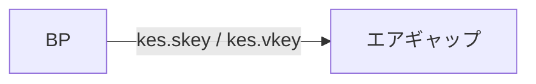
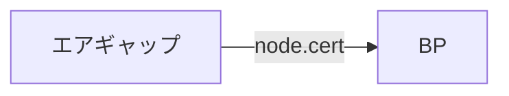

# 事前確認

同期が 100% になってから以降の手順を実施してください。

```bash
cardano-cli latest query tip ${NODE_NETWORK} | grep syncProgress
```
```yaml title="期待される表示例：" noCopy
"syncProgress": "100.00"
```


<Callout type="warn" title="BP起動に必要なファイルとは？">

ブロックプロデューサーノードでは３つのキーを生成する必要があります。

* ステークプールの運用証明書 \(node.cert\)
* ステークプールのセキュリティキー \(kes.skey\)
* ステークプールのVRFキー \(vrf.skey\)

</Callout>


## 1. KESキーの作成 [#sec-1]


<Callout type="info" title="KESキーについて">

\(KES=Key Evolving Signature\)の略  
キーを悪用するハッカーからステークプールを保護するために作成され、90日ごとに再生成する必要があります。  
詳細は運用マニュアルを参照してください。

</Callout>


<Tabs items={["ブロックプロデューサーノード"]}>
<Tab value="ブロックプロデューサーノード">

```bash
cd $NODE_HOME
cardano-cli latest node key-gen-KES \
  --verification-key-file kes.vkey \
  --signing-key-file kes.skey
```

</Tab>
</Tabs>

## 2. コールドキーの作成 [#sec-2]
<Callout type="error" title="注意（コールドキー）">

**エアギャップ（オフライン）で生成・保管してください。** オンライン環境に置かないでください。

- **重要性**: プール運営の根幹となる鍵です。<mark>流出するとプールの乗っ取りにつながる可能性があります。</mark>
- **保管**: 複数の USB などに複製し、**上書き・削除しない**よう注意してください。
- **保存場所の例**: `$HOME/cold-keys`

</Callout>


<Tabs items={["エアギャップオフラインマシン"]}>
<Tab value="エアギャップオフラインマシン">


```text
mkdir $HOME/cold-keys
```

コールドキーのペアキーとカウンターファイルを作成します。

```bash
cd $HOME/cold-keys
cardano-cli latest node key-gen \
  --cold-verification-key-file node.vkey \
  --cold-signing-key-file node.skey \
  --operational-certificate-issue-counter node.counter
```
アクセス権を読み取り専用に更新します。
```bash
chmod 400 node.vkey
chmod 400 node.skey
```

</Tab>
</Tabs>

<Callout type="warn" title="重要">

すべてのキーを、USB などの**専用かつ本体から切り離した安全な媒体**へバックアップし、**複数のコピー**を作成してください。

</Callout>


## 3. プール運用証明書の作成 [#sec-3]

<Tabs items={["ブロックプロデューサーノード"]}>
<Tab value="ブロックプロデューサーノード">


ジェネシスファイルからslotsPerKESPeriodを出力します。
```bash
cd $NODE_HOME
slotsPerKESPeriod=$(cat $NODE_HOME/${NODE_CONFIG}-shelley-genesis.json | jq -r '.slotsPerKESPeriod')
echo slotsPerKESPeriod: ${slotsPerKESPeriod}
```
同期済みslotNoを算出します。
```bash
slotNo=$(cardano-cli latest query tip $NODE_NETWORK | jq -r '.slot')
echo slotNo: ${slotNo}
```

startKesPeriodを算出します。

```bash
kesPeriod=$((${slotNo} / ${slotsPerKESPeriod}))
echo kesPeriod: ${kesPeriod}
startKesPeriod=${kesPeriod}
echo startKesPeriod: ${startKesPeriod}
```

</Tab>
</Tabs>

<Callout type="info" title="ファイル転送">

BPの`kes.skey`と`kes.vkey` をエアギャップマシンのcnodeディレクトリにコピーします。


</Callout>


BPとエアギャップで`kes.vkey`ファイルハッシュを比較します。

<Tabs items={["ブロックプロデューサーノード"]}>
<Tab value="ブロックプロデューサーノード">

```bash
cd $NODE_HOME
sha256sum kes.vkey
```

</Tab>
</Tabs>

> BPとエアギャップで表示されたハッシュ値を比較し、一致していれば問題ありません。


<Tabs items={["エアギャップオフラインマシン"]}>
<Tab value="エアギャップオフラインマシン">

```bash
cd $NODE_HOME
sha256sum kes.vkey
```

</Tab>
</Tabs>

<Callout type="info" title="確認">

ステークプールオペレータは、プールを実行する権限があることを確認するための運用証明書を発行する必要があります。  
証明書には、オペレータの署名が含まれプールに関する情報（アドレス、キーなど）が含まれます。

</Callout>


<Tabs items={["エアギャップオフラインマシン"]}>
<Tab value="エアギャップオフラインマシン">


```bash
cd $NODE_HOME
read -p "BPで算出したstartKesPeriodを入力してください:" kes
```
> このままコマンドに入力してください。    
> コマンド実行後に、数字入力モードになりますので、BPで算出した`startKesPeriod`の数字を入力します。

入力した数字が戻り値に表示されているか確認したら証明書を作成します。
```bash
echo "入力した数字は $kes です"
```

```bash
cardano-cli latest node issue-op-cert \
  --kes-verification-key-file kes.vkey \
  --cold-signing-key-file $HOME/cold-keys/node.skey \
  --operational-certificate-issue-counter $HOME/cold-keys/node.counter \
  --kes-period $kes \
  --out-file node.cert
```

</Tab>
</Tabs>

<Callout type="info" title="ファイル転送">

エアギャップマシンの`node.cert` をBPのcnodeディレクトリにコピーします。



</Callout>


**BPとエアギャップで`node.cert`ファイルハッシュを比較します。**

<Tabs items={["ブロックプロデューサーノード"]}>
<Tab value="ブロックプロデューサーノード">


```bash
cd $NODE_HOME
sha256sum node.cert
```

</Tab>
</Tabs>


> BPとエアギャップで表示されたハッシュ値を比較し、一致していれば問題ありません。

<Tabs items={["エアギャップオフラインマシン"]}>
<Tab value="エアギャップオフラインマシン">


```bash
cd $NODE_HOME
sha256sum node.cert
```

</Tab>
</Tabs>

## 4. VRFキーの作成 [#sec-4]

<Tabs items={["ブロックプロデューサーノード"]}>
<Tab value="ブロックプロデューサーノード">


```bash
cd $NODE_HOME
cardano-cli latest node key-gen-VRF \
  --verification-key-file vrf.vkey \
  --signing-key-file vrf.skey
```

vrfキーのアクセス権を読み取り専用に更新します。
```bash
chmod 400 vrf.skey
chmod 400 vrf.vkey
```

> vrfキーを誤って削除しないようにしてください。

</Tab>
</Tabs>

## 5. BPノードとして再起動 [#sec-5]


BPノードを停止します。

<Tabs items={["ブロックプロデューサーノード"]}>
<Tab value="ブロックプロデューサーノード">

```bash
sudo systemctl stop cardano-node
```

ノードポート番号を確認します。
```bash
PORT=`grep "PORT=" $NODE_HOME/startBlockProducingNode.sh`
b_PORT=${PORT#"PORT="}
echo "BPポートは ${b_PORT} です"
```
> BPのポート番号が表示されることを確認します。

起動スクリプトにKES、VRF、運用証明書のパスを追記し、更新します。

```bash
cat > $NODE_HOME/startBlockProducingNode.sh << EOF 
#!/bin/bash
DIRECTORY=$NODE_HOME
PORT=${b_PORT}
HOSTADDR=0.0.0.0
TOPOLOGY=\${DIRECTORY}/${NODE_CONFIG}-topology.json
DB_PATH=\${DIRECTORY}/db
SOCKET_PATH=\${DIRECTORY}/db/socket
CONFIG=\${DIRECTORY}/${NODE_CONFIG}-config.json
KES=\${DIRECTORY}/kes.skey
VRF=\${DIRECTORY}/vrf.skey
CERT=\${DIRECTORY}/node.cert
/usr/local/bin/cardano-node run +RTS -N --disable-delayed-os-memory-return -I0.1 -Iw300 -A32m -n4m -F1.5 -H2500M -RTS --topology \${TOPOLOGY} --database-path \${DB_PATH} --socket-path \${SOCKET_PATH} --host-addr \${HOSTADDR} --port \${PORT} --config \${CONFIG} --shelley-kes-key \${KES} --shelley-vrf-key \${VRF} --shelley-operational-certificate \${CERT}
EOF
```

BPを起動します。

```bash
sudo systemctl start cardano-node
```

BPとして起動しているか確認します。
```bash
cd $NODE_HOME/scripts
./gLiveView.sh
```
> チェーン同期後に`Core`の表示があれば問題ありません。

</Tab>
</Tabs>

<Callout type="error" title="注意事項">

ブロックプロデューサーノードを実行するためには、以下の３つのファイルが必要ですので、揃っているか確認してください。  
> このファイルが揃っていない場合や起動時に指定されていない場合はブロック生成できませんので注意してください。

- `kes.skey`
- `vrf.skey`
- `node.cert`

</Callout>

---