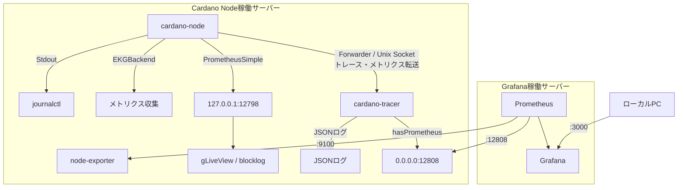

Prometheusは、監視対象のmetrics endpointからmetricsを取得し、時系列データとして保存する監視システムです。

[オフィシャルドキュメントはこちら](https://prometheus.io/docs/introduction/overview/)

Grafanaは、Prometheusなどに保存されたデータをダッシュボードとして可視化するためのツールです。

## 1. 監視構成 [#sec-1]

本手順では、Cardano Nodeのmetricsを`cardano-tracer`経由でPrometheusへ取得し、Grafanaで可視化します。

`cardano-node`から出力されるtrace（ログ）やmetricsは、`Forwarder`を使用してUnix Socket経由で`cardano-tracer`へ転送されます。

`cardano-tracer`は受け取ったデータを処理し、Prometheus形式のmetrics endpointとして公開します。

PrometheusはこのendpointからCardano Nodeのmetricsを取得します。

また、CPU、メモリ、ディスクなどのシステムmetricsは`prometheus-node-exporter`から取得します。

この手順では、 **Grafana稼働サーバー（リレーサーバー1）** で`prometheus`と`Grafana`を稼働させ、各Cardano Node稼働サーバーからmetricsを取得します。

**構成図**



本構成では、以下のmetrics endpointを使用します。

| ポート | 公開元 | 用途 |
| --- | --- | --- |
| `12798` | `cardano-node` / `PrometheusSimple` | `gLiveView` / `blocklog`などのローカルツール |
| `12808` | `cardano-tracer` / `hasPrometheus` | Cardano Node metrics |
| `9100` | `prometheus-node-exporter` | CPU、メモリ、ディスクなどのシステムmetrics |

Prometheus / Grafanaによる監視では、`PrometheusSimple`の`12798`ポートからCardano Nodeのmetricsを直接取得せず、`cardano-tracer`が公開する`12808`ポートを使用します。

## 2. cardano-tracerの確認 [#sec-2]

初期構築時に設定した`cardano-tracer`が、各Cardano Node稼働サーバーで正常に動作していることを確認します。

<Tabs items={["全ノード"]}>

<Tab value="全ノード">

**cardano-tracerのサービス確認**

`cardano-tracer`が正常に起動していることを確認します。

```bash
sudo systemctl status cardano-tracer --no-pager
```

`active (running)`であることを確認します。

**Unix Socketの確認**

Tracer用のUnix Socketが作成されていることを確認します。

```bash
ls -la ${NODE_HOME}/tracer/
```

`socket`が作成されていることを確認します。

**Prometheus endpointの確認**

TracerがPrometheus用の`12808`ポートをListenしていることを確認します。

```bash
sudo ss -lntp | grep ':12808'
```

`cardano-tracer`が`0.0.0.0:12808`でListenしていることを確認します。

**Cardano Nodeとの接続確認**

Cardano Nodeが`cardano-tracer`へ接続していることを確認します。

```bash
curl -s http://127.0.0.1:12808/
```

接続しているNode名が表示されることを確認します。

例えば、Previewのリレー1では以下のように表示されます。

```html
<html><head><title>Prometheus metrics</title></head><body><ul><li><a href="/preview-relay-1">preview-relay-1</a></li></ul></body></html>
```

</Tab>

</Tabs>

## 3. PrometheusとGrafanaのインストール [#sec-3]

**Prometheusのインストール**

<Tabs items={["Grafana稼働サーバー", "BPまたはリレー2以降"]}>

<Tab value="Grafana稼働サーバー">

```bash
sudo apt update
```

```bash
sudo apt install -y prometheus prometheus-node-exporter
```

</Tab>

<Tab value="BPまたはリレー2以降">

```bash
sudo apt update
```

```bash
sudo apt install -y prometheus-node-exporter
```

</Tab>

</Tabs>

**Grafanaのインストール**

<Tabs items={["Grafana稼働サーバー"]}>

<Tab value="Grafana稼働サーバー">

```bash
sudo apt install -y apt-transport-https gnupg
```

```bash
sudo mkdir -p /etc/apt/keyrings
```

```bash
wget -4 -O - https://apt.grafana.com/gpg.key | sudo gpg --dearmor -o /etc/apt/keyrings/grafana.gpg
```

```bash
sudo chmod 644 /etc/apt/keyrings/grafana.gpg
```

```bash
echo "deb [signed-by=/etc/apt/keyrings/grafana.gpg] https://apt.grafana.com stable main" | sudo tee /etc/apt/sources.list.d/grafana.list
```

```bash
sudo apt update && sudo apt install -y grafana
```

</Tab>

</Tabs>

**サービス有効化とファイアウォールの設定**

<Tabs items={["Grafana稼働サーバー", "BPまたはリレー2以降"]}>

<Tab value="Grafana稼働サーバー">

```bash
sudo systemctl enable --now grafana-server.service prometheus.service prometheus-node-exporter.service
```

Grafanaの`3000`ポートへの接続を許可します。

```bash
sudo ufw allow 3000/tcp
```

```bash
sudo ufw reload
```

</Tab>

<Tab value="BPまたはリレー2以降">

```bash
sudo systemctl enable --now prometheus-node-exporter.service
```

Prometheus稼働サーバーから`9100`と`12808`ポートへの接続を許可します。

```bash
sudo ufw allow from <Grafana稼働サーバーのIP> to any port 9100 proto tcp
```

```bash
sudo ufw allow from <Grafana稼働サーバーのIP> to any port 12808 proto tcp
```

```bash
sudo ufw reload
```

</Tab>

</Tabs>

## 4. Prometheusの設定 [#sec-4]

Grafana稼働サーバーにインストールしたPrometheusの設定ファイルを作成します。

各Cardano Node稼働サーバーで以下を実行し、Tracerに接続しているNode名を確認します。

```bash
curl -s http://127.0.0.1:12808/
```

```yaml title="期待される表示例： リレー1の場合" noCopy
<html><head><title>Prometheus metrics</title></head><body><ul><li><a href="/mainnet-relay-1">mainnet-relay-1</a></li></ul></body></html>
```
> 接続しているNode名が表示されれば正常です。


**設定前に置き換える値**

<Tabs items={["Grafana稼働サーバー"]}>

<Tab value="Grafana稼働サーバー">

リレー2のIPアドレスまたはDNSを代入します。

```bash
relay2_ipv4_or_dns=
```

BPのIPアドレスを代入します。

```bash
bp_ipv4=
```

Node名を設定します。

```bash
NODE_NAME_RELAY_1=${NODE_CONFIG}-relay-1
NODE_NAME_RELAY_2=${NODE_CONFIG}-relay-2
NODE_NAME_BP=${NODE_CONFIG}-bp
```

設定するNode名は、各Cardano Nodeの`TraceOptionNodeName`と一致している必要があります。

**Prometheusの設定ファイル作成**

```bash
cat > $HOME/prometheus.yml << EOF
global:
  scrape_interval: 15s
  external_labels:
    monitor: 'codelab-monitor'

scrape_configs:
  - job_name: 'prometheus'
    static_configs:
      - targets: ['localhost:9100']
        labels:
          alias: 'relaynode1'
          type: 'system'

      - targets: ['${relay2_ipv4_or_dns}:9100']
        labels:
          alias: 'relaynode2'
          type: 'system'

      - targets: ['${bp_ipv4}:9100']
        labels:
          alias: 'block-producing-node'
          type: 'system'

      - targets: ['localhost:12808']
        labels:
          alias: 'relaynode1'
          type: 'cardano-node'
          __metrics_path__: '/${NODE_NAME_RELAY_1}'

      - targets: ['${relay2_ipv4_or_dns}:12808']
        labels:
          alias: 'relaynode2'
          type: 'cardano-node'
          __metrics_path__: '/${NODE_NAME_RELAY_2}'

      - targets: ['${bp_ipv4}:12808']
        labels:
          alias: 'block-producing-node'
          type: 'cardano-node'
          __metrics_path__: '/${NODE_NAME_BP}'
EOF
```


</Tab>

</Tabs>

**prometheus.yml構文チェック**

<Tabs items={["Grafana稼働サーバー"]}>

<Tab value="Grafana稼働サーバー">

```bash
sudo promtool check config $HOME/prometheus.yml
```

</Tab>

</Tabs>

構文エラーがない場合は、以下のように表示されます。

```yaml title="正常時の表示例：" noCopy
Checking /home/$USER/prometheus.yml

SUCCESS: /home/$USER/prometheus.yml is valid prometheus config file syntax
```

構文エラーがある場合は、以下のように表示されます。

```yaml title="構文エラー時の表示例：" noCopy
Checking /home/$USER/prometheus.yml

FAILED: parsing YAML file /home/$USER/prometheus.yml: yaml: line **: did not find expected '-' indicator
```

構文エラーだった場合は、`$HOME/prometheus.yml`を開き、余分なスペースや記号の有無を確認して修正してください。

```bash
nano $HOME/prometheus.yml
```

> 修正したら、`Ctrl + O`で保存し、Enter。その後`Ctrl + X`で閉じます。

**prometheus.ymlファイルのバックアップ**

```bash
sudo cp /etc/prometheus/prometheus.yml /etc/prometheus/prometheus.yml.bak
```

**prometheus.ymlファイルの移動**

```bash
sudo mv $HOME/prometheus.yml /etc/prometheus/prometheus.yml
```

**Grafanaプラグインのインストール**

```bash
sudo grafana cli plugins install yesoreyeram-infinity-datasource
```

> GrafanaダッシュボードでJSONデータを取得するため、Infinity datasourceプラグインをインストールします。

**サービス再起動**

<Tabs items={["Grafana稼働サーバー"]}>

<Tab value="Grafana稼働サーバー">

```bash
sudo systemctl restart grafana-server.service prometheus.service prometheus-node-exporter.service
```

</Tab>

</Tabs>

**サービスが正しく実行されていることを確認します。**

<Tabs items={["Grafana稼働サーバー"]}>

<Tab value="Grafana稼働サーバー">

```bash
sudo systemctl --no-pager status grafana-server.service prometheus.service prometheus-node-exporter.service
```

</Tab>

</Tabs>

以下3つのサービスが`active (running)`になっていることを確認してください。

* `grafana-server.service`
* `prometheus.service`
* `prometheus-node-exporter.service`

**バージョン確認**

<Tabs items={["Grafana稼働サーバー", "BPまたはリレー2以降"]}>

<Tab value="Grafana稼働サーバー">

`Grafana`、`Prometheus`、`node_exporter`のバージョンを確認します。

```bash
grafana server -v
prometheus --version
prometheus-node-exporter --version
```

</Tab>

<Tab value="BPまたはリレー2以降">

`node_exporter`のバージョンを確認します。

```bash
prometheus-node-exporter --version
```

</Tab>

</Tabs>

それぞれ以下のような形式で表示されれば正常です。

```yaml title="表示例：" noCopy
Version 13.2.2
prometheus, version 2.45.3+ds
node_exporter, version 1.7.0
```

### 既存の設定ファイルを更新する場合 [#sec-5]

```bash
sudo nano /etc/prometheus/prometheus.yml
```

> 修正したら、`Ctrl + O`で保存し、Enter。その後`Ctrl + X`で閉じます。

**prometheus.yml構文チェック**

```bash
sudo promtool check config /etc/prometheus/prometheus.yml
```

構文エラーがない場合は、以下のように表示されます。

```yaml title="正常時の表示例：" noCopy
Checking /etc/prometheus/prometheus.yml

SUCCESS: /etc/prometheus/prometheus.yml is valid prometheus config file syntax
```

構文エラーがある場合は、以下のように表示されます。

```yaml title="構文エラー時の表示例：" noCopy
Checking /etc/prometheus/prometheus.yml

FAILED: parsing YAML file /etc/prometheus/prometheus.yml: yaml: line **: did not find expected '-' indicator
```

`/etc/prometheus/prometheus.yml`を開き、余分なスペースや記号の有無を確認してください。

**サービスの再起動**

```bash
sudo systemctl restart prometheus.service
```

## 5. Grafanaダッシュボードの設定 [#sec-6]

1. ローカルPCのブラウザから`http://Grafana稼働サーバーIPアドレス:3000`を開きます。

2. ログイン名・パスワードは**admin** / **admin**です。

3. パスワードを変更します。

4. 左ペインの「**Connections**」→「**Data sources**」を選択します。

5. 「**Add data source**」を選択し、「**Prometheus**」を選択します。

6. 「**Name**」は以下を入力します。

```text
Prometheus
```

7. 「**URL**」は以下を入力します。

```text
http://localhost:9090
```

8. 最下部に配置されている「**Save & Test**」を選択し、`Successfully queried the Prometheus API.`と表示されたら再度左ペインから「**Data sources**」を選択します。

9. 「**Add new data source**」を選択し、検索欄から「**Infinity**」を検索し、選択します。

10. 設定内容を変更することなく、「**Save & Test**」を選択し、`Health check successful`と表示されたら問題ありません。

11. **BPサーバー**でパネル用JSONファイルをダウンロードします。

```bash
curl -o $NODE_HOME/spo-japan-guild-cardano-node-dashboard.json https://docs.spojapanguild.net/grafana/cardano-node/spo-japan-guild-cardano-node-dashboard.json
```

```bash
sed -i \
  -e "s/bech32_id_of_your_pool/$(cat $NODE_HOME/pool.id-bech32)/g" \
  $NODE_HOME/spo-japan-guild-cardano-node-dashboard.json
```

12. BPの`cnode`フォルダにある`spo-japan-guild-cardano-node-dashboard.json`をローカルPCにダウンロードします。

13. 左ペインの「**Dashboards**」→「**New**」→「**Import**」を選択します。

14. 「**Upload dashboard JSON file**」を選択し、ダウンロードした`spo-japan-guild-cardano-node-dashboard.json`を指定します。

15. 「**DS_PROMETHEUS**」→「**Prometheus**」を選択し、「**DS_YESOREYERAM-INFINITY-DATASOURCE**」→「**yesoreyeram-infinity-datasource**」を選択し、`Import`ボタンを選択します。


これで基本的な監視設定は完了です。

以下の追加設定も実施してください。

* [Grafanaアラート設定](/cardano/operation/grafana-alert)
* [Grafanaセキュリティ強化](/cardano/operation/grafana-security)

---
