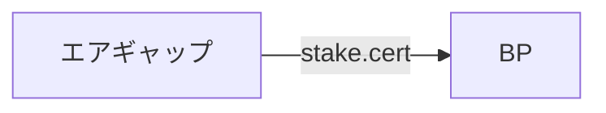
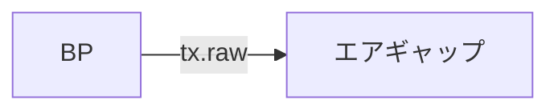
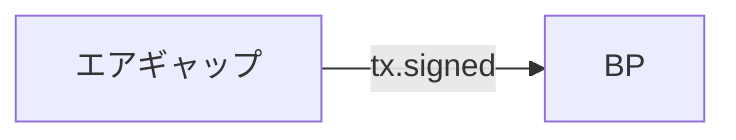

## 1. ステーク証明書の作成 [#sec-1]

<Tabs items={["エアギャップ"]}>
<Tab value="エアギャップ">


```bash
cd $NODE_HOME
cardano-cli latest stake-address registration-certificate \
    --stake-verification-key-file stake.vkey \
    --key-reg-deposit-amt 2000000 \
    --out-file stake.cert
```

</Tab>
</Tabs>

<Callout type="warn" title="ファイル転送">

エアギャップの`stake.cert` をBPのcnodeディレクトリにコピーします。


</Callout>


## 2. ステークアドレスの登録 [#sec-2]
<Callout type="info" title="Hint">

ステークアドレスの登録には2000000 lovelace \(2ADA\)が必要です。

</Callout>


<Tabs items={["BP"]}>
<Tab value="BP">

```bash
cd $NODE_HOME
currentSlot=$(cardano-cli latest query tip $NODE_NETWORK | jq -r '.slot')
echo Current Slot: $currentSlot
```

</Tab>
</Tabs>

payment.addrの残高を出力します。

<Tabs items={["BP"]}>
<Tab value="BP">

```bash
cardano-cli latest query utxo \
    --address $(cat payment.addr) \
    $NODE_NETWORK \
    --output-text \
    --out-file fullUtxo.out

tail -n +3 fullUtxo.out | sort -k3 -nr > balance.out

cat balance.out
```

</Tab>
</Tabs>

UTXOを算出します
<Tabs items={["BP"]}>
<Tab value="BP">


```sh
tx_in=""
total_balance=0
while read -r utxo; do
    in_addr=$(awk '{ print $1 }' <<< "${utxo}")
    idx=$(awk '{ print $2 }' <<< "${utxo}")
    utxo_balance=$(awk '{ print $3 }' <<< "${utxo}")
    total_balance=$((${total_balance}+${utxo_balance}))
    echo TxHash: ${in_addr}#${idx}
    echo ADA: ${utxo_balance}
    tx_in="${tx_in} --tx-in ${in_addr}#${idx}"
done < balance.out
txcnt=$(cat balance.out | wc -l)
echo Total ADA balance: ${total_balance}
echo Number of UTXOs: ${txcnt}
```

</Tab>
</Tabs>

keyDepositの値を出力します。
<Tabs items={["BP"]}>
<Tab value="BP">


```bash
keyDeposit=$(cat $NODE_HOME/params.json | jq -r '.stakeAddressDeposit')
echo keyDeposit: $keyDeposit
```

</Tab>
</Tabs>

トランザクション仮ファイルを作成します
<Tabs items={["BP"]}>
<Tab value="BP">


```bash
cardano-cli latest transaction build-raw \
    ${tx_in} \
    --tx-out $(cat payment.addr)+$(( ${total_balance} - ${keyDeposit} )) \
    --invalid-hereafter $(( ${currentSlot} + 10000)) \
    --fee 200000 \
    --out-file tx.tmp \
    --certificate stake.cert
```

</Tab>
</Tabs>

現在の最低手数料を計算します。
<Tabs items={["BP"]}>
<Tab value="BP">


```bash
fee=$(cardano-cli latest transaction calculate-min-fee \
    --tx-body-file tx.tmp \
    --witness-count 2 \
    --output-text \
    --protocol-params-file params.json | awk '{ print $1 }')
echo fee: $fee
```

</Tab>
</Tabs>

計算結果を出力します。
<Tabs items={["BP"]}>
<Tab value="BP">


```bash
txOut=$((${total_balance}-${keyDeposit}-${fee}))
echo Change Output: ${txOut}
```

</Tab>
</Tabs>

ステークアドレスを登録するトランザクションファイルを作成します。
<Tabs items={["BP"]}>
<Tab value="BP">


```bash
cardano-cli latest transaction build-raw \
    ${tx_in} \
    --tx-out $(cat payment.addr)+${txOut} \
    --invalid-hereafter $(( ${currentSlot} + 10000)) \
    --fee ${fee} \
    --certificate-file stake.cert \
    --out-file tx.raw
```

</Tab>
</Tabs>

<Callout type="warn" title="ファイル転送">

BPの`tx.raw`をエアギャップのcnodeディレクトリにコピーします。


</Callout>


paymentとstakeの秘密鍵でトランザクションファイルに署名します。

<Tabs items={["エアギャップ"]}>
<Tab value="エアギャップ">


```bash
cd $NODE_HOME
cardano-cli latest transaction sign \
    --tx-body-file tx.raw \
    --signing-key-file payment.skey \
    --signing-key-file stake.skey \
    $NODE_NETWORK \
    --out-file tx.signed
```

</Tab>
</Tabs>

<Callout type="warn" title="ファイル転送">

エアギャップの`tx.signed`をBPのcnodeディレクトリにコピーします。



</Callout>


署名されたトランザクションを送信します。

<Tabs items={["BP"]}>
<Tab value="BP">

```bash
cardano-cli latest transaction submit \
    --tx-file tx.signed \
    $NODE_NETWORK
```
> Transacsion Successfully submittedと表示されれば成功

</Tab>
</Tabs>

---