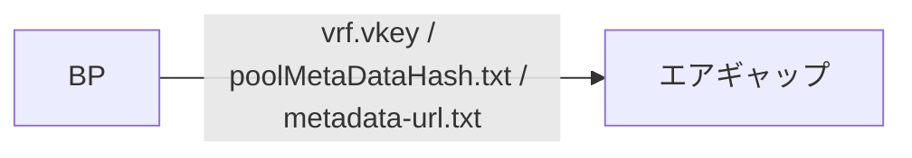
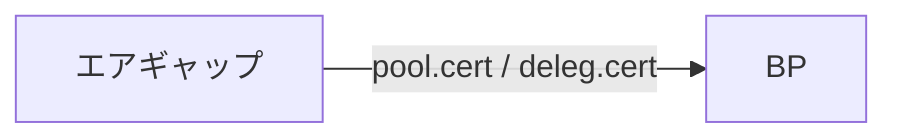
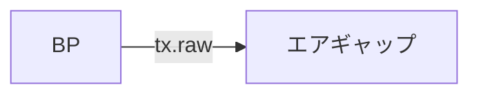
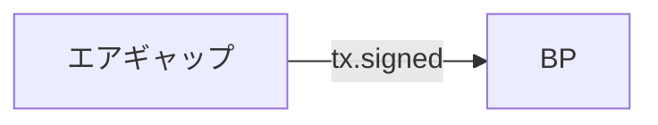
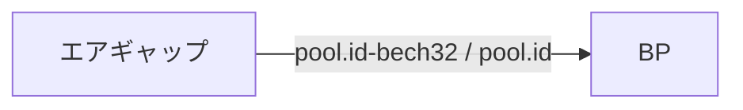

<Callout type="info" title="概要">

こちらの手順は初回プール登録時のみ有効です。  
プール登録後にメタ情報、誓約、固定費、変動費、リレー情報を変更する場合は、[運用証明書(pool.cert)の更新](/cardano/operation/cert-update)の変更手順を実施してください。

</Callout>


<Callout type="info" title="プール登録料">

ステークプール登録には、 **500ADA** の登録料が必要です。  
`payment.addr`に入金されている必要があります。

</Callout>


## 1. メタデータの作成 [#sec-1]

<Callout type="info" title="ホームページを持っていない場合">

「JSONファイルをGitHubでホストする方法」を実施してください。

</Callout>


<Tabs items={["JSONファイルをGitHubでホストする方法", "ご自身のホームページサーバでホストする方法"]}>
<Tab value="JSONファイルをGitHubでホストする方法">


<Callout type="info" title="Example">


1. GitHubアカウントを作成し、ログイン
[https://github.com/](https://github.com/)  
> ユーザー名を最大13文字以内で作成してください。

2. **Repositories**タブを選択し、右上の**New** を選択 

3. **リポジトリ**作成

- **Repository name**に任意の**リポジトリ名** <span style={{color: "red"}}>最大13文字以内</span> を入力
- Publicを選択
- **Create repository**を選択


4. 小さい文字で書かれた**creating a new file**を選択


5. ファイル名を **poolMetaData.json** として入力し、**JSON** コンテンツを貼り付け


```json
{
  "name": "MyPoolName",
  "description": "My pool description",
  "ticker": "MPN",
  "homepage": "https://myadapoolnamerocks.com"
}
```

<Callout type="error" title="作成時の注意">

- 下記は参考フォーマットとなります。ご自身のプール名、Ticker名に書き換えてください  
- まだホームページURLが無い場合は、ご自身のX(Twitter)アドレスでも大丈夫です。
- **ticker**名の長さは3～5文字以内で、`A-Z`と`0-9`のみで構成する必要があります。  
- **description**の長さは255文字以内(`255byte`)となります。（ひらがな、漢字、カタカナは1文字2byte）

</Callout>


6. **Commit Changes**を選択


7. 上部のメニューから**Settings**を選択


8. **GitHub Pages**設定

- 左メニューから**Pages**を選択
- **Branch**のプルダウンから**main** **/root**を選択
- **Save**を選択


9. **URL**の生成 

- 左メニューから**Pages**を選択
- 上部にこのリポジトリの公開URLが表示されたことを確認
- 赤枠のURLをコピー


10. **メタデータURL**の生成

9でコピーしたURLに`poolMetaData.json`を繋げてください

> **例）https://btbf.github.io/sjg/poolMetaData.json**

<span style={{color: "red"}}>このURLの文字列が64文字以内であることを確認してください</span>


11. **BP**で**JSONファイル**をダウンロードし、ハッシュ値を計算  

<Callout type="error" title="URLを書き換えてから実行してください">

10で作成したメタデータURLを用いてください。

</Callout>

URLを変数に代入
```bash
metadata_url=xxxxx
```
> 以下のように変数metadata_urlにURLを代入してください。  
> metadata_url=https://xxx.github.io/xxx/poolMetaData.json

変数に正しいURLが代入されているか確認
```bash
echo $metadata_url
```

URLをテキストファイルに保存
```bash
echo "$metadata_url" > metadata-url.txt
```

公開したメタデータをダウンロード
```bash
cd $NODE_HOME
wget -O poolMetaData.json "$metadata_url"
```

</Callout>


</Tab>
<Tab value="ご自身のホームページサーバでホストする方法">

<Callout type="info" title="Example">

<Callout type="info" title="Hint">

下記は参考フォーマットとなります。ご自身のプール名、Ticker名に書き換えてください  

</Callout>


<Callout type="info" title="作成ルール">

**ticker**名の長さは3～5文字にする必要があります。文字は`A-Z`と`0-9`のみで構成する必要があります。  
**description**の長さは255文字以内(`255byte`)となります。（ひらがな、漢字、カタカナは1文字2byte）

</Callout>


メタデータファイルの作成
<Tabs items={["BP"]}>
<Tab value="BP">


```bash
cd $NODE_HOME
cat > poolMetaData.json << EOF
{
  "name": "MyPoolName",
  "description": "My pool description",
  "ticker": "MPN",
  "homepage": "https://myadapoolnamerocks.com"
}
EOF
```

</Tab>
</Tabs>

<Callout type="error" title="注意">

**poolMetaData.json** をご自身の公開用Webサーバへアップロードしてください。 

</Callout>


</Callout>

アップロード先のURLを変数に代入
```bash
metadata_url=xxxxx
```
> 以下のように変数metadata_urlにURLを代入してください。  
> metadata_url=https://example.com/poolMetaData.json

変数に正しいURLが代入されているか確認
```bash
echo $metadata_url
```

URLをテキストファイルに保存
```bash
echo "$metadata_url" > metadata-url.txt
```

公開したメタデータをダウンロード
```bash
cd $NODE_HOME
wget -O poolMetaData.json "$metadata_url"
```


</Tab>
</Tabs>

メタデータJSONの確認
```bash
jq . $NODE_HOME/poolMetaData.json
```

<Callout type="error" title="戻り値にエラーが表示される場合">

戻り値に`parse error:`が表示される場合は、JSON構文に誤りがあります。
作成したメタデータJSONファイルを確認してください。

</Callout>


メタデータファイルのハッシュ値を計算します。
<Tabs items={["BP"]}>
<Tab value="BP">

```bash
cd $NODE_HOME
cardano-cli latest stake-pool metadata-hash --pool-metadata-file poolMetaData.json > poolMetaDataHash.txt
```

</Tab>
</Tabs>

## 2. プール登録証明書の作成 [#sec-2]

<Callout type="warn" title="ファイル転送">

BPにある`vrf.vkey`と`poolMetaDataHash.txt`と`metadata-url.txt`をエアギャップのcnodeディレクトリにコピーしてください。


</Callout>


**BPとエアギャップで`vrf.vkey`ファイルハッシュを比較**

<Tabs items={["BP"]}>
<Tab value="BP">

```bash
cd $NODE_HOME
sha256sum vrf.vkey
```

</Tab>
</Tabs>

<Callout type="info" title="ヒント">

BPとエアギャップで表示された戻り値を比較して、ハッシュ値が一致していれば問題ありません。  

</Callout>


<Tabs items={["エアギャップ"]}>
<Tab value="エアギャップ">

```bash
cd $NODE_HOME
sha256sum vrf.vkey
```

</Tab>
</Tabs>

最小プールコスト(最低固定費)を出力してください。

<Tabs items={["BP"]}>
<Tab value="BP">

```bash
minPoolCost=$(cat $NODE_HOME/params.json | jq -r .minPoolCost)
echo minPoolCost: ${minPoolCost}
```

</Tab>
</Tabs>

<Callout type="info" title="Info">

出力例: `minPoolCost` が `170000000` lovelace の場合、`170 ADA` です。

</Callout>


 **エアギャップで`pool.cert`を作成してください**

<Callout type="info" title="pool.cert とサンプル値">

`pool.cert` はステークプールの登録内容を書き込んだ証明書です。  
この後のサンプルコマンドでは、主に次の 3 つが設定されています。  
**実運用の値に読み替えてから実行**してください。

* **誓約（Pledge）** … `--pool-pledge`（例: **100 ADA** に相当します）
* **固定手数料（固定費 / cost）** … `--pool-cost`（例: **170 ADA**。**チェーンの `minPoolCost` 以上**が必要です）
* **変動手数料（マージン / margin）** … `--pool-margin`（例: **5%** → `0.05`。0～1 の小数になります）

</Callout>

<AccordionsBlue type="single">
  <Accordion id="spo-pool-cert-pledge" title="誓約（--pool-pledge）とは？">

運営者がご自身のプールに **`payment.addr` の残高で満たす**と宣言する ADA の量です。  
シビル攻撃対策などを目的とした設計があります。  
証明書の誓約より残高が下回ると報酬が得られなくなることがあるため、**運用上の細かな注意は直下の「誓約(Pledge)について」もあわせて読んでください。**

  </Accordion>
  <Accordion id="spo-pool-cert-cost" title="固定手数料（--pool-cost）とは？">

エポックごとにオペレーターへ先に支払われる**固定パート**です。  
チェーンごとに定められた **`minPoolCost` 以上**でなければ登録できません。  
このページの例では **170 ADA** としています。

  </Accordion>
  <Accordion id="spo-pool-cert-margin" title="変動手数料（--pool-margin）とは？">

プール報酬から固定手数料を差し引いたあとについて、オペレーターが取る**割合**を 0～1 の小数で指定します。  
例： **5%** は `0.05` になります。  
残りはステーク参加者へ分配されます。

  </Accordion>
</AccordionsBlue>

<Callout type="info" title="誓約(Pledge)について">

誓約(Pledge)とは、プール運営者がご自身のプールに対して保持を宣言するADA量です。

- 支払い用アドレス(`payment.addr`)の残高は、**Pledge額よりも大きい必要があります**。
- 設定した誓約数より`payment.addr`に入金されているADAが下回っている場合、プール報酬が**0**になります。
- 誓約金は**ロックされません**。いつでも自由に取り出せますが、プール登録証明書を再提出する必要があります。

</Callout>


<AccordionsBlue type="single">
  <Accordion id="spo-pool-cert-relay-ipv4" title="リレー(--pool-relay-ipv4)の記述について">

`pool.cert` 作成時のリレー指定は、主に以下の3パターンです。  
通常は **IPアドレス方式** を選びます。

**1. IPアドレス方式：リレーごとに固定IPを指定する場合**

`xxx.xxx.xxx.xxx` を各リレーのパブリックIPアドレスに置き換えてください。
```bash
  --pool-relay-ipv4 xxx.xxx.xxx.xxx \
  --pool-relay-port 6000 \
  --pool-relay-ipv4 xxx.xxx.xxx.xxx \
  --pool-relay-port 6000 \
```

**2. DNS方式：リレーごとにホスト名を指定する場合**

`relay1.yourdomain.com` などをご自身のドメイン名に置き換えてください。
```bash
  --single-host-pool-relay relay1.yourdomain.com \
  --pool-relay-port 6000 \
  --single-host-pool-relay relay2.yourdomain.com \
  --pool-relay-port 6000 \
```

**3. マルチホストDNS方式：SRVレコードで複数リレーを管理する場合**

DNSの [SRV record](https://support.dnsimple.com/articles/srv-record/) を設定している場合のみ使用します。  
`relay.yourdomain.com` をご自身のドメイン名に置き換えてください。
```bash
  --multi-host-pool-relay relay.yourdomain.com \
  --pool-relay-port 6000 \
```

  </Accordion>
</AccordionsBlue>


<Tabs items={["エアギャップ(リレー2台構成)"]}>
<Tab value="エアギャップ(リレー2台構成)">

下記はサンプルです。実行前に、ご自身のプール設定へ置き換えてから実行してください。

<Callout type="error" title="実行前に変更する値">

- `--pool-pledge`：誓約額
- `--pool-cost`：固定手数料
- `--pool-margin`：変動手数料
- `***.***.***.***`：リレー1、リレー2のパブリックIPアドレス

</Callout>

```bash
cd $NODE_HOME
metadata_url=$(cat metadata-url.txt)
```

```bash
cd $NODE_HOME
cardano-cli latest stake-pool registration-certificate \
  --cold-verification-key-file $HOME/cold-keys/node.vkey \
  --vrf-verification-key-file vrf.vkey \
  --pool-pledge 100000000 \
  --pool-cost 170000000 \
  --pool-margin 0.05 \
  --pool-reward-account-verification-key-file stake.vkey \
  --pool-owner-stake-verification-key-file stake.vkey \
  $NODE_NETWORK \
  --pool-relay-ipv4 ***.***.***.*** \
  --pool-relay-port 6000 \
  --pool-relay-ipv4 ***.***.***.*** \
  --pool-relay-port 6000 \
  --metadata-url "$metadata_url" \
  --metadata-hash "$(cat poolMetaDataHash.txt)" \
  --out-file pool.cert
```

</Tab>
</Tabs>

**ご自身のステークプールに委任する証明書(`deleg.cert`)を作成します。**

<Tabs items={["エアギャップ"]}>
<Tab value="エアギャップ">


```bash
cardano-cli latest stake-address stake-delegation-certificate \
  --stake-verification-key-file stake.vkey \
  --cold-verification-key-file $HOME/cold-keys/node.vkey \
  --out-file deleg.cert
```

</Tab>
</Tabs>

<Callout type="warn" title="ファイル転送">

エアギャップの`pool.cert`と`deleg.cert`をBPのcnodeディレクトリにコピーしてください。


</Callout>


## 3. プール登録トランザクションの送信 [#sec-3]

**最新のスロット番号を取得します。**

<Tabs items={["BP"]}>
<Tab value="BP">

```bash
cd $NODE_HOME
currentSlot=$(cardano-cli latest query tip $NODE_NETWORK | jq -r '.slot')
echo Current Slot: $currentSlot
```

</Tab>
</Tabs>

**`payment.addr`の残高を出力します。**

<Tabs items={["BP"]}>
<Tab value="BP">

```bash
cardano-cli latest query utxo \
  --address $(cat payment.addr) \
  $NODE_NETWORK \
  --output-text \
  --out-file fullUtxo.out

tail -n +3 fullUtxo.out | sort -k3 -nr > balance.out

cat balance.out
```

</Tab>
</Tabs>

**UTXOを算出します。**

<Tabs items={["BP"]}>
<Tab value="BP">

```bash
tx_in=""
total_balance=0
while read -r utxo; do
  in_addr=$(awk '{ print $1 }' <<< "${utxo}")
  idx=$(awk '{ print $2 }' <<< "${utxo}")
  utxo_balance=$(awk '{ print $3 }' <<< "${utxo}")
  total_balance=$((${total_balance}+${utxo_balance}))
  echo TxHash: ${in_addr}#${idx}
  echo ADA: ${utxo_balance}
  tx_in="${tx_in} --tx-in ${in_addr}#${idx}"
done < balance.out
txcnt=$(cat balance.out | wc -l)
echo Total ADA balance: ${total_balance}
echo Number of UTXOs: ${txcnt}
```

</Tab>
</Tabs>

**poolDepositを出力します。**

<Tabs items={["BP"]}>
<Tab value="BP">


```bash
poolDeposit=$(cat $NODE_HOME/params.json | jq -r '.stakePoolDeposit')
echo poolDeposit: $poolDeposit
```

</Tab>
</Tabs>

**トランザクション仮ファイルを作成します。**

<Tabs items={["BP"]}>
<Tab value="BP">


```bash
cardano-cli latest transaction build-raw \
  ${tx_in} \
  --tx-out $(cat payment.addr)+$(( ${total_balance} - ${poolDeposit})) \
  --invalid-hereafter $(( ${currentSlot} + 10000)) \
  --fee 200000 \
  --certificate-file pool.cert \
  --certificate-file deleg.cert \
  --out-file tx.tmp
```

</Tab>
</Tabs>

**最低手数料を計算します。**

<Tabs items={["BP"]}>
<Tab value="BP">


```bash
fee=$(cardano-cli latest transaction calculate-min-fee \
  --tx-body-file tx.tmp \
  --witness-count 3 \
  --output-text \
  --protocol-params-file params.json | awk '{ print $1 }')
echo fee: $fee
```

</Tab>
</Tabs>

**計算結果を出力します。**

<Tabs items={["BP"]}>
<Tab value="BP">


```bash
txOut=$((${total_balance}-${poolDeposit}-${fee}))
echo txOut: ${txOut}
```

</Tab>
</Tabs>

**トランザクションファイルを作成します。**

<Tabs items={["BP"]}>
<Tab value="BP">


```bash
cardano-cli latest transaction build-raw \
  ${tx_in} \
  --tx-out $(cat payment.addr)+${txOut} \
  --invalid-hereafter $(( ${currentSlot} + 10000)) \
  --fee ${fee} \
  --certificate-file pool.cert \
  --certificate-file deleg.cert \
  --out-file tx.raw
```

</Tab>
</Tabs>

<Callout type="warn" title="ファイル転送">

BPの`tx.raw`をエアギャップのcnodeディレクトリにコピーします。



</Callout>


**トランザクションに署名します。**

<Tabs items={["エアギャップ"]}>
<Tab value="エアギャップ">

```bash
cd $NODE_HOME
cardano-cli latest transaction sign \
  --tx-body-file tx.raw \
  --signing-key-file payment.skey \
  --signing-key-file $HOME/cold-keys/node.skey \
  --signing-key-file stake.skey \
  $NODE_NETWORK \
  --out-file tx.signed
```

</Tab>
</Tabs>

<Callout type="warn" title="ファイル転送">

エアギャップの`tx.signed`をBPのcnodeディレクトリにコピーします。


</Callout>


**トランザクションを送信します**

<Tabs items={["BP"]}>
<Tab value="BP">

```bash
cardano-cli latest transaction submit \
  --tx-file tx.signed \
  $NODE_NETWORK
```

</Tab>
</Tabs>

 > Transaction successfully submittedと表示されれば成功

## 4. プール登録確認 [#sec-4]

**ステークプールIDは以下のように出力できます。**

<Tabs items={["エアギャップ"]}>
<Tab value="エアギャップ">

```bash
chmod u+rwx $HOME/cold-keys
cardano-cli latest stake-pool id --cold-verification-key-file $HOME/cold-keys/node.vkey --output-format bech32 --out-file pool.id-bech32
cardano-cli latest stake-pool id --cold-verification-key-file $HOME/cold-keys/node.vkey --output-format hex --out-file pool.id
chmod a-rwx $HOME/cold-keys
```

</Tab>
</Tabs>

<Callout type="warn" title="ファイル転送">

エアギャップの`pool.id-bech32`と`pool.id`をBPのcnodeディレクトリにコピーします。


</Callout>


**以下のコマンドを実行し、プール情報が表示されればブロックチェーンに登録されています。**
<Tabs items={["BP"]}>
<Tab value="BP">

```bash
curl -s -X POST "https://api.koios.rest/api/v1/pool_info" \
  -H "Accept: application/json" \
  -H "Content-Type: application/json" \
  -d '{"_pool_bech32_ids":["'$(cat $NODE_HOME/pool.id-bech32)'"]}' | jq .
```

</Tab>
</Tabs>

**ご自身のステークプールが`Cardanoscan`に登録されているか確認します。**
<Tabs items={["BP"]}>
<Tab value="BP">

```bash
cd $NODE_HOME
cat pool.id-bech32;echo
```

</Tab>
</Tabs>

表示されたPool IDでご自身のステークプールがブロックチェーンに登録されているか、次のサイトで確認できます。  
[Cardanoscan](https://cardanoscan.io/pools)

---